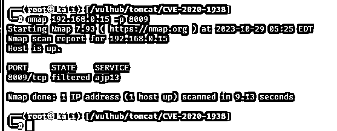
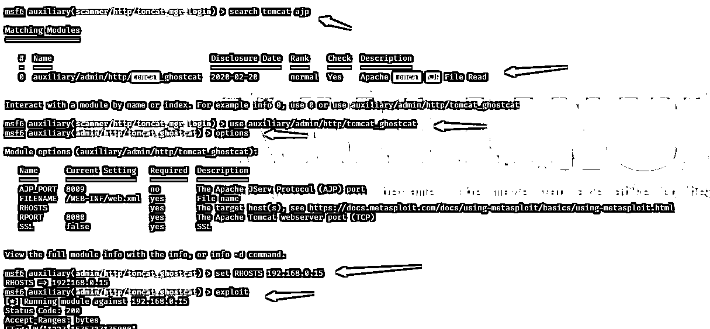
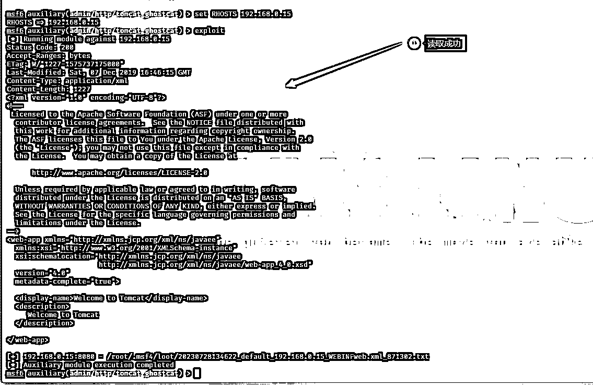

# 服务器容器漏洞-tomcat ajp 任意文件读取(CVE-2020-1938) - 挖洞 404 - 博客园

> 原文：[`www.cnblogs.com/wd404/p/17552589.html`](https://www.cnblogs.com/wd404/p/17552589.html)

1、介绍

名称：tomcat ajp 任意文件读取

编号：CVE-2020-1938

原理：漏洞是 Tomcat AJP 协议存在缺陷而导致，攻击者利用漏洞可以构造特定参数，读取服务器 webapp/ROOT 下的任意文件。若目标服务器同时存在文件上传功能，攻击者可进一步通过文件包含实现远程代码执行。

应用：tomcat

版本：这个漏洞影响全版本默认配置下的 Tomcat（确认其影响 Tomcat 9/8/7/6 全版本，而年代过于久远的更早的版本未进行验证），这意味着它在 Tomcat 里已经潜伏了长达十多年的时间。

2、测试

2.1 搭建靶场

靶场：/vulhub/tomcat/CVE-2020-1938

```
docker-compose up -d
```

访问 http://192.168.0.15:8080


8009 是 ajp 的默认端口，判断其是否开启




2.2 xray 测试端口

```
xray_windows_386.exe servicescan --target 192.168.52.130:8009
```

2.3 msf





3、防护

更新 tomcat 版本，将 tomcat 升级到 9.0.31、8.5.51 或者 7.0.100 版本

禁止使用 AJP 协议

配置 secret 和 secretRequired 来设置 AJP 协议的认证凭证