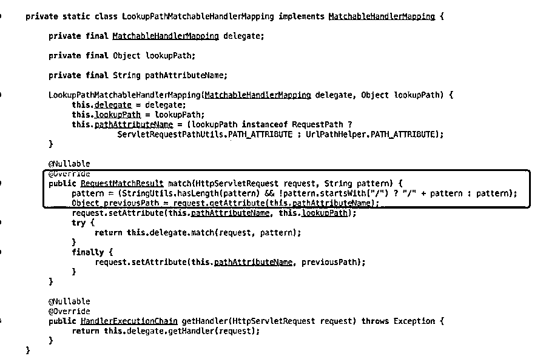
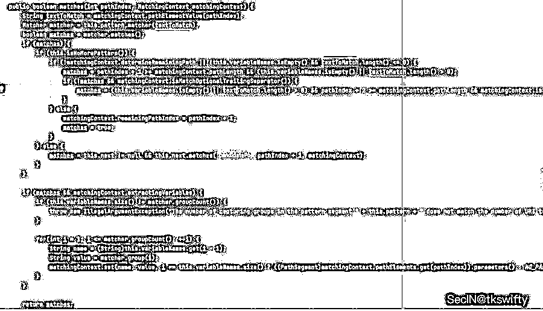
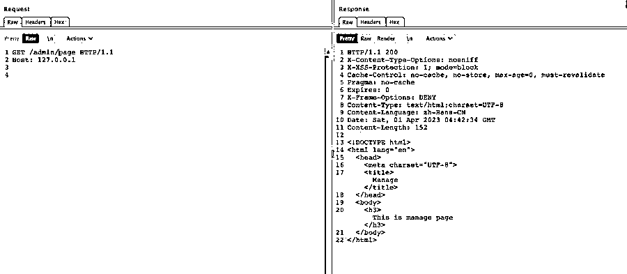
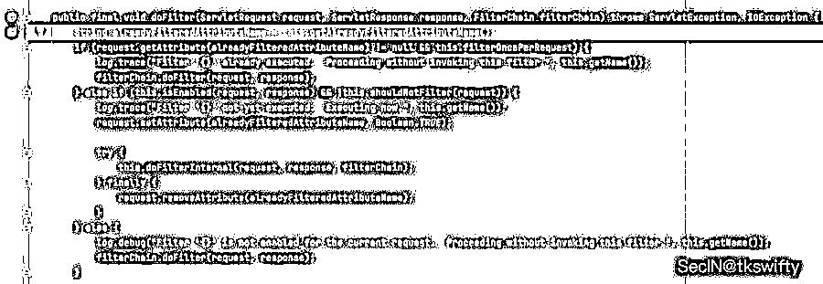
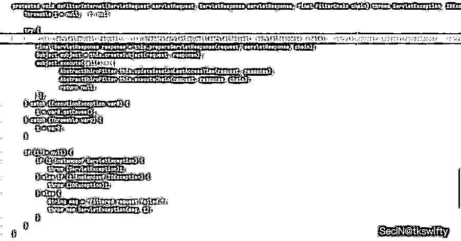
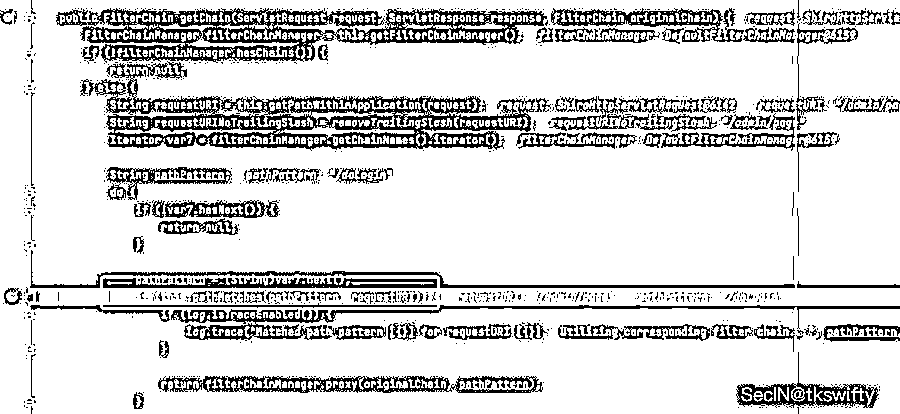
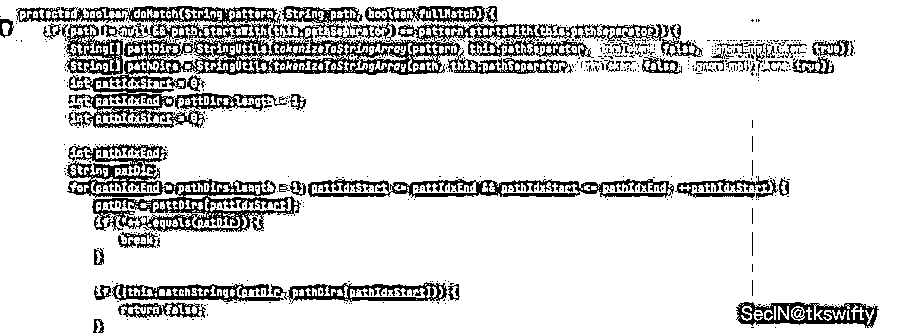

# 浅谈 Apache 与 CVE-2023-20860 - SecIN 社区 - 博客园

> 原文：[`www.cnblogs.com/SecIN/p/17535103.html`](https://www.cnblogs.com/SecIN/p/17535103.html)

# 一、前言

  一般情况下，开发者配置鉴权时，可能都会遵循一个原则，就是"优先使用/**认证兜底，明确哪些接口无需认证，而不是明确哪些接口需要认证。

  在 Spring Controller 中,以下两个路由访问是等价的（熟悉 spring framework 源码的话，会知道其实都是在解析 pattern 前做了补全的处理（不论是 AntPathMatcher 还是高版本的 PathPattern））：

```
@GetMapping("/admin/*")
@GetMapping("admin/*") 
```

  所以很多时候有的开发者会会直接认为`**`代表全路径，确实在某些鉴权框架中也生效了。

# 1.1 关于 CVE-2023-20860

  前段时间 Spring 官方发布了 Spring Framework 身份认证绕过漏洞(CVE-2023-20860)，当 Spring Security 使用 mvcRequestMatcher 配置并将**作为匹配模式时，在 Spring Security 和 Spring MVC 之间会发生模式不匹配，最终可能导致身份认证绕过。首先简单回顾下漏洞的原理：

  对比 commit 可以看到在调用 PathPattern 的 match 之前，首先判断 pattern 是否以`/`开头，如果不是的话进行补全（以修复版本 spring-webmvc-5.3.26 为例）：

*   PS： 下面代码块中的/admin/**就是 pattern:

```
httpSecurity.authorizeRequests().mvcMatchers("/admin/**").authenticated(); 
```



  结合漏洞描述以及对 commit 的分析，大致绕过的是如下的配置：

```
httpSecurity.authorizeRequests().mvcMatchers("**").authenticated(); 
```

  结合影响的版本可以确定对应的 Spring 应用使用的是 PathPattern 进行解析。而 MvcRequestMatcher 实际上使用 Spring MVC 的 HandlerMappingIntrospector 来匹配路径并提取变量，对应的影响判断在匹配 pattern 跟请求的 path 时使用的也是 PathPattern。根据 PathPattern 的解析方式，大致可以知道漏洞的成因了。

  首先 PathPattern 会根据/将 URL 拆分成多个 PathElement 对象，然后根据其的链式节点中对应的 PathElement 的 matches 方法逐个进行匹配。正常情况下，`/**`这个 Pattern 对应的 matches 是 WildcardTheRestPathElement。

  因为 PathPattern 通配符只能定义在尾部(不能以/结尾)，所以当 pathElements 的元素个数大于 PathPattern 中的元素个数即可匹配：


  所以此时正常情况下访问/admin/page 无法绕过。

  但是如果此时使用的是`**`这个 Pattern，因为漏洞版本缺少了补全`/`的操作（修复版本会判断 pattern 是否以`/`开头，如果不是的话进行补全），那么此时对应的 matches 是 RegexPathElement：

  就跟命名里的 Regex 一样，这个 matches 主要是通过 java.util.regex.compile#matcher 处理，看看当前 pathElements 的内容是否符合正则预期：



  此时获取 textToMacth，对于`/admin/page`这个 path 第一个元素是`/`，此时会返回空字符串：


  虽然`*`能匹配到空字符串，但是这里还有一个逻辑，首先 pathIndex+1 后明显小于`matchingContext.pathLength`，此时 matches 为 false，再往下的逻辑，pathIndex+1 后对应的元素并不是`/`，而是 admin，此时匹配失败，auth Bypass：

```
matches = pathIndex + 1 >= matchingContext.pathLength && (this.variableNames.isEmpty() || textToMatch.length() > 0);
if (!matches && matchingContext.isMatchOptionalTrailingSeparator()) {
    matches = (this.variableNames.isEmpty() || textToMatch.length() > 0) && pathIndex + 2 >= matchingContext.pathLength && matchingContext.isSeparator(pathIndex + 1);
} 
```




  在 Java 生态中，还有一个常用的鉴权组件 shiro，那么 shiro 请求解析的过程又是怎么样处理的呢，是否也会有类似的问题。查看 shiro 的源码进行简单的分析：


# 二、特殊场景下的 shiro auth Bypass

  结合上述背景，查看 shiro 能否按期我们的预期处理`**`：

## 2.1 相关场景

  假设设置对应的 url 和过滤器匹配规则如下：

```
@Bean
ShiroFilterFactoryBean shiroFilterFactoryBean(){
    ShiroFilterConfiguration shiroFilterConfiguration = new ShiroFilterConfiguration();
    shiroFilterConfiguration.setStaticSecurityManagerEnabled(true);
    shiroFilterConfiguration.setFilterOncePerRequest(true);

    ShiroFilterFactoryBean bean = new ShiroFilterFactoryBean();
    bean.setShiroFilterConfiguration(shiroFilterConfiguration);

    bean.setSecurityManager(securityManager());
    bean.setLoginUrl("/login");
    bean.setSuccessUrl("/index");
    bean.setUnauthorizedUrl("/unauthorizedurl");
    Map<String, String> map = new LinkedHashMap<>();
    map.put("/**", "authc");
    map.put("/doLogin", "anon");
    bean.setFilterChainDefinitionMap(map);
    return  bean;
} 
```

  按照预期的设定，按道理是能对以下 Controller 进行防护的：

```
@GetMapping("/admin/page")
public String admin() {
    return "admin page";
} 
```

  实际上这个配置并不会生效，还是可以访问到对应的 Controller：


## 2.2 具体原理

  以 1.10.0 版本的 shiro 为例，查看具体的原因：

  当发起 HTTP 请求时，Shiro 的多个过滤器形成了一条链，所有请求都必须通过这些过滤器后才能成功访问到资源。简单看下 Shiro 拦截请求处理的过程。

  查阅相关资料，shiro 发挥作用的入口是在`org.apache.shiro.spring.web.ShiroFilterFactoryBean.SpringShiroFilter`中，其中它继承自 OncePerRequestFilter，字面上看是每个请求执行一次。

  在接收到请求时会先进入 OncePerRequestFilter.doFilter() ，在这里写一个断点：



  这里会做一些简单的判断，然后 org.apache.shiro.web.servlet.AbstractShiroFilter#doFilterInternal 方法，首先会对 request 和 response 对象进行包装，然后调用 createSubject 方法，这里会处理认证授权信息并进行封装:



  接着在 Callable 修改了最近一次的访问时间，然后调用 FilterChain，实际上调用的是 org.apache.shiro.web.filter.mgt.PathMatchingFilterChainResolver#getChain 来获取（会根据 URL 路径匹配，解析出 ServletRequest 请求过程中要执行的过滤器链）:


  根据前面的分析，在 org.apache.shiro.web.filter.mgt.PathMatchingFilterChainResolver#getChain 来获取其会根据 URL 路径匹配，解析出 ServletRequest 请求过程中要执行的过滤器链：


  首先调用 getPathWithinApplication 方法获取应用程序内的 URI 的相对路径，然后往下遍历 filterChains，requestURI 和 pattern 匹配的话会代理到 filterChainManager.proxy 方法里去，如果不能匹配，会删除最后的"/" 再匹配一次：



  shiro 使用的是 AntPathMatcher 进行匹配的，如果请求的 path 和 pattern 没有以/，就不再进行匹配了，与 Spring 不同的是，shiro 在匹配前并不会对 pattern 进行检查，补全开头的/：



  根据 AntPathMatcher 的代码可以知道，如果 pattern 没有以`/`开头会直接匹配失败。会导致前面的对于`**`配置失效，可以看到 filterChain 仅仅返回了 InvalidRequestFilter，并没有返回 authc 对应的 Filter（权限控制失效）:


PS：实际上只要不以`/`开头的 Pattern，Shiro 都会找不到对应的 Filter。所以类似`admin/*`的配置也是会 auth Bypass 的。

# 三、其他

  相比 CVE-2023-20860，`**`这个 auth Bypass 并不是由于 shiro 与 Spring Framework 的解析不一致导致的。这个问题也第一时间反馈给了 Apache，但是 Apache 认为这不能算一个漏洞：


  实际上在开发过程中由于各个框架间的差异导致的安全问题是十分常见的，如何正确的使用现有框架，规避不必要的安全风险是一个值得思考的问题。