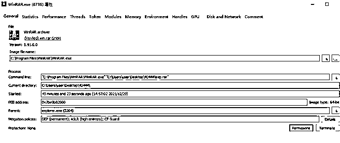
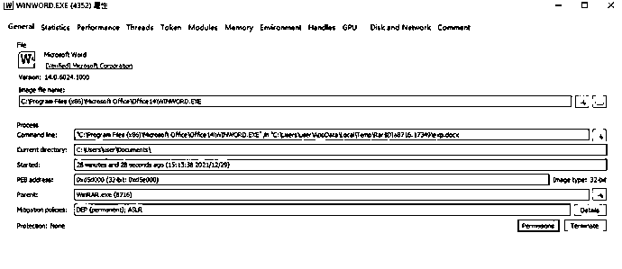
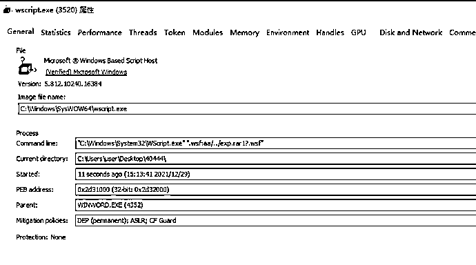
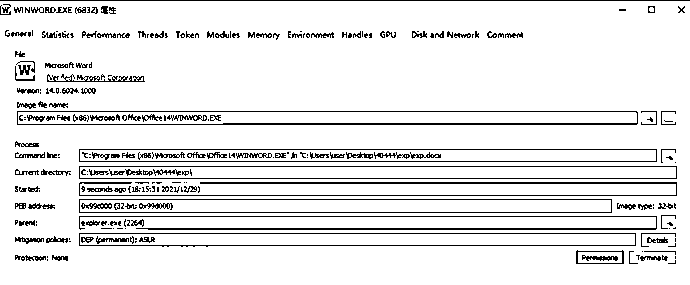
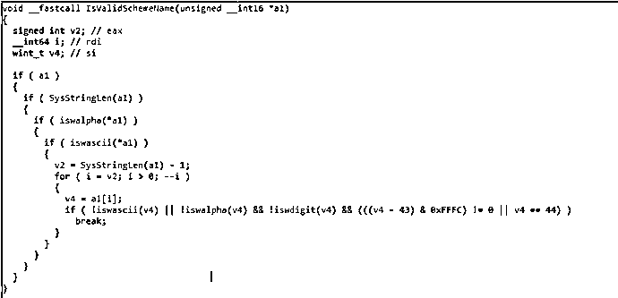

# 深入剖析 CVE-2021-40444-Cabless 利用链 - 白鹭鹭鹭 - 博客园

> 原文：[`www.cnblogs.com/slll/p/15942200.html`](https://www.cnblogs.com/slll/p/15942200.html)

## **背景**

CVE-2021-40444 为微软 MHTML 远程命令执行漏洞，攻击者可通过传播 Microsoft Office 文档，诱导目标点击文档从而在目标机器上执行任意代码。该漏洞最初的利用思路是使用下载 cab 并释放、加载 inf 文件的形式执行恶意代码。独立安全研究员 Eduardo B.在 github 公开了一种新的“无 CAB”的漏洞利用方法及其 POC。公众号之前发布的研判文章中已对在野利用中出现的新的 Cabless 利用链以及 RAR 文件隐藏载荷的巧妙方法进行了分析。本篇将进一步探究该利用链的技术本质，并在复现攻击场景的前提下尝试对利用链进行改进。

## 基于 URL Scheme 的 Cabless 利用链

与基于 cab 的攻击方式一样，新攻击链依然需要在 Office 文档中插入恶意 htmlfile OLE 对象，当目标用户点击文档后会请求访问远程 html 页面，而 html 页面中通过 ActiveX 控件调用".wsf:../" URL Scheme 链接，最终调用 wcript.exe 执行 RAR 中嵌入的 wsf 脚本。

'.wsf:../../../Downloads/?.wsf'

URL Scheme 也叫 URL protocol，它的作用是通过链接启动对应的本地程序，格式为[scheme]://[host]/[path]?[query]。文件后缀名可同样用作 scheme，调用相关文件类型绑定的程序。’?[query]’的存在则可利用 URL Scheme 与程序在处理路径时不同的行为，达到忽略真实后缀名，绕过扩展名校验的目的。在之前的攻击链中曾使用”.cpl”链接调用系统 rundll32.exe 程序将 inf 文件作为 cpl 文件加载执行。

目前公开的配合 RAR 的 Cabless 利用链的 POC 有两个利用条件，一是猜测到 WINRAR 的存储位置，默认其位于用户目录的 Downloads 文件夹下，否则无法获取 wsf 脚本位置；二是明确 wscript.exe 运行的当前路径（例如 Documents 目录），否则无法构造正确的路径。下面将从不同的利用场景考虑，思考更灵活的 URL Scheme 构造方式。

## 基于不同利用场景的利用链改进

配合 RAR 的 Cabless 利用链在实际执行时有两种可能，用户直接在 WinRAR 中打开 DOCX 文件，以及先解压再打开，对这两条攻击路径进行分别的探究。

**直接在 WINRAR 中打开 DOCX 文件**

当用户直接在 WINRAR 中打开压缩包中的 DOCX 文件时的进程树如下：

WinRAR 的当前路径为 RAR 文件所在文件夹。

Word 的当前路径为 C:\Users\user\Documents，RAR 中的 DOCX 文件被释放到%TEMP%临时文件夹中。

wscript.exe 被触发执行后的当前路径为 WinRAR 的路径（也就是压缩包所在的文件夹）。

".wsf:"被用于 Url Scheme 唤起 wscript.exe，而在被唤起后又被当作普通目录名去解析。’.wsf:’后的两个’.’可替换为其他内容，不影响执行，但是如果去掉这两个字符会在参数传递给 wscript.exe 时吞掉一个“../”导致找不到文件。这是因为 wscript.exe 解析路径的时候会将“.wsf:aa”整体当作一个 host 看待，后面拼接“../”就抵消了这层目录关系，相当于当前目录。

基于以上测试可知，当 DOCX 文件在 WinRAR 中直接执行时虽然 DOCX 文件释放于临时目录，但 wscript.exe 的当前目录即是 RAR 文件所在的目录。由此我们可以构造此情况下 100%可用的 URL Scheme（直接从当前路径读取 RAR 文件）：

'.wsf:aa/../exp.rar1?.wsf'

**先解压 DOCX 文件再打开**

这种情况其实更复杂，也是公开的 POC 针对的场景，对应进程树：

直接点击解压后的 DOCX 文件打开时，Word 的当前路径为 DOCX 文件所在路径，wscript.exe 的路径也将保持一致。

值得注意的是，在一些情况下 Word 会将当前路径设置为 C:\Users\Document，这可能是公开 POC 中构造路径的依据。但无论当前路径是什么，攻击者都必须成功获取(猜测)到 RAR 所在的文件夹。

## 漏洞修复

微软在 9 月的补丁中已将 MHTML 中使用 URL Scheme 的问题修复，在 ieframe.dll 中加入了一个新的校验函数 IsValidSchemeName：

该函数将对 URL Scheme 进行校验，诸如”.cpl”、“.wsf”这种以文件扩展名启动应用程序的方式由于以字符“.”开头无法通过该校验函数的判断。

## 总结

本文主要分析了 CVE-2021-40444 的 Cabless 利用链中存在的路径问题以及对之前技术研判内容进行补充。通过分析 CVE-2021-40444 新利用链，可以看到该漏洞的根本原因是 Office 文档可以通过 MHTML 协议请求访问远程 HTML 页面从而执行 JavaScript 代码，并最终通过 Url Scheme 启动本地应用程序执行投递的恶意代码，而中间投递恶意代码的方式是可以替换的。同时也给了作为初学者的笔者很多启发，在分析漏洞时需加入对根本问题的思考：在攻击链中哪些部分是必不可少的，哪些是可以替换的。必不可少的部分作为漏洞根本问题要更深入地分析，而可以替换的部分要尝试去挖掘可替换的新利用链。而对于防守方，把握漏洞本质与漏洞利用必经之路，方能以不变应万变彻底控制各种漏洞利用变体。