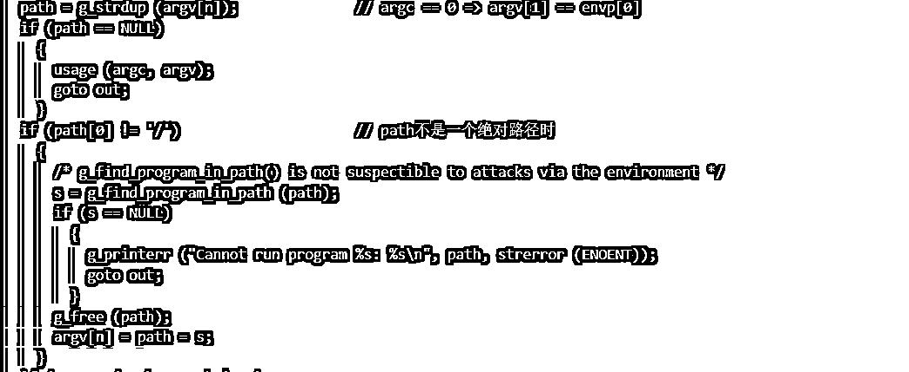

# 漏洞分析：PwnKit CVE-2021-4034 - Riv4ille - 博客园

> 原文：[`www.cnblogs.com/L0g4n-blog/p/15997669.html`](https://www.cnblogs.com/L0g4n-blog/p/15997669.html)

# 漏洞分析：PwnKit CVE-2021-4034

　　今天花时间看了一下前一段时间 pkexec 的提权漏洞 PwnKit，这个漏洞最早在 2011 年的时候就被发现了，但是之前普遍认为在 argc>=1 的情况下，漏洞无法利用，所以这个漏洞被当做一个 bug 处理了，直到前一段时间 qualys 的安全研究人员将 argc 设置为 0，然后完成了漏洞利用和权限提升的过程。整个漏洞利用的过程非常精妙，很难让人不拍手称赞，这里根据给出的 exp 做一个简单的分析。

## 前置知识

　　可以通过一个小 demo，帮助理解一下 char** argv 和 char** envp 在内存中的布局。

```
#include<stdio.h> #include<stdlib.h>

int main(int argc,char** argv,char** envp){ int n;

    printf("%d\n",argc); for(n = 0; argv[n] ; n++){
        printf("argv[%d] : %p\n",n,&argv[n]);
        printf("%p : %s\n",argv[n],argv[n]);
    } for(n = 0; argv[n] ; n++){
        printf("envp[%d] : %p\n",n,&envp[n]);
        printf("%p : %s\n",envp[n],envp[n]);
    } return 0;
}
```


 　　可以看到，argv 和 envp 在栈上是紧邻的，但是 argv[1]和 envp[0]中间有 8 字节的间距，然后我们接着向下看。

## 漏洞点

漏洞出现在对主函数的参数处理上，这里的判断条件出现了问题，n 被初始化为 1： 


 　　初始化为 1 之后，进入到如下处理流程：  



 　　在 argc==1 的情况下，我们无法通过这个循环条件的错误判断来构建合适的漏洞利用原语，只会读写空出来的那 8 个字节最终造成 crash。

　　但是如果可以将 argc 设置为 0 的话，argv[1]的位置，实际上就是 envp[0]，这时候会形成一个越界读写。

## 漏洞利用

### 认识 SUID

　　在学习漏洞利用之前，需要先看一下 suid 相关的一些知识，p 牛的这篇文章深入浅出地讲解了 suid 的提权机制：https://www.leavesongs.com/PENETRATION/linux-suid-privilege-escalation.html。

　　pkexec 默认是具有 suid 属性的，这个漏洞的利用过程，其实也是 suid 提权机制的一种体现。

### 引入恶意环境变量

　　正常来说，不安全的环境变量在 ld.so 中都会被删除，所以越界写 envp[0]的目的，实际上是要引入危险的环境变量。引入危险环境变量的目的，是把本地的恶意动态链接库加载到 pkexec 进程空间中然后执行 setuid 进行提权。关于如何写入危险的环境变量，qualys 的分析中给出了如下内容：


 　　意思就是形如"PATH=name="这种的环境变量，如果 name 是当前目录下一个已存在的目录名，而且 name 这个目录下存在一个名为 value 的可执行文件，那么 g_find_program_in_path 最后返回的字符串指针指向的内容就是"name=./value"。

　　其中 GCONV_PATH 可以加载对应路径下的动态链接库到当前进程的内存中，这个环境变量就是我们要引入的。

## 劫持执行流

 　　在源码中引用了很多次 g_printerr 函数，用于输出错误信息该函数是调用 GLib 的函数。但是如果环境变量 CHARSET 不是 UTF-8，g_printerr()将会调用 glibc 的函数 iconv_open()，来将消息从 UTF-8 转换为另一种格式。iconv_open 函数的执行过程为：iconv_open 函数首先会找到系统提供的 gconv-modules 配置文件，这个文件中包含了各个字符集的相关信息存储的路径，每个字符集的相关信息存储在一个.so 文件中，即 gconv-modules 文件提供了各个字符集的.so 文件所在位置，之后会调用.so 文件中的 gconv()与 gonv_init()函数。

　　只要在 GCONV_PATH 目录下，再创建一个 gconv-modules 配置文件，然后配置文件中的内容，写入执行 gconv-modules 所以目录下的 so 文件，就可以实现对控制流的劫持。

　　触发点，找一个能够稳定调用 g_printerr 的地方：


 　　由于会清空环境变量，所以触发点就要在 validate_environment_variable 函数中去找，两条构造的路径其实都比较容易满足，一个是构造错误的"SHELL"变量的值，另一个是构造"XAUTHORITY"变量中出现"%"，".."，"/"这几个字符其中一个。

