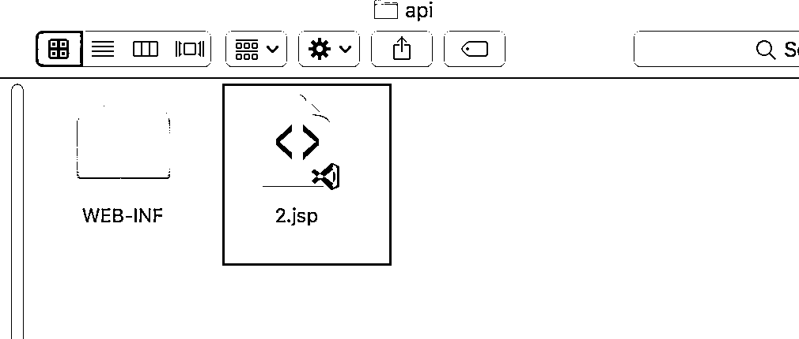

# 漏洞复现 - ActiveMQ 任意文件写入漏洞（CVE-2016-3088） - Sally_Zhang - 博客园

> 原文：[`www.cnblogs.com/sallyzhang/p/12302540.html`](https://www.cnblogs.com/sallyzhang/p/12302540.html)

**漏洞原理**

fileserver 是 Apache ActiveM 提供的一个 RESTful API 接口，可通过 GET、PUT、DELETE 等 HTTP 请求对文件进行读写操作，设计目的是为了弥补消息队列操作不能传输、存储二进制文件的缺陷，在文件操作过程中出现了任意文件读写漏洞。

**影响版本**

5.12.x 之前的版本。

**复现环境**

将 ActiveMQ 部署在 MAC 上，使用版本为 apache-activemq-5.11.1，JDK 版本为 1.7

**复现过程**

启动 ActiveMQ，并尝试上传 jsp 木马，返回 401，上传时失败。。。

把文件名后缀改为 txt，再上传，返回 204，上传成功(网上有些文章直接上传 jsp 也能传上去，我这里是传不上去的，原因不明。。。)

在 apache-activemq-5.11.1/webapps/fileserver 文件夹下可以找到刚才上传的文件：

此时的 jsp 木马是无法执行的，原因有二：1.文件名后缀是 txt，2.fileserver 目录无法执行 jsp。所以需要将该文件后缀改为 jsp，然后移动到可以执行 jsp 的文件夹内。

查看 activemq 的绝对路径：[`IP:8161/admin/test/systemProperties.jsp`](http://192.168.101.9:8161/admin/test/systemProperties.jsp)，将木马传到 webapps/api 下面：

访问上传的木马，执行 ls 命令成功：

****本文仅用于技术学习和交流，严禁用于非法用途，否则产生的一切后果自行承担。****