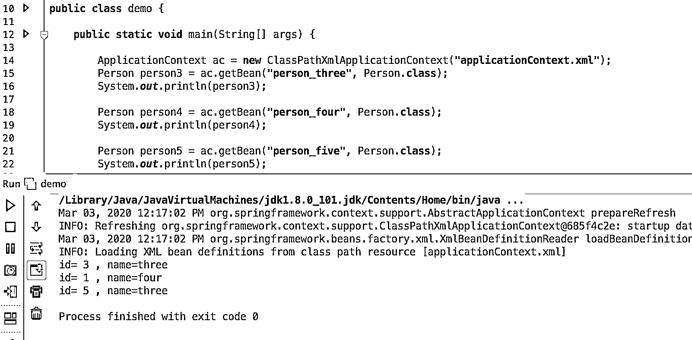

# 漏洞复现 - Spring Data Rest 远程命令执行漏洞（CVE-2017-8046） - Sally_Zhang - 博客园

> 原文：[`www.cnblogs.com/sallyzhang/p/12401604.html`](https://www.cnblogs.com/sallyzhang/p/12401604.html)

**基础知识**

今天和昨天的漏洞都跟 SpEL 有关。SpEL 是 Spring 的表达式语言，支持在运行时查询和操作对象图，可以与基于 XML 和基于注解的 Spring 配置还有 bean 定义一起使用。由于它能够在运行时动态分配值，可节省大量 Java 代码。

用 bean 做实验：

调用结果：

**漏洞原理**

在 REST API 的 Patch 方法中（实现[RFC6902](https://tools.ietf.org/html/rfc6902)），path 的值被传入`setValue`，导致执行了 SpEL 表达式，触发远程命令执行漏洞。

**复现环境**

在 ubuntu 16.04 虚拟机中用 vulhub 靶场提供的 docker 容器来复现

jdk 版本 1.7

**影响版本**

pivotal Spring Data REST < 2.5.12 2.6.7 3.0 RC3
pivotal Spring Boot < 2.0.0M4
pivotal Spring Data < Kay-RC3

****复现过程****

1\. 进入 vulhub 目录：spring/CVE-2017-8046，启动 docker 容器

2.发送如下请求，利用 SpEL 表达式执行恶意代码：

 3.查看结果，恶意代码执行成功

 

这里的 SpEL 用的就是基础知识里面提到的第二种使用方式，使用了 java.lang.Runtime 类的 getRuntime().exec 方法，可是这里为啥要转成 byte[]，不直接传字符串？

试了下直接调 SpelExpression 是可以直接传字符串的：

再发一次之前的 PATCH 请求，直接传字符串 T(java.lang.Runtime).getRuntime().exec(new java.lang.String('touch /tmp/success'))，没有成功，好吧，可能是源程序里面的参数类型是 byte[]吧。。

看了一下 Spring 目录后面的几个目录，都是 SpEL 命令执行造成的，原理差不多，就不一一复现了。

**本文仅用于技术学习和交流，严禁用于非法用途，否则产生的一切后果自行承担。**