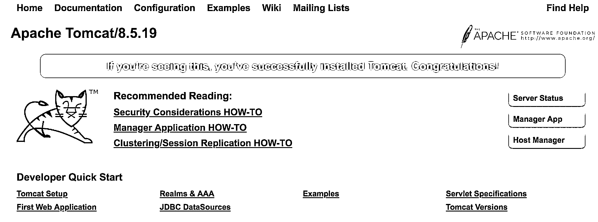
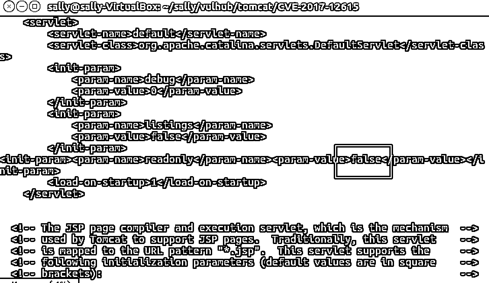

# 漏洞复现 - Tomcat 任意文件上传漏洞（CVE-2017-12615） - Sally_Zhang - 博客园

> 原文：[`www.cnblogs.com/sallyzhang/p/12341711.html`](https://www.cnblogs.com/sallyzhang/p/12341711.html)

**漏洞原理**

Tomcat 配置文件 web.xml 中，servlet 配置了 readonly=fasle 时，会引发任意文件上传漏洞。

readonly 参数默认是 true，即不允许 delete 和 put 操作，所以通过 XMLHttpRequest 对象的 put 或者 delete 方法访问就会报告 http 403 错误。但很多时候为了支持 REST 服务，会设置该属性为 false。 

**复现环境**

在 ubuntu 16.04 虚拟机中用 vulhub 靶场提供的 docker 容易来复现

jdk 版本 1.7

Tomcat 版本 8.5.19

****复现过程****

1\. 进入 vulhub 目录：tomcat/CVE-2017-12615

2.启动 docker 容器，tomcat 页面正常访问：

进入容器查看一下 web.xml 的 readonly 配置：

3\. 抓包，尝试上传 jsp 木马，没成功，不能直接传 jsp 文件

4.绕过以下，再次上传(其他类型的文件也可以上传的，传 jsp 文件是方便执行 jsp 中的代码)：

5.进入 docker 容器内部查看上传文件：

6.访问该文件，执行成功：

**防御实验**

将 readonly 参数改为 false，在发一次 PUT 请求：

****本文仅用于技术学习和交流，严禁用于非法用途，否则产生的一切后果自行承担。****