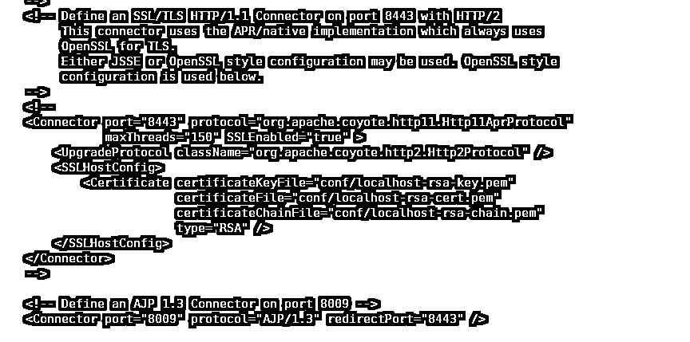
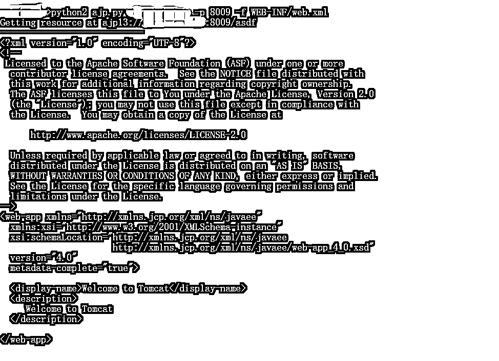

# 漏洞复现-CVE-2020-1938-Tomcat 文件读取/包含漏洞 - 铺哩 - 博客园

> 原文：[`www.cnblogs.com/cute-puli/p/15319805.html`](https://www.cnblogs.com/cute-puli/p/15319805.html)

# 0x00 实验环境

攻击机：Win 10

靶场：docker 拉的 vulhub 靶场

# 0x01 影响版本

**受影响版本**

*   Apache Tomcat 6
*   Apache Tomcat 7 < 7.0.100
*   Apache Tomcat 8 < 8.5.51
*   Apache Tomcat 9 < 9.0.31

**不受影响版本**

*   Apache Tomcat = 7.0.100
*   Apache Tomcat = 8.5.51
*   Apache Tomcat = 9.0.31

# 0x02 漏洞复现

**描述**： tomcat 默认的**conf/server.xml**中配置了 2 个**Connector**，两个端口默认均监听在外网 ip：

> 一个为 8080 的对外提供的 HTTP 协议端口
> 
> 一个默认的 8009 AJP 协议端口
> 
> 若 web 站点存在文件上传功能，可配合上传 shell 进行服务器权限的控制。



（1）探测存活端口为 8009，也可能为其他端口：

```
nmap  -A -v ip
```


（2）执行命令（exp 将不对外提供，此处进行免责声明，本博客所有复现类漏洞均用于学习与正义的工作，如产生安全事故概与本人无关）

```
python2 ajp.py x.x.x.x -p 8009 -f WEB-INF/web.xml
```

 

# 0x03 漏洞原理

AJP 连接器可以通过 AJP 协议和另一个 web 容器进行交互。它监听**8009**端口，负责和其他的 HTTP 服务器建立连接。在把 Tomcat 与其他 HTTP 服务器集成时，就需要用到这个连接器。AJP 连接器可以通过 AJP 协议和一个 web 容器进行交互。

# 0x04 修复建议

1\.   如未使用**Tomcat AJP**协议：

如未使用 Tomcat AJP 协议，可以直接将 Tomcat 升级到 **9.0.31**、**8.5.51**或 **7.0.100** 版本进行漏洞修复。

如无法立即进行版本更新、或者是更老版本的用户，建议直接关闭 AJPConnector，或将其监听地址改为仅监听本机 localhost。

具体操作：

（1）编辑 <CATALINA_BASE>/conf/server.xml，找到如下行（<CATALINA_BASE> 为 Tomcat 的工作目录）：

<Connector port="8009"protocol="AJP/1.3"redirectPort="8443"/>

（2）将此行注释掉（**也可删掉该行**）：

<!--<Connectorport="8009"protocol="AJP/1.3"redirectPort="8443"/>-->

（3）保存后需重新启动，规则方可生效。

***参考文献**：https://cloud.tencent.com/developer/article/1590029*

# 0x05 免责声明

本漏洞复现文章仅用于学习、工作与兴趣爱好，并立志为网络安全奉献一份力量，凡是利用本博客相关内容的无良**hackers**造成的安全事故均与本人无关！