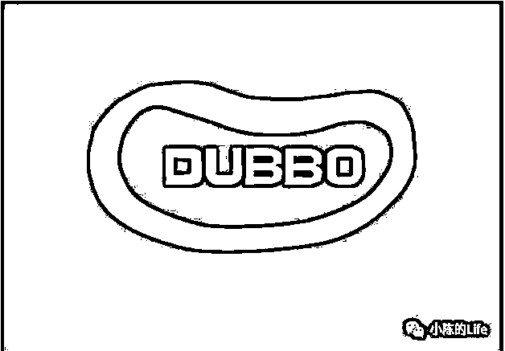
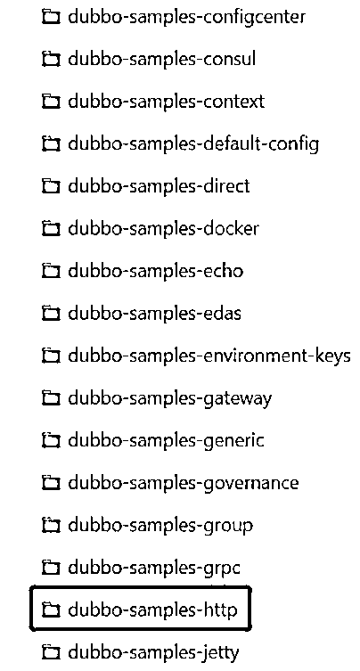
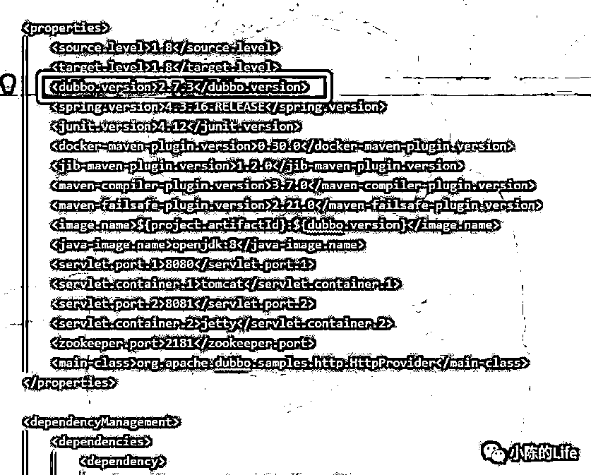
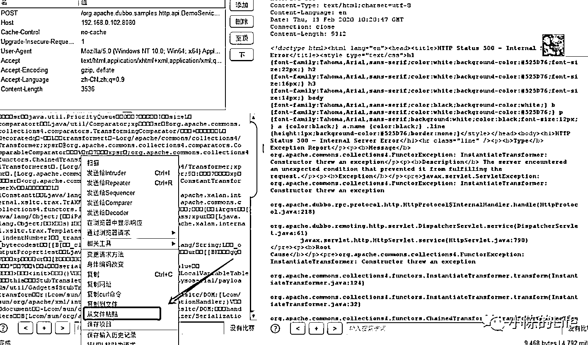
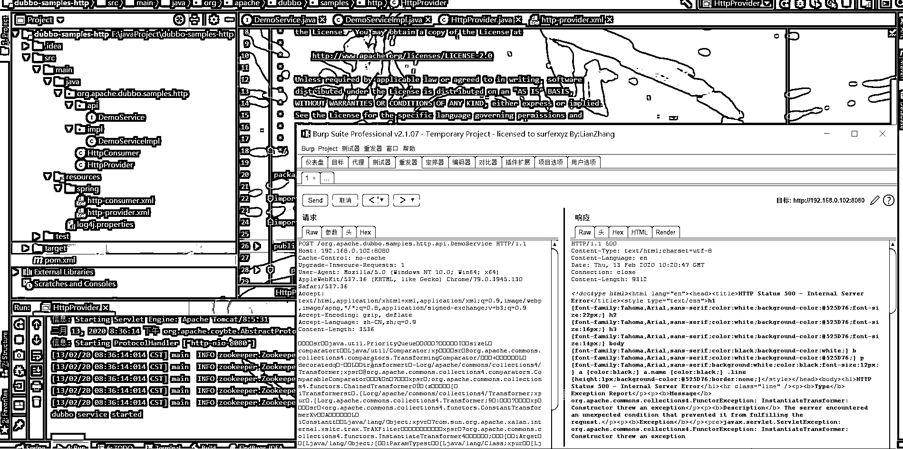

# 漏洞复现|Dubbo 反序列化漏洞 CVE-2019-17564 - admin-神风 - 博客园

> 原文：[`www.cnblogs.com/wh4am1/p/12307848.html`](https://www.cnblogs.com/wh4am1/p/12307848.html)



### 01 漏洞描述

—

Apache Dubbo 支持多种协议,官方推荐使用 Dubbo 协议.Apache Dubbo HTTP 协议中的一个反序列化漏洞（CVE-2019-17564）,该漏洞的主要原因在于当 Apache Dubbo 启用 HTTP 协议之后，Apache Dubbo 对消息体处理不当导致不安全反序列化，当项目包中存在可用的 gadgets 时即可导致远程代码执行.

### 02 影响范围

—

2.7.0 <= Apache Dubbo <= 2.7.4.1

2.6.0 <= Apache Dubbo <= 2.6.7

Apache Dubbo = 2.5.x

### 03 漏洞复现

—

环境介绍：

Windows 10

JDK8u221

一、环境搭建

先从 GIthub 上获取 dubbo 的项目

项目地址：https://github.com/apache/dubbo-samples

提取“dubbo-samples-http”目录到项目中



 用 IDEA 打开后需要修改 pom.xml 中的 dubbo.version



我这里将其修改为 2.7.3 漏洞版本

加载 pom.xml 中的依赖，其中有些依赖无法从远程仓库中获取的，经过分析后这些依赖无需加载，将其删掉就可以了。

导入完依赖后还需要一个本地触发 gadgets，这里导入 commons-collections4-4.0。

当然启动还需要依赖 zookeeper，下载完 zookeeper 后将 conf 目录下的 zoo_sample.cfg 文件改成 zoo.cfg 并修改其中的两个参数


data 和 log 目录需要自己在 zookeeper 目录下创建

运行 bin\zkServer.cmd 文件

随后启动 dubbo 项目中的启动 HttpProvider


### 二、构造反序列化

利用 ysoserial 生成 payload

```
java -jar ysoserial-master-30099844c6-1.jar CommonsCollections4 "calc" > payload.out
```


 将 payload 粘贴至 burp 中



 

后面的分析就不多说了，关注公众号“小陈的 Life”可以查看详情

https://mp.weixin.qq.com/s/KZxhX3Q_mE6PJ6MT7cYbeQ

