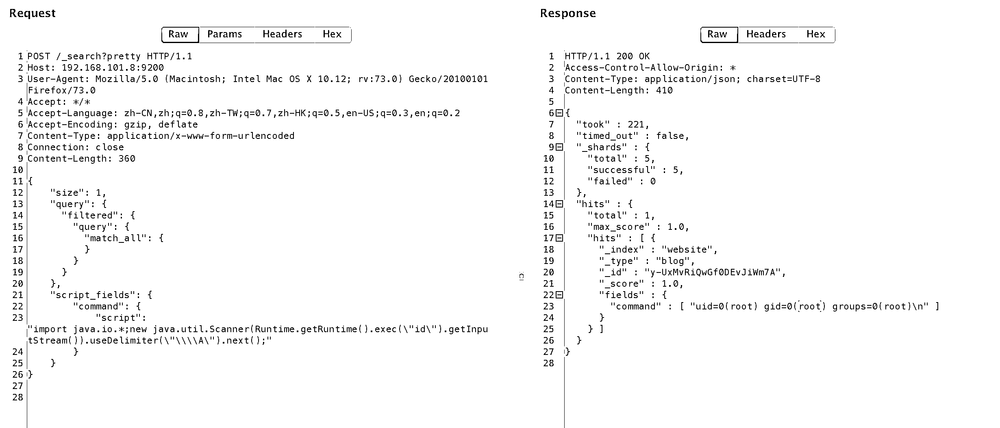
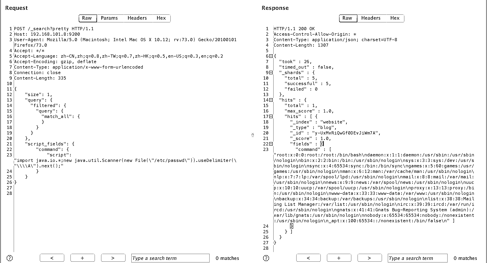
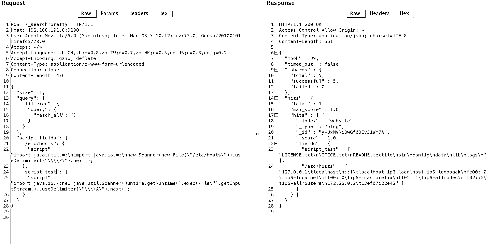

# 漏洞复现-ElasticSearch 命令执行漏洞（CVE-2014-3120） - Sally_Zhang - 博客园

> 原文：[`www.cnblogs.com/sallyzhang/p/12450035.html`](https://www.cnblogs.com/sallyzhang/p/12450035.html)

**基础知识**

1\. 全文检索：扫描文章中的每一个词，给每一个词建立一个索引指明该词在文章中出现的位置和次数。当进行查询操作时直接根据索引进行查找。

2\. 倒排索引：索引表中的每一项都包括一个属性值和具有该属性值的各记录的地址。由于不是由记录来确定属性值，而是由属性值来确定记录的位置，因而称为倒排索引(inverted index)。

举个栗子：文档 A 和 C 里面都有一个词 B，我们查找 B 的时候，是先找到关键词 B，再根据 B 存储的索引找到 A 和 C；而不是先找到 A，在 A 里面检索 B，再找到 C，在 C 里面检索 B。

3. ElasticSearch：基于开源的全文检索引擎 Lucene，是一个实时分布式搜索和分析引擎，支持全文检索，结构化检索(就是咱们平时用的 sql 语句的形式)和数据分析等。

4\. ES 的一些核心概念：

*   Index：索引，就是我们平时理解的数据库(database)
*   type：类型，就是表(table)
*   document：文档，es 的最小数据单元。就是表中的一行数据(row)
*   field：字段，就是列(column)
*   mapping：映射，就是约束(schema)

**漏洞原理**

ElasticSearch 1.2 版本之前支持动态脚本。漏洞是通过 _search 方法的参数传入恶意代码，远程执行任意 MVEL 表达式和 Java 代码。

**复现环境**

在 ubuntu 16.04 虚拟机中用 vulhub 靶场提供的 docker 容器来复现

jdk 版本 1.7

ElasticSearch 版本 1.1.1

**影响版本**

ElasticSearch 1.2 之前的版本

**复现过程**

1\. 启动 docker 容器，先创建一条数据：

2\. 按照 vulhub 给出的例子来传参数：

3\. 既然能执行任意代码，应该也能读取文件：

3\. 执行操作系统命令（还可以同时执行多行恶意代码：） 

**防御方法**

1\. 升级版本

2\. 在 elasticsearch.yml 里配置 script.disable_dynamic: true

****本文仅用于技术学习和交流，严禁用于非法用途，否则产生的一切后果自行承担。****

******如需转载，请注明出处，这是对他人劳动成果的尊重。******