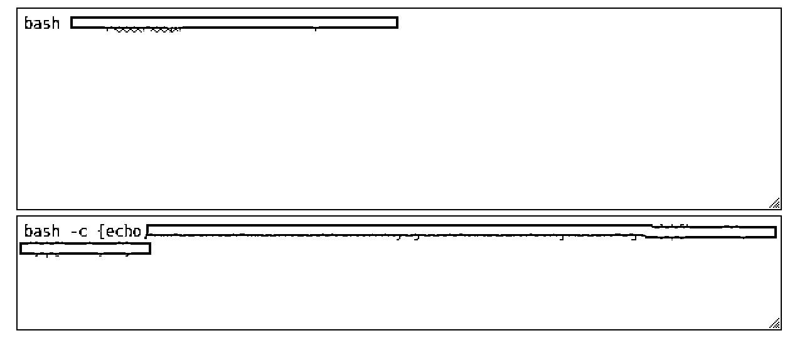
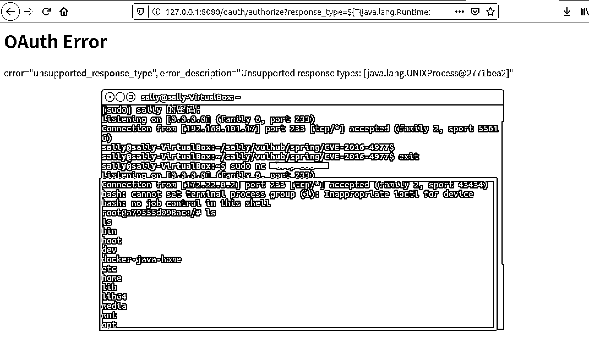

# 漏洞复现-Spring Security OAuth2 远程命令执行漏洞（CVE-2016-4977） - Sally_Zhang - 博客园

> 原文：[`www.cnblogs.com/sallyzhang/p/12373069.html`](https://www.cnblogs.com/sallyzhang/p/12373069.html)

**漏洞原理**

Spring Security OAuth2 处理认证请求的时候如果使用了 whitelabel 视图，response_type 参数值会被当做 Spring SpEL 来执行，恶意攻击者通过构造 response_type 值可以触发远程代码执行漏洞 

**复现环境**

在 ubuntu 16.04 虚拟机中用 vulhub 靶场提供的 docker 容器来复现

jdk 版本 1.7

python 版本 3.5

**影响版本**

Spring Security OAuth 2.3 到 2.3.2

Spring Security OAuth 2.2 到 2.2.1

Spring Security OAuth 2.1 到 2.1.1

Spring Security OAuth 2.0 到 2.0.14

**复现过程**

1\. 进入 vulhub 目录：spring/CVE-2016-4977，启动 docker 容器

2\. 对反弹 shell 的 POC 进行 base64 编码（java 反弹 shell 都需要先编码，不然不会成功，原因貌似是 runtime 不支持管道符）

3\. 用 vulhub 提供的 poc.py 生成反弹 shell 的 POC：

4\. 监听反弹端口，并访问下面的 url：

http://your-ip:8080/oauth/authorize?response_type=上面的那一长串 POC&client_id=acme&scope=openid&redirect_uri=http://test

反弹成功，从返回页面来看，这里实际上是利用抛出的错误消息来执行恶意代码的，漏洞代码的位置应该在内部错误处理的代码中。

**本文仅用于技术学习和交流，严禁用于非法用途，否则产生的一切后果自行承担。**