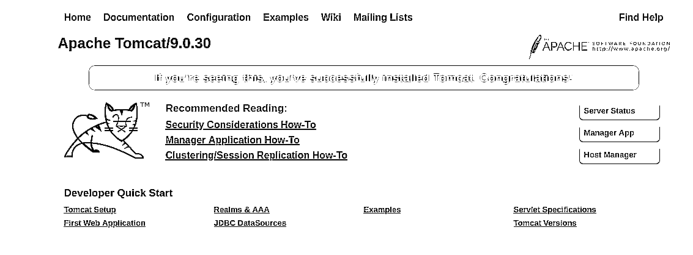

# 漏洞复现-Tomcat AJP 文件包含漏洞（CVE-2020-1938） - Sally_Zhang - 博客园

> 原文：[`www.cnblogs.com/sallyzhang/p/12357669.html`](https://www.cnblogs.com/sallyzhang/p/12357669.html)

**漏洞原理**

该漏洞是由于 Tomcat AJP 协议存在缺陷导致，攻击者利用该漏洞可通过构造特定参数，读取服务器 webapp 下的任意文件。若目标服务器同时存在文件上传功能，攻击者可进一步实现远程代码执行。目前，厂商已发布新版本完成漏洞修复。

**复现环境**

在 ubuntu 16.04 虚拟机中用 vulhub 靶场提供的 docker 容器来复现

jdk 版本 1.7

Tomcat 版本 9.0.30

**影响版本**

Apache Tomcat 6

Apache Tomcat 7 < 7.0.100

Apache Tomcat 8 < 8.5.51

Apache Tomcat 9 < 9.0.31

**复现过程**

1\. 进入 vulhub 目录：tomcat/CVE-2020-1938

2.启动 docker 容器，tomcat 页面正常访问：

 

看下 server.xml 中 AJP 协议的相关配置，目前是打开的，端口号 8009:

使用推荐的漏洞利用工具([`github.com/YDHCUI/CNVD-2020-10487-Tomcat-Ajp-lfi`](https://github.com/YDHCUI/CNVD-2020-10487-Tomcat-Ajp-lfi))读取 web.xml:

**防御实验**

在不升级版本的情况下，直接关闭 AJP Connector：

重启 Tomcat，再试着读取 web.xml，读取失败：

**拓展学习 **

我有一点点疑问，为啥这个漏洞要叫“文件包含”漏洞。。。和我理解的文件包含貌似不一样啊([`www.cnblogs.com/sallyzhang/p/12221089.html`](https://www.cnblogs.com/sallyzhang/p/12221089.html))。咱把[`github.com/YDHCUI/CNVD-2020-10487-Tomcat-Ajp-lfi`](https://github.com/YDHCUI/CNVD-2020-10487-Tomcat-Ajp-lfi)代码 copy 下来 debug 了一下，作为一个 Python 零级菜鸟选手，我只看懂了一丢丢..>_<...

代码做的事情大概就是自己按照 AJP 协议的要求拼装了 request(会转成二进制)发过去，然后把 response 的内容解析出来，命令行传入的参数放在 attributes 里面：

应该是 javax.servlet.include.path_info 的锅。。。，网上参考了这两篇文章：[`paper.seebug.org/1126/`](https://paper.seebug.org/1126/) ， [`www.jianshu.com/p/1803731ed527`](https://www.jianshu.com/p/1803731ed527)

好吧，确实是文件包含漏洞，个人觉得也可以叫任意文件读取漏洞 >_<

**本文仅用于技术学习和交流，严禁用于非法用途，否则产生的一切后果自行承担。**

**如需转载，请注明出处，这是对他人劳动成果的尊重。**