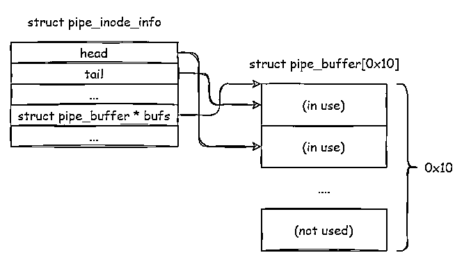
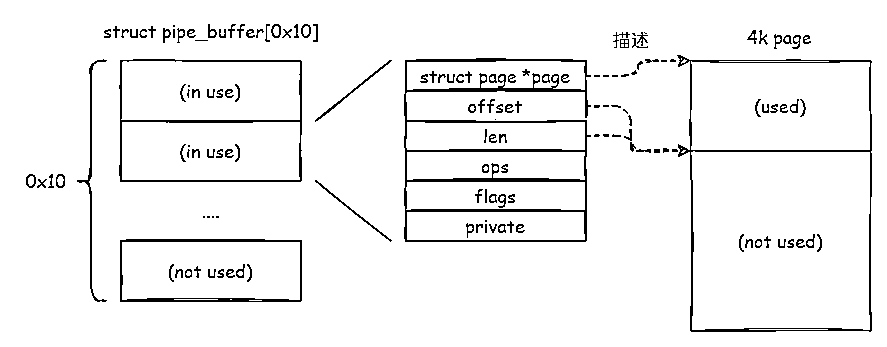
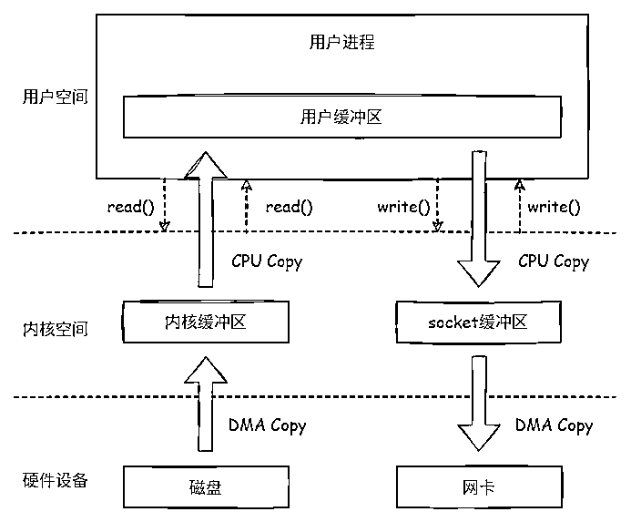
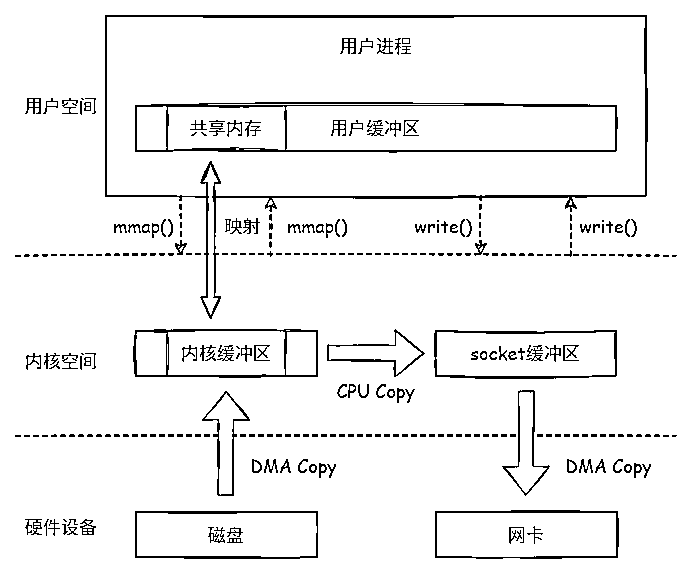
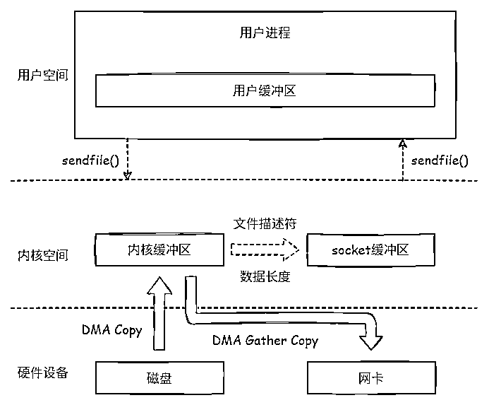

# 详解 CVE-2022-0847 DirtyPipe 漏洞 - 华为云开发者联盟 - 博客园

> 原文：[`www.cnblogs.com/huaweiyun/p/16288527.html`](https://www.cnblogs.com/huaweiyun/p/16288527.html)

> **摘要：**本文详细介绍了 CVE-2022-0847 漏洞形成根因，相应补丁修复方法，通过本文让读者对 CVE-2022-0847 漏洞有更清晰的了解。

本文分享自华为云社区《[CVE-2022-0847 DirtyPipe](https://bbs.huaweicloud.com/blogs/349688?utm_source=cnblog&utm_medium=bbs-ex&utm_campaign=paas&utm_content=content)》，作者：安全技术猿。

## 简介

**CVE-2022-0847**不需要调用特权 syscall 就能完成对任意只读文件的修改（有点类似之前的脏牛，但底层原理其实不一样），且由于利用过程中不涉及内存损坏，因此不需要 ROP 等利用方法，也自然不需要知道内核基址等信息，故不需要对内核版本进行适配（因此可以被广泛利用，危害巨大）。

本质上，**这个漏洞是由内存未初始化造成的**，且从 2016 年就存在了，但在当时并不能发生有趣的利用，直到 2020 年由于对 pipe 内部实现进行了一些修改，才让这个“BUG”变成了能够利用的“漏洞”。

## 漏洞分析

这个漏洞主要涉及到两个 syscall：

*   pipe：https://man7.org/linux/man-pages/man2/pipe.2.html
*   splice：https://man7.org/linux/man-pages/man2/splice.2.html

## syscall pipe

pipe，我想使用 linux 的都不陌生它的作用，因此直接从底层实现开始说。

pipe 在内核中使用 struct pipe_inode_info 进行管理，注释中为比较重要的几个字段。

```
/**
 *    struct pipe_inode_info - a linux kernel pipe
 *    @head: The point of buffer production
 *    @tail: The point of buffer consumption
 *    @max_usage: The maximum number of slots that may be used in the ring
 *    @ring_size: total number of buffers (should be a power of 2)
 *    @tmp_page: cached released page
 *    @bufs: the circular array of pipe buffers
 **/
struct pipe_inode_info {
...
    unsigned int head;
    unsigned int tail;
    unsigned int max_usage;
    unsigned int ring_size;
... struct page *tmp_page;
... struct pipe_buffer *bufs;
...
};
```

pipe 在内核中使用了环状 buffer（bufs 字段），而默认的数量为 16 个（PIPE_DEF_BUFFERS），每一个 struct pipe_buffer 管理一个 buffer，而一个 buffer 为一页的大小（默认 0x1000）。pipe 为 FIFO 的结构体，这可以从 head 和 tail 两个字段体现出来，head 指向最新生产的 buffer，而 tail 指向开始消费的 buffer。



pipe_buffer 为如下的结构体，其中这里的 page 并不直接指向目标页，而是一个**物理页的页框**（实际使用过程中通过 kmap_atomic()获取对应的虚拟地址）。毕竟 pipe 需要考虑到跨进程，这里在结构体中使用物理页是明知智选。

```
// >>> include/linux/pipe_fs_i.h:17 /**
 *    struct pipe_buffer - a linux kernel pipe buffer
 *    @page: the page containing the data for the pipe buffer
 *    @offset: offset of data inside the @page
 *    @len: length of data inside the @page
 *    @ops: operations associated with this buffer. See @pipe_buf_operations.
 *    @flags: pipe buffer flags. See above.
 *    @private: private data owned by the ops.
 **/
struct pipe_buffer { struct page *page;
    unsigned int offset, len; const struct pipe_buf_operations *ops;
    unsigned int flags;
    unsigned long private;
};
```



接着我们分析下 pipe 的使用。假设用户向分配的 pipe 中写入数据，在内核层就会进入函数 pipe_write：

```
// >>> fs/pipe.c:415 /* 415 */ static ssize_t /* 416 */ pipe_write(struct kiocb *iocb, struct iov_iter *from) /* 417 */ { /* 418 */     struct file *filp = iocb->ki_filp; // 拿到 pipe 结构体 /* 419 */     struct pipe_inode_info *pipe = filp->private_data; /* 420 */     unsigned int head; /* 421 */     ssize_t ret = 0; // total_len 为此次写入的长度 /* 422 */     size_t total_len = iov_iter_count(from); /* 423 */ ssize_t chars; /* 424 */     bool was_empty = false; /* 425 */     bool wake_next_writer = false; ------
/* 457 */     head = pipe->head; /* 458 */     was_empty = true; // 考虑使用 merge /* 459 */     chars = total_len & (PAGE_SIZE-1); // 如果 len&0xFFF !=0 且当前使用的页 /* 460 */     if (chars && !pipe_empty(head, pipe->tail)) { /* 461 */         unsigned int mask = pipe->ring_size - 1; /* 462 */         struct pipe_buffer *buf = &pipe->bufs[(head - 1) & mask]; /* 463 */         int offset = buf->offset + buf->len; /* 464 */ 
/* 465 */         if ((buf->flags & PIPE_BUF_FLAG_CAN_MERGE) && // 可以 merge /* 466 */             offset + chars <= PAGE_SIZE) { // 小于一页 /* 467 */             ret = pipe_buf_confirm(pipe, buf); ------
                    // 拷贝内容 /* 471 */             ret = copy_page_from_iter(buf->page, offset, chars, from); ------
/* 480 */ } /* 481 */ } /* 482 */ 
            // merge 失败，或者 merge 不完全，接着处理剩下的内容 /* 483 */     for (;;) { ------
/* 491 */         head = pipe->head; // 如果 pipe 没满 /* 492 */         if (!pipe_full(head, pipe->tail, pipe->max_usage)) { /* 493 */             unsigned int mask = pipe->ring_size - 1; // 取当前的 pipe buffer /* 494 */             struct pipe_buffer *buf = &pipe->bufs[head & mask]; /* 495 */             struct page *page = pipe->tmp_page; /* 496 */             int copied; /* 497 */             // 如果当前 page 是空的，就创建新的 page /* 498 */             if (!page) { /* 499 */                 page = alloc_page(GFP_HIGHUSER | __GFP_ACCOUNT); ------
/* 504 */                 pipe->tmp_page = page; /* 505 */ } ------
/* 519 */             // head++ /* 520 */             pipe->head = head + 1; /* 521 */             spin_unlock_irq(&pipe->rd_wait.lock); /* 522 */ 
/* 523 */             // 开始初始化 pipe buffer 的各个字段 /* 524 */             buf = &pipe->bufs[head & mask]; /* 525 */             buf->page = page; /* 526 */             buf->ops = &anon_pipe_buf_ops; /* 527 */             buf->offset = 0; /* 528 */             buf->len = 0; /* 529 */             if (is_packetized(filp)) // 一般不走 /* 530 */                 buf->flags = PIPE_BUF_FLAG_PACKET; /* 531 */             else
                        // 设置 flag PIPE_BUF_FLAG_CAN_MERGE /* 532 */                 buf->flags = PIPE_BUF_FLAG_CAN_MERGE; /* 533 */             pipe->tmp_page = NULL; /* 534 */ 
                    // 复制内容 /* 535 */             copied = copy_page_from_iter(page, 0, PAGE_SIZE, from); ------
/* 541 */             ret += copied; /* 542 */             buf->offset = 0; /* 543 */             buf->len = copied;
```

可以看到，在 pipe_write 中使用了 merge 的思想，如果我们分 16 次向 pipe 中写入 1 字节，这 16 字节不会并不会分别占用 16 个 pipe_buffer，而是连续占用第一个 pipe_buffer。这很好理解，不然 pipe 就堵死了，那利用率就太低了。而负责管理 merge 的是 struct pipe_buffer 中的 flags 字段 PIPE_BUF_FLAG_CAN_MERGE。

相对应的，pipe_read 也是通过 pipe_inode_info 拿到 pipe_buffer 进行读取，这里就不在分析。需要注意的是，pipe_buffer 在 read 过程中只会被修改其 offset 和 len 字段，并不会被释放或是修改其 flags 字段，也就是说 PIPE_BUF_FLAG_CAN_MERGE 一但设置，则在 read/write 的过程中就不会再被清除掉。

## syscall splice

接着来分析一下 splice 这个 syscall。

splice 是在 Linux 2.6.16 中被引入的（[5274f052e7b3dbd81935772eb551dfd0325dfa9d](https://github.com/torvalds/linux/commit/5274f052e7b3dbd81935772eb551dfd0325dfa9d)），本质上是为了解决文件对拷的效率问题，它实现了“零拷贝”。

这里稍微展开说说零拷贝。可以思考下在 Linux 上你会如何实现文件对拷？

最简单的，就是 open()两个文件，然后申请一个 buffer，然后使用 read()/write()来进行拷贝。但这样效率太低，原因是一对 read()和 write()涉及到 4 次上下文切换，2 次 CPU 拷贝，2 次 DMA 拷贝。



因此稍微聪明点的人，会使用 mmap()+write()的组合，这样涉及 4 次上下⽂切换，1 次 CPU 拷⻉，2 次 DMA 拷⻉。



更近一步的，会使用 sendfile()，调用 sendfile()只需提供两个互拷的 fd，以及拷贝的长度即可。与 mmap 内存映射⽅式不同的是， sendfile 调⽤中 I/O 数据对⽤户空间是完全不可⻅的。因此它只涉及 2 次上下⽂切换，2 次 DMA 拷⻉。



splice()类似，不过使用了 pipe 机制，从而不需要硬件的支持就能实现两个 fd 间的零拷贝。它也只涉及 2 次上下⽂切换，2 次 DMA 拷⻉。


一般我们用下面的模式使用 splice 实现文件对拷：

```
int in_fd = open(file_to_read); int out_fd = open(file_to_write); int anon_pipes[2];
pipe(anon_pipes); while has_content_to_copy:
    splice(in_fd,&in_off,anon_pipes[1],NULL,size);
    splice(anon_pipes[0],NULL,out_fd,&out_off,size);

close(in_fd);
close(out_fd);
```

可以看到，splice 底层用到了 pipe。splice 支持对接多种设备，例如普通文件，socket 等。下面我们啃一下 splice 的源码，以上面的 splice(in_fd,&in_off,anon_pipes[1],NULL,size);为例：

```
// >>> fs/splice.c:1325 /* 1325 */ SYSCALL_DEFINE6(splice, int, fd_in, loff_t __user *, off_in, /* 1326 */         int, fd_out, loff_t __user *, off_out, /* 1327 */         size_t, len, unsigned int, flags) /* 1328 */ { ------
                    // splice 是对 __do_splice 的简单包装 /* 1343 */             error = __do_splice(in.file, off_in, out.file, off_out, /* 1344 */ len, flags); ------
/* 1350 */ } // __do_splice 是对 do_splice 的简单包装 // >>> fs/splice.c:1008 /* 1008 */ long do_splice(struct file *in, loff_t *off_in, struct file *out, /* 1009 */            loff_t *off_out, size_t len, unsigned int flags) /* 1010 */ { ------
/* 1011 */     struct pipe_inode_info *ipipe; /* 1012 */     struct pipe_inode_info *opipe; ------
            // 从 in/out 中尝试取得 pipe_inode_info /* 1020 */     ipipe = get_pipe_info(in, true); /* 1021 */     opipe = get_pipe_info(out, true); ------
            // 上面例子中 in 是普通文件，out 是 pipe，因此不进这里 /* 1037 */     if (ipipe) { ------
/* 1068 */ } ------
            // 进这里 /* 1070 */     if (opipe) { ------
                    // 调用 do_splice_to /* 1093 */             ret = do_splice_to(in, &offset, opipe, len, flags); ------
/* 1104 */ } ------
/* 1107 */ } // >>> fs/splice.c:770 /* 770 */ static long do_splice_to(struct file *in, loff_t *ppos, /* 771 */              struct pipe_inode_info *pipe, size_t len, /* 772 */              unsigned int flags) /* 773 */ { ------
            // 这里根据 in 的 f_op->splice_read 选择对应的函数 // 由于是普通文件，所以： //
            // >>> fs/read_write.c:28 // /* 28 */ const struct file_operations generic_ro_fops = { // ------ // /* 32 */     .splice_read    = generic_file_splice_read, // /* 33 */ }; /* 788 */     return in->f_op->splice_read(in, ppos, pipe, len, flags); /* 789 */ } // >>> fs/splice.c:298 /* 298 */ ssize_t generic_file_splice_read(struct file *in, loff_t *ppos, /* 299 */                  struct pipe_inode_info *pipe, size_t len, /* 300 */                  unsigned int flags) /* 301 */ { /* 302 */     struct iov_iter to; /* 303 */     struct kiocb kiocb; /* 304 */     unsigned int i_head; /* 305 */     int ret; /* 306 */ 
            // 从 pipe 中取数据，得到 to /* 307 */     iov_iter_pipe(&to, READ, pipe, len); /* 308 */     i_head = to.head; /* 309 */     init_sync_kiocb(&kiocb, in); /* 310 */     kiocb.ki_pos = *ppos; // 进入这里，其实是调用 in->f_op->read_iter(&kiocb,&to); // 即 generic_file_read_iter() /* 311 */     ret = call_read_iter(in, &kiocb, &to); ------
/* 328 */ } // 之后： // generic_file_read_iter() // -> generic_file_buffered_read() // -> copy_page_to_iter() // >>> lib/iov_iter.c:916 /* 916 */ size_t copy_page_to_iter(struct page *page, size_t offset, size_t bytes, /* 917 */              struct iov_iter *i) /* 918 */ { ------
/* 921 */     if (i->type & (ITER_BVEC|ITER_KVEC)) { ------
/* 926 */     } else if (unlikely(iov_iter_is_discard(i))) { ------
/* 931 */     } else if (likely(!iov_iter_is_pipe(i))) /* 932 */         return copy_page_to_iter_iovec(page, offset, bytes, i); /* 933 */     else
                // 这里的 i 其实就是前面 generic_file_splice_read 中的 to，因此是 pipe /* 934 */         return copy_page_to_iter_pipe(page, offset, bytes, i); /* 935 */ } // 终于来到了我们今天的主角：copy_page_to_iter_pipe // >>> lib/iov_iter.c:375 /* 375 */ static size_t copy_page_to_iter_pipe(struct page *page, size_t offset, size_t bytes, /* 376 */              struct iov_iter *i) /* 377 */ { ------
/* 378 */     struct pipe_inode_info *pipe = i->pipe; ------
/* 379 */     struct pipe_buffer *buf; ------
/* 394 */     off = i->iov_offset; ------
/* 395 */     buf = &pipe->bufs[i_head & p_mask]; /* 396 */     if (off) { ------
/* 405 */ } /* 406 */     if (pipe_full(i_head, p_tail, pipe->max_usage)) /* 407 */         return 0; /* 408 */ 
            // 划重点!!! 没有设置 buf->flags /* 409 */     buf->ops = &page_cache_pipe_buf_ops; /* 410 */     
            // page ref_count ++ /* 411 */ get_page(page); // 直接把普通文件的 pipe 拿来放到 pipe 中 /* 412 */     buf->page = page; /* 413 */     buf->offset = offset; /* 414 */     buf->len = bytes; /* 415 */ 
/* 416 */     pipe->head = i_head + 1; /* 417 */     i->iov_offset = offset + bytes; /* 418 */     i->head = i_head; /* 419 */ out: /* 420 */     i->count -= bytes; /* 421 */     return bytes; /* 422 */ }
```

可以看到，最主要的逻辑就在 copy_page_to_iter_pipe 中，之所以 splice 实现了 CPU 的零拷贝是因为他直接对目标页的 ref count 进行了递增，然后把目标页的物理页页框复制到 pipe buffer 的 page 处，但这里却忘记设置 pipe buffer 的 flags 字段。

OK，现在梳理完了这两个 syscall 的逻辑，也发现在 splice 中存在对 pipe buffer 的 flags 字段为初始化漏洞，那一种可行的利用思路就出来了。

使用 pipe read/write，我们可以让目标 pipe 的每个 pipe buffer 都带上 PIPE_BUF_FLAG_CAN_MERGEflag。之后打开目标文件，并使用 splice 写到之前处理过的 pipe 中，splice 底层会帮助我们把目标文件的 page cache 设置到 pipe buffer 的 page 字段，但却没有修改 flags 字段。之后我们再调用 pipe write 时由于存在 PIPE_BUF_FLAG_CAN_MERGEflag 字段，内容会接着上次被写入同一个 page 中，但 page 其实已经变成了目标文件的 page cache，导致直接修改了目标文件 page cache。如果之后有其他文件尝试读取这个文件，kernel 会优先返回 cache 中的内容，也就是被我们修改后的 page cache。但由于这个修改并不会触发 page 的 dirty 属性，因此若由于内存紧张后或系统重启等原因，就会导致这个 cache 内 kernel 丢弃，再次读取文件内核就会重新从磁盘中取出未被我们修改的内容（这就是和脏牛的不同点）。

## 杂谈

这个 bug 其实在 2016 年就产生了，但为什么在 2020 年才能被利用呢？这就涉及到 linux 代码的历史了。

最早的时候，是否能够 merge 并不是通过 struct pipe_buffer 中的 flags 字段来管理，而是通过 struct pipe_buf_operations 中的 can_merge 字段来判断。因此在 splice 被加入 linux 时，splice 提供了一个新的 pipe_buf_operations 叫 page_cache_pipe_buf_ops，如下：

```
static struct pipe_buf_operations page_cache_pipe_buf_ops = {
    .can_merge = 0,
    .map = page_cache_pipe_buf_map,
    .unmap = page_cache_pipe_buf_unmap,
    .release = page_cache_pipe_buf_release,
};
```

其中 can_merge 字段默认就是 0，这就解释了为什么在 copy_page_to_iter_pipe 中不存在对 flags 的设置逻辑，因为只需要修改 fops 到 page_cache_pipe_buf_ops 就可以了。

之后在 2016 年的一个 commit 中 [commit 241699cd72a8 “new iov_iter flavour: pipe-backed” (Linux 4.9, 2016)](https://github.com/torvalds/linux/commit/241699cd72a8489c9446ae3910ddd243e9b9061b)，添加了两个函数，其中一个就是 copy_page_to_iter_pipe，里面对 pipe_buffer 的 flags 没有进行初始化，但现在还没出什么大问题，因为此时 can_merge 参数还在 fops 中，且 flags 中也没有什么有趣的选项。

时间来到 2019 年，[Commit 01e7187b4119 “pipe: stop using ->can_merge” (Linux 5.0, 2019)](https://github.com/torvalds/linux/commit/01e7187b41191376cee8bea8de9f907b001e87b4)中开始对 can_merge 字段下手了，但这个时候操刀还比较暴力，除了把所有使用所有 fops 中的 can_merge 字段删除外，还增加了一个函数叫 pipe_buf_can_merge，可能是发现除了匿名管道外，所有的管道都不支持 merge，所以只要判断一下 fops 是不是 anon_pipe_buf_ops 就行了。到目前为止，merge 操作和 16 年的未初始化 bug 还没挂钩。

```
static bool pipe_buf_can_merge(struct pipe_buffer *buf)
{ return buf->ops == &anon_pipe_buf_ops;
}
```

终于，在 2020 年，可能还是感觉这种判断太过于暴力，于是把 merge 操作的判断塞进了 pipe_buffer 的 flags 中：[Commit f6dd975583bd “pipe: merge anon_pipe_buf*_ops” (Linux 5.8, 2020)](https://github.com/torvalds/linux/commit/f6dd975583bd8ce088400648fd9819e4691c8958) 。16 年埋下的 bug 终于在 4 年后变成了漏洞。

## 漏洞修复

https://git.kernel.org/pub/scm/linux/kernel/git/torvalds/linux.git/commit/?id=9d2231c5d74e13b2a0546fee6737ee4446017903

内核的修复方法很简单，把两处 pipe buffer 的 flags 未初始化补上即可。

```
diff --git a/lib/iov_iter.c b/lib/iov_iter.c
index b0e0acdf96c15..6dd5330f7a995 100644
--- a/lib/iov_iter.c +++ b/lib/iov_iter.c
@@ -414,6 +414,7 @@ static size_t copy_page_to_iter_pipe(struct page *page, size_t offset, size_t by return 0;

     buf->ops = &page_cache_pipe_buf_ops; +    buf->flags = 0;
     get_page(page);
     buf->page = page;
     buf->offset = offset;
@@ -577,6 +578,7 @@ static size_t push_pipe(struct iov_iter *i, size_t size, break;

         buf->ops = &default_pipe_buf_ops; +        buf->flags = 0;
         buf->page = page;
         buf->offset = 0;
         buf->len = min_t(ssize_t, left, PAGE_SIZE);
```

## 阅读福利：

试试下面的漏扫服务，看看系统是否存在安全风险：[>>>漏洞扫描服务](https://www.huaweicloud.com/product/vss.html)

## 参考

*   [`github.com/bbaranoff/CVE-2022-0847`](https://github.com/bbaranoff/CVE-2022-0847)
*   https://dirtypipe.cm4all.com/
*   https://elixir.bootlin.com/linux/v5.10.60/source
*   https://www.cnblogs.com/liconglong/p/15211413.html

**[点击关注，第一时间了解华为云新鲜技术~](https://bbs.huaweicloud.com/blogs?utm_source=cnblog&utm_medium=bbs-ex&utm_campaign=paas&utm_content=content)**