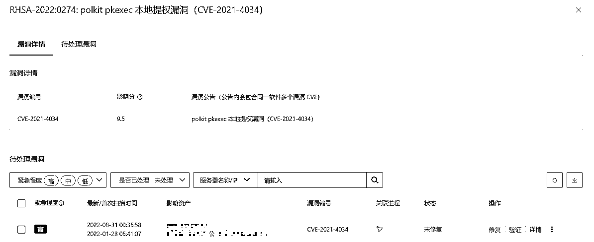

# 阿里云的漏洞提示 Linux Polkit 权限提升漏洞(CVE-2021-4034)解决方案 - GreenForestQuan - 博客园

> 原文：[`www.cnblogs.com/GreenForestQuan/p/16645595.html`](https://www.cnblogs.com/GreenForestQuan/p/16645595.html)



```

#首先确认下自己的系统版本，因为我装的是 centos
[root@iZj6c948tjmfrd1uc46981Z ~]# cat /etc/redhat-release
CentOS Linux release 7.8.2003 (Core)

通过命令查询出自己的 Polkit 版本
[root@iZj6c948tjmfrd1uc46981Z ~]# rpm -qa polkit
polkit-0.112-26.el7.x86_64
```

Linux Polkit 权限提升漏洞漏洞描述：
Polkit 是用于在类 Unix 操作系统中控制系统范围特权的组件。它为非特权进程提供了与特权进程进行通信的有组织的方式。

国外安全团队发布公告称，在 polkit 的 pkexec 程序中发现了一个本地权限提升漏洞。pkexec 应用程序是一个 setuid 工具，旨在允许非特权用户根据预定义的策略以特权用户身份运行命令。

由于当前版本的 pkexec 无法正确处理调用参数计数，并最终会尝试将环境变量作为命令执行。攻击者可以通过控制环境变量，从而诱导 pkexec 执行任意代码。利用成功后，可导致非特权用户获得管理员权限。

Linux Polkit 权限提升漏洞处置措施

安全版本

| CentOS 系列 |   |
| CentOS 6 | polkit-0.96-11.el6_10.2 |
| CentOS 7 | polkit-0.112-26.el7_9.1 |
| CentOS 8.0 | polkit-0.115-13.el8_5.1 |
| CentOS 8.2 | polkit-0.115-11.el8_2.2 |
|   |   |

| Ubuntu 系列 |   |
| Ubuntu 14.04 ESM | policykit-1 - 0.105-4ubuntu3.14.04.6+esm1 |
| Ubuntu 16.04 ESM | policykit-1 - 0.105-14.1ubuntu0.5+esm1 |
| Ubuntu 18.04 LTS | policykit-1 - 0.105-20ubuntu0.18.04.6 |
| Ubuntu 20.04 LTS | policykit-1 - 0.105-26ubuntu1.2 |

Linux Polkit 权限提升漏洞修复建议

CentOS 用户可采用如下命令升级到安全版本或更高版本：
yum clean all && yum makecache;

yum update polkit -y

通过以下命令可查看 Polkit 是否为安全版本：
rpm -qa polkit

Ubuntu 用户可采用如下命令升级至安全版本或更高版本：

apt-get update;

apt-get install policykit-1

通过以下命令可查看 Polkit 是否为安全版本：
dpkg -l policykit-1

更新了安装补丁，高危问题已修复


官方源未更新用户可通过以下命令临时缓解：

chmod 0755 /usr/bin/pkexec

目前各 Linux 发行版官方均已给出安全补丁，建议用户尽快升级至安全版本，或参照官方说明措施进行缓解;